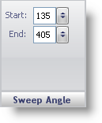

////

|metadata|
{
    "name": "webgauge-sweep-angle-pane",
    "controlName": ["WebGauge"],
    "tags": ["How Do I"],
    "guid": "{F5E5F65A-9321-407B-B498-E6FA9D9D68B4}",  
    "buildFlags": [],
    "createdOn": "0001-01-01T00:00:00Z"
}
|metadata|
////

= Sweep Angle Pane

The Sweep Angle pane determines the start and the end angles of the scale.

pick:[asp-net="link:{ApiPlatform}webui.ultrawebgauge{ApiVersion}~infragistics.ultragauge.resources.radialgaugescale~startangle.html[Start]"]  -- Set this value to a value from -999 to 999. This value determines the start angle of the scale.

pick:[asp-net="link:{ApiPlatform}webui.ultrawebgauge{ApiVersion}~infragistics.ultragauge.resources.radialgaugescale~endangle.html[End]"]  -- Set this value to a value from -999 to 999. This value determines the end angle of the scale.

== Related Topic

link:webgauge-scale-layout-tab.html[Scale Layout Tab]