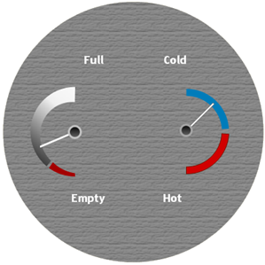

////

|metadata|
{
    "name": "webgauge-texture-brush-element",
    "controlName": ["WebGauge"],
    "tags": ["How Do I"],
    "guid": "{382E5CFE-4550-4699-99BA-3643B7612C5C}",  
    "buildFlags": [],
    "createdOn": "0001-01-01T00:00:00Z"
}
|metadata|
////

= Texture Brush Element

If you want the background of a property on your gauge to have a textured look and feel such as a canvas, set the brush type to Texture. When you select the Texture brush element, you can specify the start color, end color and texture style. You can apply the Texture brush element to the properties of your gauge using:

* link:webgauge-apply-the-texture-brush-element-using-the-gauge-designer.html[the Gauge Designer]
* link:webgauge-apply-the-texture-brush-element-at-design-time.html[the Gauges collection editor]
* link:webgauge-apply-the-texture-brush-element-at-run-time.html[code]

The following screen shot shows a Radial gauge with the Dial's BrushElement property set to a TextureBrushElement with the following settings:

* Texture style -- Canvas
* Start color -- Silver
* End color -- Dim Gray

