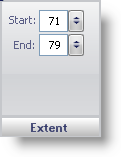

////

|metadata|
{
    "name": "webgauge-tickmark-extent-pane",
    "controlName": ["WebGauge"],
    "tags": ["How Do I"],
    "guid": "{22ECDE9B-B8FC-485B-B16B-811437BBFBBA}",  
    "buildFlags": [],
    "createdOn": "0001-01-01T00:00:00Z"
}
|metadata|
////

= Extent Pane

The Extent pane determines the start and end point of the tick mark on the scale. This sets the length of the tick mark. In a Radial gauge the start and end values are measured from the center and in a Linear gauge the start and end values are measured from the left of the gauge.

pick:[asp-net="link:infragistics4.webui.ultrawebgauge.v{ProductVersion}~infragistics.ultragauge.resources.gaugescaletickmarkappearance~startextent.html[Start]"]  -- Set this value to an integer from 0 to 100. This value sets the start position of the tick mark.

pick:[asp-net="link:infragistics4.webui.ultrawebgauge.v{ProductVersion}~infragistics.ultragauge.resources.gaugescaletickmarkappearance~endextent.html[End]"]  -- Set this value to an integer from 0 to 100. This value sets the end position of the tick mark.

== Related Topic

link:webgauge-tickmark-layout-tab.html[Tickmark Layout Tab]