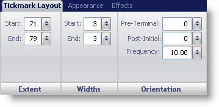
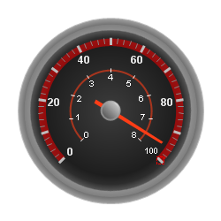

////

|metadata|
{
    "name": "webgauge-tickmark-layout-tab",
    "controlName": ["WebGauge"],
    "tags": ["How Do I"],
    "guid": "{9B1C4054-00A6-4827-AE38-8BEFD635BFD3}",  
    "buildFlags": [],
    "createdOn": "0001-01-01T00:00:00Z"
}
|metadata|
////

= Tickmark Layout Tab

The  pick:[asp-net="link:{ApiPlatform}webui.ultrawebgauge{ApiVersion}~infragistics.ultragauge.resources.gaugescaletickmarkappearance.html[Tickmark]"]  property on the WebGauge control is used to visually display the values on a scale of your Radial or Linear gauge. There are two types of tick marks:

* minor tick marks
* major tick marks

You can configure both of them to display 'ticks' at specific values. Major tick marks are usually larger than minor tick marks. They are configured to highlight every n^th^ value on the scale.

You can customize the tick marks on your gauge using the Tickmark Layout tab of the Properties panel. To access this tab, you can either click Major Tickmarks or Minor Tickmarks in the Gauge Explorer (Radial\Linear Gauge >Scales > Major\Minor Tickmarks) or click a tick mark on your gauge in interactive preview area.

The tab is divided into three panes:

* link:webgauge-extent-pane.html[Extent]
* link:webgauge-widths-pane.html[Widths]
* link:webgauge-orientation-pane.html[Orientation]

The following screen shot shows a scale that was created according to layout settings specified in the above screen shot.

