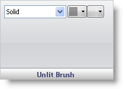

////

|metadata|
{
    "name": "webgauge-unlit-brush-pane",
    "controlName": ["WebGauge"],
    "tags": ["How Do I"],
    "guid": "{ED1150DB-532F-432E-9E2A-3FAAE64E9B43}",  
    "buildFlags": [],
    "createdOn": "0001-01-01T00:00:00Z"
}
|metadata|
////

= Unlit Brush Pane

The Unlit Brush pane sets the brush type and brush color of the segments that are not used to display the values. For more information on unused segments, see link:webgauge-working-with-digital-webgauges.html[Working with Digital WebGauges].

pick:[asp-net="link:infragistics4.webui.ultrawebgauge.v{ProductVersion}~infragistics.ultragauge.resources.segmenteddigitalgauge~unlitbrushelement.html[Brush Type]"]  -- This drop-down list lets you change the brush type of the unused segments on your Digital gauge.

pick:[asp-net="link:infragistics4.webui.ultrawebgauge.v{ProductVersion}~infragistics.ultragauge.resources.segmenteddigitalgauge~unlitbrushelement.html[Brush Color]"]  -- Depending on which brush type you select, the brush color list will populate with the colors available for that brush type.

Relative Bounds Editor -- This pop-up menu displays two bounds editors, link:webgauge-relative-bounds.html[Relative Bounds] and link:webgauge-relative-clip-bounds.html[Relative Clip Bounds], that allows you to determine the size and location of your brush element.

== Related Topic

link:webgauge-digit-appearance-tab.html[Digit Appearance Tab]