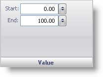

////

|metadata|
{
    "name": "webgauge-value-pane",
    "controlName": ["WebGauge"],
    "tags": ["How Do I"],
    "guid": "{29809C76-85BD-47DE-A419-7DDCAF7BFAE0}",  
    "buildFlags": [],
    "createdOn": "0001-01-01T00:00:00Z"
}
|metadata|
////

= Value Pane

The Value pane lets you specify the start point and the end point of the range on the scale.

pick:[asp-net="link:infragistics4.webui.ultrawebgauge.v{ProductVersion}~infragistics.ultragauge.resources.gaugerange~startvalue.html[Start]"]  -- Set this value to an integer from 0 to 360. This value sets the start point of the range on the scale.

pick:[asp-net="link:infragistics4.webui.ultrawebgauge.v{ProductVersion}~infragistics.ultragauge.resources.gaugerange~endvalue.html[End]"]  -- Set this value to an integer from 0 to 360. This value sets the end point of the range on the scale.

== Related Topic

link:webgauge-range-layout-tab.html[Range Layout Tab]