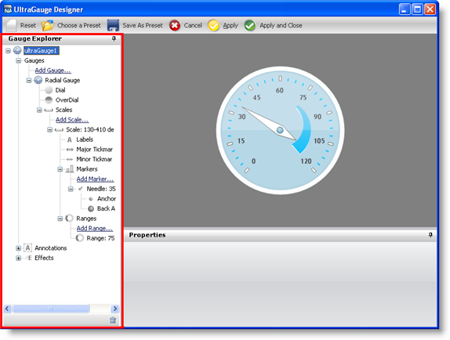
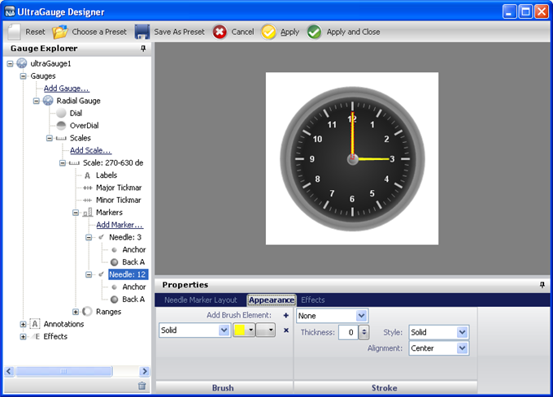

////

|metadata|
{
    "name": "webgauge-webgauge-explorer",
    "controlName": ["WebGauge"],
    "tags": ["How Do I"],
    "guid": "{3F52E85E-1DEF-46AB-AFB7-DB39345E049E}",  
    "buildFlags": [],
    "createdOn": "0001-01-01T00:00:00Z"
}
|metadata|
////

= WebGauge Explorer

The Gauge Explorer of the designer allows you to add/delete Linear, Digital, and Radial gauges to/from your existing WebGauge control. It also allows for easy navigation through properties of the Gauge control.

The Gauge control can consist of many different gauges -- all of which you can see and manage from the Gauge Explorer. When you select a gauge from the Gauge Explorer, the gauge is highlighted in the interactive preview area, and the Properties panel displays the properties of the selected gauge.

The following screen shot shows the Gauge Explorer of the designer with a Radial gauge selected:

The Gauge Explorer also allows you to drill down to the individual properties of your gauge. When you select a gauge property from the Gauge Explorer, the property appears highlighted on the gauge in the interactive preview area. For example, if you have a Radial gauge that represents a clock, clicking on the  pick:[asp-net="link:{ApiPlatform}webui.ultrawebgauge{ApiVersion}~infragistics.ultragauge.resources.radialgaugeneedle.html[Needle]"]  property of the gauge through the Gauge Explorer highlights the hand of the clock in the interactive preview area, as shown in the following screen shot.

