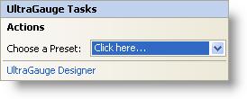

////

|metadata|
{
    "name": "webgauge-webgauge-smart-tag",
    "controlName": ["WebGauge"],
    "tags": ["How Do I"],
    "guid": "{7C9C839B-C56D-4AFB-892F-1264AC6432A1}",  
    "buildFlags": [],
    "createdOn": "0001-01-01T00:00:00Z"
}
|metadata|
////

= WebGauge Smart Tag

In Visual Studio 2005 (.NET Framework 2.0), each Infragistics ASP.NET control/component is equipped with a Smart Tag. By simply selecting the control/component, a Smart Tag anchor appears. When you click this anchor, a pop-up panel appears, providing you with quick and easy access to the most common properties and settings of the control/component.

The WebGauge™ Smart Tag contains the following sections:

* Actions -- Allows you to select a link:webgauge-creating-a-webgauge-using-a-preset.html[gauge preset].
* UltraGauge Designer -- Launches the link:webgauge-webgauge-designer.html[WebGauge Designer], which lets you quickly and easily modify the look and feel of your gauge.

See below for a description of the item (e.g., drop-down list) in each section, as well as the item's corresponding property in the properties grid.

[options="header", cols="a,a,a"]
|====
|Actions|Description|Corresponding Property

|Choose Preset
|Click the "Click here” link and quickly select a preset for WebGauge.
|n/a

|====