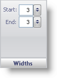

////

|metadata|
{
    "name": "webgauge-widths-pane",
    "controlName": ["WebGauge"],
    "tags": ["How Do I"],
    "guid": "{DE0B4D42-1417-452E-8089-EC826A649F7E}",  
    "buildFlags": [],
    "createdOn": "0001-01-01T00:00:00Z"
}
|metadata|
////

= Widths Pane

The Widths pane determines the thickness of each tick mark on your Radial or Linear gauge.

pick:[asp-net="link:infragistics4.webui.ultrawebgauge.v{ProductVersion}~infragistics.ultragauge.resources.radialgaugescaletickmarkappearance~startwidth.html[Start]"]  -- Set this value to an integer from 0 to 100. This value sets the width of the start point of the tick mark.

pick:[asp-net="link:infragistics4.webui.ultrawebgauge.v{ProductVersion}~infragistics.ultragauge.resources.radialgaugescaletickmarkappearance~endwidth.html[End]"]  -- Set this value to an integer from 0 to 100. This value sets the width of the end point of the tick mark.

== Related Topic

link:webgauge-tickmark-layout-tab.html[Tickmark Layout Tab]