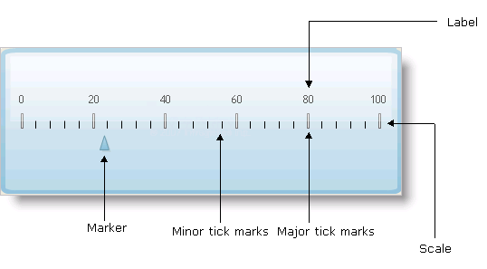

////

|metadata|
{
    "name": "webgauge-working-with-linear-webgauges",
    "controlName": ["WebGauge"],
    "tags": ["How Do I"],
    "guid": "{4A093546-4DC4-4FE0-93BC-D6A996AB3DA6}",  
    "buildFlags": [],
    "createdOn": "0001-01-01T00:00:00Z"
}
|metadata|
////

= Working with Linear WebGauges

Linear gauges consist of different components that work together to create visually impressive gauges. To create a Linear gauge, you will need to understand how the components specific to Linear gauges work.

== Scales

The scale displays the range of values of your gauge. The  pick:[asp-net="link:{ApiPlatform}webui.ultrawebgauge{ApiVersion}~infragistics.ultragauge.resources.lineargauge~scales.html[Scales]"]  property includes various properties, including  pick:[asp-net="link:{ApiPlatform}webui.ultrawebgauge{ApiVersion}~infragistics.ultragauge.resources.lineargaugescale~labels.html[Labels]"] ,  pick:[asp-net="link:{ApiPlatform}webui.ultrawebgauge{ApiVersion}~infragistics.ultragauge.resources.lineargaugescale~markers.html[Markers]"]  and  pick:[asp-net="link:{ApiPlatform}webui.ultrawebgauge{ApiVersion}~infragistics.ultragauge.resources.lineargaugescale~majortickmarks.html[TickMarks]"] .

===== Tick Marks

You can add tick marks to Linear gauges to display the values of the gauge's scale.

The TickMarks property has two attributes:

* Minor TickMarks
* Major TickMarks

You can configure both of them to display 'ticks' at specific values. Major tick marks are usually larger than minor tick marks. They are configured to highlight every n^th^ value on the scale.

===== Labels

Labels are numeric or text values that are used to represent the points of the scale. They are associated with the tick marks on the scale.

== Markers

Markers are elements that point out values on a scale. In a Linear gauge, the Marker property has two attributes:

* Needle marker -- These are displayed as pointers that point to a value on the scale.
* Bar marker -- These are displayed as bars that have a start and end point on the scale.