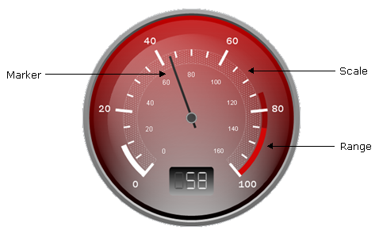
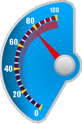
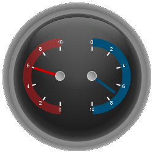
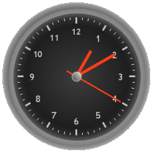
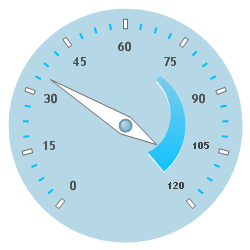

////

|metadata|
{
    "name": "webgauge-working-with-radial-webgauges",
    "controlName": ["WebGauge"],
    "tags": ["How Do I"],
    "guid": "{D558580A-AE2C-4358-966F-48FBBFEA040F}",  
    "buildFlags": [],
    "createdOn": "0001-01-01T00:00:00Z"
}
|metadata|
////

= Working with Radial WebGauges

A Radial gauge is composed of many separate, but related, parts. These parts (e.g.,  pick:[asp-net="link:infragistics4.webui.ultrawebgauge.v{ProductVersion}~infragistics.ultragauge.resources.radialgaugescale~ranges.html[Ranges]"] ,  pick:[asp-net="link:infragistics4.webui.ultrawebgauge.v{ProductVersion}~infragistics.ultragauge.resources.radialgaugescale~markers.html[Markers]"] ,  pick:[asp-net="link:infragistics4.webui.ultrawebgauge.v{ProductVersion}~infragistics.ultragauge.resources.radialgauge~scales.html[Scales]"] ) can be customized in detail;. But before approaching them individually, it is important to understand how all of these parts work together to make a Radial gauge.

== Dial

The Radial gauge dial is what gives it its shape. By default, the dial sweeps 360 degrees, so it appears as a circle. It is also possible, using the dial properties, to change the  pick:[asp-net="link:infragistics4.webui.ultrawebgauge.v{ProductVersion}~infragistics.ultragauge.resources.radialgaugescale~startangle.html[StartAngle]"]  and  pick:[asp-net="link:infragistics4.webui.ultrawebgauge.v{ProductVersion}~infragistics.ultragauge.resources.radialgaugescale~endangle.html[EndAngle]"] . Furthermore, the dial provides several other properties, such as InnerExtent, for customizing the shape.

== Scales

The Radial gauge scale is the element containing labels, tick marks, and all things related to displaying a range of values on the gauge. The scale is also responsible for Markers (e.g. needles), of which there can be one or more per scale. The most important part of a scale is its Axis, which determines the start and end value, as well as how frequently objects like labels and tick marks are drawn.

Most gauges contain only one scale. However, it is possible for a gauge to contain several scales independent of each other. Each scale can, in turn, have its own marker or markers; however, a marker cannot traverse between scales.

== Markers

A marker is an element that points out a value on a scale. The most common form of marker for Radial gauges is the needle. Each marker has a  pick:[asp-net="link:infragistics4.webui.ultrawebgauge.v{ProductVersion}~infragistics.ultragauge.resources.gaugemarker~value.html[Value]"]  property which tells it where to point on the scale.

== Ranges

Each scale is capable of displaying one or more ranges. A range is a visual element which begins and ends at specified values within a scale. The most common real-world examples of ranges are the high-RPM zones (typically yellow and red or orange and red) on a vehicle tachometer, which indicate that the engine is running at higher than the optimal load.

Like many other elements on a radial gauge, ranges are positioned using extent properties. In addition to the  pick:[asp-net="link:infragistics4.webui.ultrawebgauge.v{ProductVersion}~infragistics.ultragauge.resources.gaugerange~startvalue.html[StartValue]"]  and  pick:[asp-net="link:infragistics4.webui.ultrawebgauge.v{ProductVersion}~infragistics.ultragauge.resources.gaugerange~endvalue.html[EndValue]"]  properties, the  pick:[asp-net="link:infragistics4.webui.ultrawebgauge.v{ProductVersion}~infragistics.ultragauge.resources.radialgaugerange~outerextent.html[OuterExtent]"] ,  pick:[asp-net="link:infragistics4.webui.ultrawebgauge.v{ProductVersion}~infragistics.ultragauge.resources.radialgaugerange~innerextentstart.html[InnerExtentStart]"] , and  pick:[asp-net="link:infragistics4.webui.ultrawebgauge.v{ProductVersion}~infragistics.ultragauge.resources.radialgaugerange~innerextentend.html[InnerExtentEnd]"]  are used to specify the position and shape of ranges.

