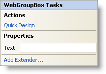

////

|metadata|
{
    "name": "webgroupbox-smart-tag",
    "controlName": ["WebGroupBox"],
    "tags": ["Design Environment","Layouts"],
    "guid": "{8956D7C2-C29C-4CD6-9162-A21F5500E0FC}",  
    "buildFlags": [],
    "createdOn": "2007-05-02T08:05:40Z"
}
|metadata|
////

= WebGroupBox Smart Tag

In Visual Studio 2005 (.NET Framework 2.0), each Infragistics ASP.NET control/component is equipped with a Smart Tag. By simply selecting the control/component, a Smart Tag anchor appears. When you click this anchor, a pop-up panel appears, providing you with quick and easy access to the most common properties and settings of the control/component.

The WebGroupBox™ Smart Tag contains the following sections:

* Actions -- Lets you perform common tasks (i.e., accessing the Quick Designer and loading presets).
* Properties -- Provides easy access to common properties such as Text.
* Add Extender -- Clicking this will bring up a dialog that shows all of the control extenders that can be used with the WebGroupBox.

See below for a description of the item (e.g., field, drop-down list, checkbox) in each section, as well as the item's corresponding property in the properties grid.

[options="header", cols="a,a,a"]
|====
|Actions|Description|CorrespondingProperty

|Quick Design
|Click Quick Design to access the Quick Designer. This is the same functionality as if you right-clicked on the control and selected Quick Design from the context menu.
|n/a

|====

[options="header", cols="a,a,a"]
|====
|Property|Description|CorrespondingProperty

|Text
|The text that will be displayed for this control. The text appears vertically centered with respect to the top border
| pick:[asp-net="link:{ApiPlatform}webui.misc{ApiVersion}~infragistics.webui.misc.webgroupbox~text.html[Text]"] 

|====