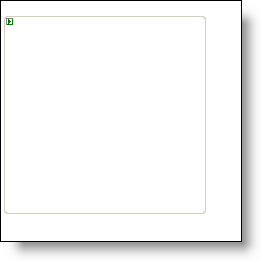
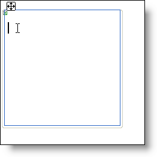

////

|metadata|
{
    "name": "webgroupbox-using-editable-designer-regions-in-webgroupbox",
    "controlName": ["WebGroupBox"],
    "tags": ["Design Environment","Editing","Layouts"],
    "guid": "{0595659E-2CC2-461D-A4EC-47BF86BB51F1}",  
    "buildFlags": [],
    "createdOn": "2005-02-11T00:00:00Z"
}
|metadata|
////

= Using Editable Designer Regions in WebGroupBox

Editable Regions are Visual Studio 2005's (.NET Framework 2.0) replacement for design-time templates. An Editable Region is simply a template that is always in Edit mode. Drag any Web Element into the editable region without having to "Edit Template." Editable Regions now make this process just one step.

The WebGroupBox™ is a simple control with a simple editable designer region. All you need to do is click inside the WebGroupBox and a typing cursor shows up. The editable region is surrounded by a blue (depending on your preset) outline. You can also drop controls directly into the WebGroupBox.

