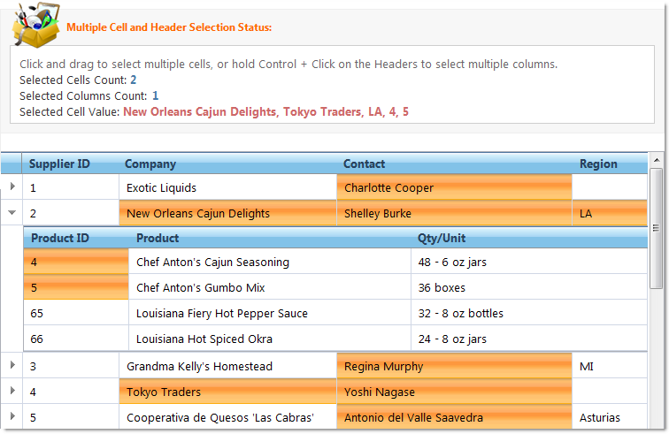

////

|metadata|
{
    "name": "webhierachicaldatagrid-selection",
    "controlName": ["WebHierarchicalDataGrid"],
    "tags": ["Grids","Selection"],
    "guid": "{3E060D4B-EEDF-403D-B6D9-6106FC6C6127}",  
    "buildFlags": [],
    "createdOn": "0001-01-01T00:00:00Z"
}
|metadata|
////

= Selection

The selection behavior enables the selection of rows, cells, and columns of WebHierarchicalDataGrid™. Once the Selection behavior is added, the selection type must be set to specify which objects the user can select.

The select type consists of None, Single, and Multiple choices allowing you to set single or multiple selection of an object, or disable the option altogether.

You can also set client-side events and CSS styles for individual objects when adding the selection behavior.

To enable selection follow these steps.

[start=1]
. In the Microsoft® Visual Studio™ property window, locate the  pick:[asp-net="link:infragistics4.web.v{ProductVersion}~infragistics.web.ui.gridcontrols.webhierarchicaldatagrid~behaviors.html[Behaviors]"]  property and click the ellipsis (...) button to launch the Behaviors Editor Dialog.
[start=2]
. Check the checkbox next to Selection on the left-hand side to add and enable the behavior.
[start=3]
. The  pick:[asp-net="link:infragistics4.web.v{ProductVersion}~infragistics.web.ui.gridcontrols.selection~cellclickaction.html[CellClickAction]"]  property is set to Cell by default. In this example, we will leave the default value.

.Note:
[NOTE]
====
When enabling  pick:[asp-net="link:infragistics4.web.v{ProductVersion}~infragistics.web.ui.gridcontrols.rowdeleting.html[RowDeleting]"]  you are also prompted to add the Selection behavior. If you choose to do so, Selection will be enabled with the and CellClickAction properties set to Single and Row, respectively.
====

[start=4]
. Click Ok to close the dialog. WebHierarchicalDataGrid is now set up to select a cell when it is clicked.

== Cell Selection

By default, the  pick:[asp-net="link:infragistics4.web.v{ProductVersion}~infragistics.web.ui.gridcontrols.selection~cellclickaction.html[CellClickAction]"]  property of the Selection behavior is set to Cell, allowing cell selection. You can set the  pick:[asp-net="link:infragistics4.web.v{ProductVersion}~infragistics.web.ui.gridcontrols.selection~cellselecttype.html[CellSelectType]"]  property to either Single or Multiple.

===== Select a Cell

The end user can select cells by using the mouse or keyboard.

To select cells in code, add cells to the selected cells collection. To unselect a cell, remove it from the collection or call the clear method to remove all selected cells. You can do this both server-side and client-side.

In this example, for the server-side code the  pick:[asp-net="link:infragistics4.web.v{ProductVersion}~infragistics.web.ui.gridcontrols.webhierarchicaldatagrid~rowislanddatabound_ev.html[RowIslandDataBound]"]  event is handled to perform cell selection. Similarly for the client-side code, to select cells in the child band, the Populated client-side event is handled.

*In Visual Basic:*

----
' Hook up RowIslandDataBound event 
AddHandler Me.WebHierarchicalDataGrid1.RowIslandDataBound, AddressOf WebHierarchicalDataGrid1_RowIslandDataBound
Protected Sub WebHierarchicalDataGrid1_RowIslandDataBound(ByVal sender As Object, ByVal e As RowIslandEventArgs) Handles WebHierarchicalDataGrid1.RowIslandDataBound
   ' Selecting a cell in the PARENT band 
   If e.RowIsland.DataMember = "SqlDataSource1_DefaultView" Then
       Dim s As Selection = e.RowIsland.Behaviors.Selection
       s.SelectedCells.Add(e.RowIsland.Rows(5).Items(1))
   End If
   ' Selecting a cell in the CHILD band 
   If e.RowIsland.DataMember = "SqlDataSource2_DefaultView" AndAlso e.RowIsland.ParentRow = Me.WebHierarchicalDataGrid1.GridView.Rows(0) Then
       Dim s As Selection = e.RowIsland.Behaviors.Selection
       s.SelectedCells.Add(e.RowIsland.Rows(0).Items(3))
   End If
End Sub
----

*In C#:*

----
// Hook up RowIslandDataBound event
this.WebHierarchicalDataGrid1.RowIslandDataBound += new RowIslandEventHandler(WebHierarchicalDataGrid1_RowIslandDataBound);
protected void WebHierarchicalDataGrid1_RowIslandDataBound(object sender, RowIslandEventArgs e)
{            
   // Selecting a cell in the PARENT band
   if (e.RowIsland.DataMember == "SqlDataSource1_DefaultView")
   {
      Selection s = e.RowIsland.Behaviors.Selection;
      s.SelectedCells.Add(e.RowIsland.Rows[5].Items[1]);
   }
   // Selecting a cell in the CHILD band
   if (e.RowIsland.DataMember == "SqlDataSource2_DefaultView"
       && e.RowIsland.ParentRow == this.WebHierarchicalDataGrid1.GridView.Rows[0])
   {
      Selection s = e.RowIsland.Behaviors.Selection;
      s.SelectedCells.Add(e.RowIsland.Rows[0].Items[3]);
   }
}
----

*In Javascript:*

----
var grid = $find("WebHierarchicalDataGrid1");
var parentGrid = grid.get_gridView();
var childGrid = grid.get_gridView().get_rows().get_row(0).get_rowIslands(0)[0];
// PARENT cell selection
if (parentGrid!= null)
parentGrid.get_behaviors().get_selection().get_selectedCells().add(parentGrid.get_rows().get_row(0).get_cell(0));
// CHILD cell selection
if (childGrid != null) childGrid.get_behaviors().get_selection().get_selectedCells().add(childGrid.get_rows().get_row(0).get_cell(0));
----

== Column Selection

After enabling column selection, the end user can select a column by clicking on the column’s header. You can also select columns in code by adding them to the selected columns collection.

.Note:
[NOTE]
====
You do not need to set ColumnSelectType when selecting columns in code. All you need is the Selection behavior enabled.
====

In this example, for the server-side code the  pick:[asp-net="link:infragistics4.web.v{ProductVersion}~infragistics.web.ui.gridcontrols.webhierarchicaldatagrid~rowislanddatabound_ev.html[RowIslandDataBound]"]  event is handled to perform column selection. Similarly for the client-side code, to select columns in the child band the Populated client-side event is handled.

*In Visual Basic:*

----
' Hook up RowIslandDataBound event 
AddHandler Me.WebHierarchicalDataGrid1.RowIslandDataBound, AddressOf WebHierarchicalDataGrid1_RowIslandDataBound
Protected Sub WebHierarchicalDataGrid1_RowIslandDataBound(ByVal sender As Object, ByVal e As RowIslandEventArgs)HandlesWebHierarchicalDataGrid1.RowIslandDataBound
   ' Selecting a cell in the PARENT band 
   If e.RowIsland.DataMember = "SqlDataSource1_DefaultView" Then
       Dim s As Selection = e.RowIsland.Behaviors.Selection
       s.SelectedColumns.Add(e.RowIsland.Columns(2))
   End If
   ' Selecting a cell in the CHILD band 
   If e.RowIsland.DataMember = "SqlDataSource2_DefaultView" AndAlso e.RowIsland.ParentRow = Me.WebHierarchicalDataGrid1.GridView.Rows(0) Then
       Dim s As Selection = e.RowIsland.Behaviors.Selection
       s.SelectedColumns.Add(e.RowIsland.Columns(2))
   End If
End Sub
----

*In C#:*

----
// Hook up RowIslandDataBound event
this.WebHierarchicalDataGrid1.RowIslandDataBound += new RowIslandEventHandler(WebHierarchicalDataGrid1_RowIslandDataBound);
protected void WebHierarchicalDataGrid1_RowIslandDataBound(object sender, RowIslandEventArgs e)
{       
   // Selecting a cell in the PARENT band
   if (e.RowIsland.DataMember == "SqlDataSource1_DefaultView")
   {
      Selection s = e.RowIsland.Behaviors.Selection;
      s.SelectedColumns.Add(e.RowIsland.Columns[2]);
   }
   // Selecting a cell in the CHILD band
   if (e.RowIsland.DataMember == "SqlDataSource2_DefaultView"
       && e.RowIsland.ParentRow == this.WebHierarchicalDataGrid1.GridView.Rows[0])
   {
      Selection s = e.RowIsland.Behaviors.Selection;
      s.SelectedColumns.Add(e.RowIsland.Columns[2]);
   }
}
----

*In Javascript:*

----
var grid = $find("WebHierarchicalDataGrid1");
var parentGrid = grid.get_gridView();
var childGrid = grid.get_gridView().get_rows().get_row(3).get_rowIslands(0)[0];
// PARENT column selection
if (parentGrid!= null)
parentGrid.get_behaviors().get_selection().get_selectedColumns().add(parentGrid.get_columns().get_column(0));
// CHILD column selection
if (childGrid != null) childGrid.get_behaviors().get_selection().get_selectedColumns().add(childGrid.get_columns().get_column(0));
----

== Row Selection

There are several ways to select a row after enabling row selection: you can select a row by clicking on a cell in that row or you can also select rows in code by adding them to the selected rows collection. To unselect a row, remove it from the collection.

.Note:
[NOTE]
====
You do not need to set CellClickAction or RowSelectType when selecting rows in code. All you need is the Selection behavior enabled.
====

In this example, for the server-side code the  pick:[asp-net="link:infragistics4.web.v{ProductVersion}~infragistics.web.ui.gridcontrols.webhierarchicaldatagrid~rowislanddatabound_ev.html[RowIslandDataBound]"]  event is handled to perform row selection. Similarly for the client-side code, to select rows in the child band the Populated client event is handled.

*In Visual Basic:*

----
' Hook up RowIslandDataBound event 
AddHandler Me.WebHierarchicalDataGrid1.RowIslandDataBound, AddressOf WebHierarchicalDataGrid1_RowIslandDataBound
Protected Sub WebHierarchicalDataGrid1_RowIslandDataBound(ByVal sender As Object, ByVal e As RowIslandEventArgs) Handles WebHierarchicalDataGrid1.RowIslandDataBound
   ' Selecting a cell in the PARENT band 
   If e.RowIsland.DataMember = "SqlDataSource1_DefaultView" Then
      Dim s As Selection = e.RowIsland.Behaviors.Selection
      s.SelectedRows.Add(e.RowIsland.Rows(2))
   End If
   ' Selecting a cell in the CHILD band 
   If e.RowIsland.DataMember = "SqlDataSource2_DefaultView" AndAlso e.RowIsland.ParentRow = Me.WebHierarchicalDataGrid1.GridView.Rows(0) Then
      Dim s As Selection = e.RowIsland.Behaviors.Selection
      s.SelectedRows.Add(e.RowIsland.Rows(4))
   End If
End Sub
----

*In C#:*

----
// Hook up RowIslandDataBound event
this.WebHierarchicalDataGrid1.RowIslandDataBound += new RowIslandEventHandler(WebHierarchicalDataGrid1_RowIslandDataBound);
protected void WebHierarchicalDataGrid1_RowIslandDataBound(object sender, RowIslandEventArgs e)
{
   // Selecting a cell in the PARENT band
   if (e.RowIsland.DataMember == "SqlDataSource1_DefaultView")
   {
      Selection s = e.RowIsland.Behaviors.Selection;
      s.SelectedRows.Add(e.RowIsland.Rows[2]);
   }
   // Selecting a cell in the CHILD band
   if (e.RowIsland.DataMember == "SqlDataSource2_DefaultView"
        && e.RowIsland.ParentRow == this.WebHierarchicalDataGrid1.GridView.Rows[0])
   {
      Selection s = e.RowIsland.Behaviors.Selection;
      s.SelectedRows.Add(e.RowIsland.Rows[4]);
   }
}
----

*In Javascript:*

----
var grid = $find("WebHierarchicalDataGrid1");
var parentGrid = grid.get_gridView();
var childGrid = grid.get_gridView().get_rows().get_row(3).get_rowIslands(0)[0];
// PARENT row selection
if (parentGrid!= null)
parentGrid.get_behaviors().get_selection().get_selectedRows().add(parentGrid.get_rows().get_row(0));
// CHILD row selection
if (childGrid != null) childGrid.get_behaviors().get_selection().get_selectedRows().add(childGrid.get_rows().get_row(0));
----