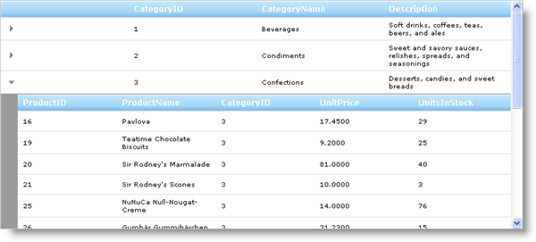

////

|metadata|
{
    "name": "webhierarchicaldatagrid-about-webhierarchicaldatagrid",
    "controlName": ["WebHierarchicalDataGrid"],
    "tags": ["Getting Started","Grids","How Do I"],
    "guid": "{E044D668-DDC5-4019-9860-2B8C4589C314}",  
    "buildFlags": [],
    "createdOn": "0001-01-01T00:00:00Z"
}
|metadata|
////

= About WebHierarchicalDataGrid

The WebHierarchicalDataGrid™ control allows you to display hierarchical data. It derives from the WebDataGrid™ control and has many related features. WebHierarchicalDataGrid introduces bands and container grids to represent a hierarchical data structure. A band represents the data member, and container grids represent the nested row islands for a given row. The following list shows some of the WebHierarchicalDataGrid features:

* *Multiple Bands* – Your data source can contain as many nested levels as you need. Further, you can display sibling child data in WebHierarchicalDataGrid. The sibling child band support alone is a highly sought out feature that does not exist in our standard WebGrid control but does indeed exist in WebHierarchicalDataGrid.
* *Hierarchical Data Source Support* – Supports all hierarchical data source controls as well as DataSet objects and objects that implement the IEnumerable interface.
* *AJAX Enabled* – You can fully enable AJAX in the control for smoother data retrieval and unobtrusive data operations.
* *Client-Side Object Model* - Dynamically work with the control on the client-side using the expansive Javascript API.
* *Autogenerate Bands and Columns* - WebHierarchicalDataGrid can optionally walk through your hierarchical data to automatically produce bands and columns.
* *WebDataGrid™ Features* - You will be able to leverage many behaviors from WebDataGrid on the bands and data islands.

== Hierarchical View

The WebHierarchicalDataGrid control is built upon WebDataGrid. WebHierarchcalDataGrid creates a collection of  pick:[asp-net="link:infragistics4.web.v{ProductVersion}~infragistics.web.ui.gridcontrols.containergrid.html[ContainerGrid]"]  objects to display the different hierarchical views. These objects can have child ContainerGrid objects of their own.

===== ContainerGrid

A ContainerGrid object overrides WebDataGrid with a modified rendering engine that allows injecting hidden child rows in between the standard data rows. These child rows display the nested data when the data row is expanded.

If you have a 2 level hierarchical data structure, WebHierarchicalDataGrid creates a ContainerGrid object for the root level and it also creates additional ContainerGrid objects for the nested data of each parent row.

You can access the root ContainerGrid object by referencing the WebHierarchicalDataGrid control’s  pick:[asp-net="link:infragistics4.web.v{ProductVersion}~infragistics.web.ui.gridcontrols.webhierarchicaldatagrid~gridview.html[GridView]"]  property . Further, you can access a row’s child ContainerGrid objects by using the  pick:[asp-net="link:infragistics4.web.v{ProductVersion}~infragistics.web.ui.gridcontrols.containergridrecord.html[ContainerGridRecord]"]  object’s  pick:[asp-net="link:infragistics4.web.v{ProductVersion}~infragistics.web.ui.gridcontrols.containergridrecord~rowislands.html[RowIslands]"]  property. If you are using Load on Demand, make sure that the ContainerGrid exists; i.e, the parent row is expanded before trying to access the row island.

===== Bands

A  pick:[asp-net="link:infragistics4.web.v{ProductVersion}~infragistics.web.ui.gridcontrols.band.html[Band]"]  object represents all the data islands belonging to a level in the hierarchy. You can use the Band object to set properties, styles, and behaviors specific to each data level. Each Band object implements the  pick:[asp-net="link:infragistics4.web.v{ProductVersion}~infragistics.web.ui.gridcontrols.iband.html[IBand]"]  interface. WebHierarchicalDataGrid implements IBand and represents the root band.

A ContainerGrid object exposes the Bands property of type  pick:[asp-net="link:infragistics4.web.v{ProductVersion}~infragistics.web.ui.gridcontrols.bandcollection.html[BandCollection]"]  containing the different data bands in the control. If you have a data source with a parent-child relationship, WebHierarchicalDataGrid's Bands collection will contain 1 Band object for the child data; the parent band is WebHierarchicalDataGrid itself and settings on this object will apply to only the parent data level. For more information on how to configure settings for different bands see, link:webhierarchicaldatagrid-behaviors.html[Behaviors].

===== Rows

The ContainerGrid object's link:infragistics4.web.v{ProductVersion}~infragistics.web.ui.gridcontrols.containergrid~rows.html[Rows] property of type link:infragistics4.web.v{ProductVersion}~infragistics.web.ui.gridcontrols.containergridrecordcollection.html[ContainerGridRecordCollection] holds ContainerGridRecord objects representing each row belonging to the grid. Each row contains the data cells as well as the ContainerGrid for any nested data.

===== Accessing Row Islands

The following code shows you how to access the nested data collection for the first parent row in WebHierarchicalDataGrid. You can use the DataMember or the index of the data band to reference the container grid in the container grid collection.

*In Visual Basic:*

----
Dim childGrid As ContainerGrid = Me.WebHierarchicalDataGrid1.GridView.Rows(0).RowIslands(0)
' Get row island using data member
Dim childGrid2 As ContainerGrid = Me.WebHierarchicalDataGrid1.GridView.Rows(1).RowIslands("SqlDataSource2_DefaultView")
----

*In C#:*

----
ContainerGrid childGrid = this.WebHierarchicalDataGrid1.GridView.Rows[0].RowIslands[0];
// Get row island using data member
ContainerGrid childGrid2 = this.WebHierarchicalDataGrid1.GridView.Rows[1].RowIslands["SqlDataSource2_DefaultView"];
----

*In Javascript:*

----
// Get top level grid view
var grid = $find("WebHierarchicalDataGrid1");
var containerGrid = grid.get_gridView();
// Get child container grid collection of first row
var rowIslands = containerGrid.get_rows().get_row(0).get_rowIslands(0);
// Get child container grid collection of second row using data member
var rowIslands2 = containerGrid.get_rows().get_row(1).get_rowIslands("SqlDataSource2_DefaultView");
// Get child container grid of first row
var childGrid = rowIslands[0];
// Get child container grid of second row
var childGrid2 = rowIslands2[0];
----

There are also two additional server-side methods you can use to access the row islands:

* RowIslands.FindByDataMember - finds the row island using the band's data member.
* RowIslands.FindByKey - finds teh row island using the band's key.

===== Accessing Parent Row

With a reference to a ContainerGrid object, you can set the properties and behaviors for the data rows in the data island. You can also access the rows of that row island by using the ContainerGrid's Rows property. With a row island, if you need to access its parent row, use the ContainerGrid object's ParentRow property. Further, you can access a row's ContainerGrid object by accessing its owner row collection and referencing the ControlMain property.

The following code follows directly from the code above and shows you how to reference a row's parent row.

*In Visual Basic:*

----
Dim row As ContainerGridRecord = childGrid.Rows(0)
' Get the row's owner row collection 
Dim rowCollection As ContainerGridRecordCollection = row.Owner
' Get the parent row by first accessing the owner Container Grid 
Dim parentRow As ContainerGridRecord = rowCollection.ControlMain.ParentRow
----

*In C#:*

----
ContainerGridRecord row = childGrid.Rows[0];
// Get the row's owner row collection
ContainerGridRecordCollection rowCollection = row.Owner;
// Get the parent row by first accessing the owner Container Grid
ContainerGridRecord parentRow = rowCollection.ControlMain.ParentRow;
----

*In Javascript:*

----
var row = childGrid.get_rows().get_row(0);
// Get container owner Container Grid
 var g = row.get_grid();
// Get parent row
 var parentRow = g.get_parentRow();
----

== Related Topics

link:webhierarchicaldatagrid-getting-started-with-webhierarchicaldatagrid.html[Getting Started with WebHierarchicalDataGrid]

link:webhierarchicaldatagrid-using-webhierarchicaldatagrid.html[Using WebHierarchicalDataGrid]

link:webhierarchicaldatagrid-behaviors.html[Behaviors]