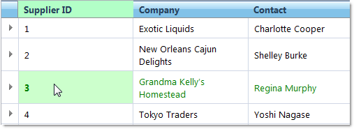

////

|metadata|
{
    "name": "webhierarchicaldatagrid-activation",
    "controlName": ["WebHierarchicalDataGrid"],
    "tags": ["Grids","Selection"],
    "guid": "{C229D7E4-4BF5-40A3-9274-4E30FB070F76}",  
    "buildFlags": [],
    "createdOn": "0001-01-01T00:00:00Z"
}
|metadata|
////

= Activation

=== Grid Activation

The WebHierarchicalDataGrid™ control’s cells support activation. A cell is active when it is the current cell or the last to receive an action, such as a mouse click. The row or column to which an active cell belongs to is considered active as well. An element can also be activated through code. Certain functionalities of WebHierarchicalDataGrid require an active element.

.Note:
[NOTE]
====
Throughout WebHierarchicalDataGrid you can only have one active cell at a time.
====

With Activation turned on, pressing the + key on your keyboard will expand the currently active row if it has children and pressing the – key will collapse it.

=== Activation at Design Time

Cell activation in WebHierarchicalDataGrid is a behavior. To enable it, click the ellipsis (...) button for  pick:[asp-net="link:{ApiPlatform}web{ApiVersion}~infragistics.web.ui.gridcontrols.webhierarchicaldatagrid~behaviors.html[Behavior]"]  in the property window and check the  pick:[asp-net="link:{ApiPlatform}web{ApiVersion}~infragistics.web.ui.gridcontrols.activation.html[Activation]"]  behavior in the Behaviors editor.

WebHierarchicalDataGrid’s cell activation behaves in the following ways:

[start=1]
. When an end user clicks on a cell, that cell and row will both become active.
[start=2]
. If the end user tabs into WebHierarchicalDataGrid, the first cell will become active. The end user can then continue to tab into other cells, or use the arrow keys to navigate. With child bands expanded, the end user can Tab into or use the arrow keys to navigate through the child level cells.
[start=3]
. Once a cell has been activated, WebHierarchicalDataGrid will maintain its activation even if it loses focus.
[start=4]
. WebHierarchicalDataGrid will maintain the active cell during postbacks.
[start=5]
. When a row is selected the first cell in a row will be activated.

=== Activation through Code

WebHierarchicalDataGrid provides properties and methods to get or set an active cell. Use the  pick:[asp-net="link:{ApiPlatform}web{ApiVersion}~infragistics.web.ui.gridcontrols.activation~activecell.html[ActiveCell]"]  property when on the server and use the get or set accessors when on the client. Set the ActiveCell property to Null if you want to clear WebHierarchicalDataGrid of an active cell. You can get the row or column from the active cell if you need them.

The  pick:[asp-net="link:{ApiPlatform}web{ApiVersion}~infragistics.web.ui.gridcontrols.webhierarchicaldatagrid~rowislanddatabound_ev.html[RowIslandDataBound]"]  server-side event is handled to activate the parent and child cell.

The following code assumes Activation Behavior is enabled.

*In Visual Basic:*

----
' Hook up RowIslandDataBound event 
AddHandler Me.WebHierarchicalDataGrid1.RowIslandDataBound, AddressOf WebHierarchicalDataGrid1_RowIslandDataBound
Protected Sub WebHierarchicalDataGrid1_RowIslandDataBound(ByVal sender As Object, ByVal e As RowIslandEventArgs) Handles WebHierarchicalDataGrid1.RowIslandDataBound
   ' Parent band 
   If e.RowIsland.DataMember = "SqlDataSource1_DefaultView" Then
     'Set active cell in parent band 
     Dim active As Activation = e.RowIsland.Behaviors.Activation
     active.ActiveCell = e.RowIsland.Rows(0).Items(1)
   End If
   ' Child band 
   If e.RowIsland.DataMember = "SqlDataSource2_DefaultView" AndAlso e.RowIsland.ParentRow = Me.WebHierarchicalDataGrid1.GridView.Rows(0) Then
      ' Set active cell in child band 
      Dim active As Activation = e.RowIsland.Behaviors.Activation
      active.ActiveCell = e.RowIsland.Rows(0).Items(2)
   End If
End Sub
----

*In C#:*

----
// Hook up RowIslandDataBound event
this.WebHierarchicalDataGrid1.RowIslandDataBound += new RowIslandEventHandler(WebHierarchicalDataGrid1_RowIslandDataBound);
protected void WebHierarchicalDataGrid1_RowIslandDataBound(object sender, RowIslandEventArgs e)
{
   // Parent band
   if (e.RowIsland.DataMember == "SqlDataSource1_DefaultView")
   {
      //Set active cell in parent band
      Activation active = e.RowIsland.Behaviors.Activation;
      active.ActiveCell = e.RowIsland.Rows[0].Items[1];
   }
   // Child band
   if (e.RowIsland.DataMember == "SqlDataSource2_DefaultView"
        && e.RowIsland.ParentRow == this.WebHierarchicalDataGrid1.GridView.Rows[0])
   {
      // Set active cell in child band
      Activation active = e.RowIsland.Behaviors.Activation;
      active.ActiveCell = e.RowIsland.Rows[0].Items[2];
   }
}
----

*In Javascript:*

----
var parentGrid = grid.get_gridView();
// Set Active parent Cell
if (parentGrid != null) parentGrid.get_behaviors().get_activation().set_activeCell(parentGrid.get_rows().get_row(0).get_cell(2));
var childGrid = grid.get_gridView().get_rows().get_row(0).get_rowIslands(0)[0];
// Set Active cell in child level
if (childGrid != null) childGrid.get_behaviors().get_activation().set_activeCell(childGrid.get_rows().get_row(0).get_cell(2));
----

=== Activation with Keyboard

The following are ways to activate WebHierarchicalDataGrid with the keyboard:

===== +/- Keys

Pressing the + key expands the currently active row if it has children and similarly pressing the - key collapse the active row.

===== Arrow Keys

* Move through the WebHierarchicalDataGrid cells.
* The arrow keys will let the end user navigate within cells only.
* With child levels expanded, navigation depends upon the arrow keys the end user is pressing. Navigates up to the last cell within child level and then back to the active parent cell that was last active.

===== Tab

* Move to the next cell in a row.
* If the last cell of a row is active, then pressing Tab activates the first cell of the next row, if one exists.
* If it is the last cell in the last row, move focus to the next control.
* With child levels expanded, moves from the expanded parent cell to the first cell within child band.

===== Enter Key

* Move to the cell below.
* If already in the last row, then stay there.
* With child levels expanded, moves from the expanded parent cell to the first cell within child band. If in the last cell within the child band, pressing enter moves to the corresponding parent cell that was last active.

===== Shift Enter Key

* Move to Cell Above.
* If already in the top most row, then stay there.
* With child levels expanded, moves to cell above the current cell. If in the first row of a child level activation moves up to the last cell of the expanded parent row.

===== Shift + Tab

* Move to the previous cell in a row.
* If it is the first cell in the first row, then move focus to the control, and then to the next control.
* If in the first cell of a row, then move to the last cell of the previous row, if one exists.
* With child levels expanded, and if in the first cell of a child row, activation moves to the last cell of the expanded parent row.

===== Shift + [Any Arrow Keys]

* Begin cell selection from the active cell and navigate depending on the arrow keys the end user is pressing.

===== Activation with Mouse

* Click on a cell or a row to activate it.

===== Activation Styling

The active elements of WebHierarchicalDataGrid can be styled individually using CSS. This can be done by creating a CSS style and setting the appropriate property for the element you want to style. For example, to style an active row, set the ActiveRowCSSClass property.

== Related Topics

link:webhierarchicaldatagrid-cell-editing.html[Cell Editing]

link:webhierarchicaldatagrid-enabling-paging.html[Enabling Paging]

link:webhierarchicaldatagrid-enabling-row-adding.html[Enabling Row Adding]

link:webhierarchicaldatagrid-enabling-row-deleting.html[Enabling Row Deleting]

link:webhierachicaldatagrid-selection.html[Selection]

link:webhierarchicaldatagrid-sorting.html[Sorting]