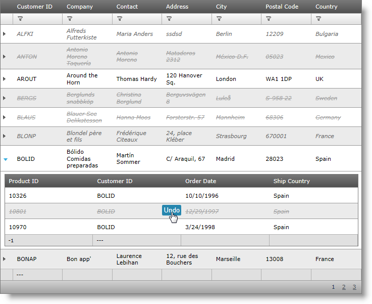

////

|metadata|
{
    "name": "webhierarchicaldatagrid-batch-updating-enabling",
    "controlName": ["WebHierarchicalDataGrid"],
    "tags": ["Editing","Getting Started","Grids","Performance"],
    "guid": "684d32ac-e165-4a1c-a674-149c5801c828",  
    "buildFlags": [],
    "createdOn": "2011-10-26T07:53:03.8643328Z"
}
|metadata|
////

= Enabling Batch Updating

This topic demonstrates how to enable batch updating for the WebHierarchicalDataGrid™ and how the user can undo the changes made during batch updating.

== Introduction

When batch updating is enabled, an unlimited number of rows can be modified without calling the server, as it is the case with the “normal: editing behavior. With batch updating, all changes – adding, updating, deleting rows are kept on the client and are send to the server on the first triggered postback . The picture below demonstrates an igHierarchicalGrid with batch update feature enabled.

Figure 1: Modifying rows in a batch in the WebHierarchicalDataGrid

== Enabling Batch Updating

To enable batch updating, you only need to set the BatchUpdate property to true in either the markup or the code behind. Note that for the child bands, you need to enable the Batch updating mode separately. This is true for all the child features – you need to specify the batch options individually for every band.

*In ASPX:*

----
<ig:WebHierarchicalDataGrid ID="whdg1" runat="server">
    <Behaviors>
        <ig:Activation/>                 
        <ig:EditingCore BatchUpdating="true">
            <Behaviors>
                <ig:RowAdding/>
                <ig:RowDeleting/>
                <ig:CellEditing/>
            </Behaviors>
        </ig:EditingCore>
    </Behaviors>
    <Bands>
        <ig:Band>
            <Behaviors>
                <ig:EditingCore BatchUpdating="true">
                    <Behaviors>
                        <ig:RowAdding/>
                        <ig:RowDeleting/>
                        <ig:CellEditing/>
                    </Behaviors>
                </ig:EditingCore>
            </Behaviors>
        </ig:Band>
    </Bands>
</ig:WebHierarchicalDataGrid>
----

*In C#:*

----
this.whdg1.Behaviors.EditingCore.BatchUpdating = true;
this.whdg1.Bands[0].Behaviors.EditingCore.BatchUpdating = true;
----

Alternatively, you can just enable inheritance for the particular behavior and achieve the same result. So if you enable inheritance on parent level, you won’t need to do enable it again for the children bands.

*In ASPX:*

----
<ig:WebHierarchicalDataGrid ID="whdg1" runat="server">
    <Behaviors>
        <ig:Activation/>                 
        <ig:EditingCore EnableInheritance="true" BatchUpdating="true">
            <Behaviors>
                <ig:RowAdding/>
                <ig:RowDeleting/>
                <ig:CellEditing/>
            </Behaviors>
        </ig:EditingCore>
    </Behaviors>
    <Bands>
        <ig:Band>
        </ig:Band>
    </Bands>
</ig:WebHierarchicalDataGrid>
----

*In C#:*

----
this.whdg1.Behaviors.EditingCore.BatchUpdating = true;
this.whdg1.Behaviors.EditingCore.EnableInheritance = true;
----

To verify the result open the page in your web browser. You should be able to modify rows in a batch as shown in Figure 1.

.Note:
[NOTE]
====
When you add a parent row you need to make a postback to save it to the database. Only after that you can add, delete, or update any child rows.
====

== Recovering the Original Data

A great advantage of the batch update feature is that, as long as you are in Batch Update mode (that is, the changes have not been committed to the server yet), you can to recover every modified row data to its original state.

Recovering is done one row at a time, by placing the focus on the row to be recovered. After that:

* Press Ctrl+Z to undo the edits made to the row
* Click the Undo hover button to restore a deleted row

Figure 2: Deleted row with Undo functionality

.Note:
[NOTE]
====
Apart from mouse click, the Undo button can be activated by pressing either Enter or the Space key on the keyboard.
====

== Related Topics

link:webhierarchicaldatagrid-batch-updating-overview.html[WebHierarchicalDataGrid Batch Updating Overview]

link:webhierarchicaldatagrid-batch-updating-events.html[WebHierarchicalDataGrid Batch Updating Events]

link:webhierarchicaldatagrid-batch-updating-summaries.html[WebHierarchicalDataGrid Batch Updating Summaries]

link:known-issues-known-issues-and-breaking-changes-revision-history.html[Known Issues and Breaking Changes]