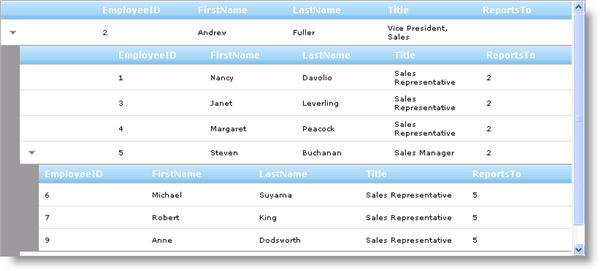

////

|metadata|
{
    "name": "webhierarchicaldatagrid-binding-to-self-related-data",
    "controlName": ["WebHierarchicalDataGrid"],
    "tags": ["Data Binding","Grids"],
    "guid": "{DFEE815A-E3D6-4249-AF71-C219D31D2FBD}",  
    "buildFlags": [],
    "createdOn": "2009-01-10T14:45:43Z"
}
|metadata|
////

= Binding to Self-Related Data

== Before You Begin

You can bind WebHierarchicalDataGrid™ to a self-related data source. The control displays the data in a hierarchical view; however, it contains only 1 band. Since a self-referential data source can have an infinite amount of levels in its hierarchy, you can use the link:{ApiPlatform}web{ApiVersion}~infragistics.web.ui.gridcontrols.webhierarchicaldatagrid~maxdatabinddepth.html[MaxDataBindDepth] property to set the maximum data binding depth.

== What You Will Accomplish

You will learn how to bind to a self-referential data set using the Employees table from the Northwind database.

== Follow these Steps

[start=1]
. Create an ASP.Net web page.
[start=2]
. Drag a ScriptManager component from the toolbox onto the page.
[start=3]
. Drag a WebHierarchicalDataGrid control from the toolbox onto the page.
[start=4]
. Handle the page's Init event.

.. Establish a connection to the Northwind database and retrieve the Employees table.
.. Set up a self relation using the EmployeeID and ReportsTo columns.
.. Set the primary key field for the Employees table.
.. Store the table in Session state.
.. Set WebHierchicalDataGrid's link:{ApiPlatform}web{ApiVersion}~infragistics.web.ui.gridcontrols.webhierarchicaldatagrid~isselfreference.html[IsSelfReference] property to True to allow self referencing data.
.. Set up the MaxDataBindDepth property to 2 to allow 3 levels of data. The property allows 1 level of data (the root level) with a value of 0, and allows all levels with a value of -1.

*In Visual Basic:*

----
Protected Sub Page_Init(ByVal sender As Object, ByVal e As EventArgs)
   If Not Page.IsPostBack Then
      ' Set up connection and command to retrieve the Employees table 
      Dim con As New SqlConnection("Data Source=.\sqlexpress;Initial Catalog=Northwind;Integrated Security=True")
      Dim com As New SqlCommand("SELECT EmployeeID, FirstName, LastName, Title, ReportsTo FROM EMPLOYEES", con)
      ' Set up a data adapter to fill up a dataset with data 
      Dim da As New SqlDataAdapter(com)
      Dim employees As New DataSet()
      con.Open()
      ' Retrieve data 
      da.Fill(employees, "Employees")
      con.Close()
      ' Set up data relation for the same table with the EmployeeID and ReportsTo columns 
      Dim rel As New DataRelation("Employees", employees.Tables("Employees").Columns("EmployeeID"), employees.Tables("Employees").Columns("ReportsTo"))
      employees.Relations.Add(rel)
      ' Set the table's primary key field
      employees.Tables("Employees").PrimaryKey = New DataColumn() {employees.Tables("Employees").Columns("EmployeeID")}
      ' Store the data in Session state 
      Me.Session("Employees") = employees
      Me.WebHierarchicalDataGrid2.IsSelfReference = True
      Me.WebHierarchicalDataGrid2.MaxDataBindDepth = 2
   End If
   ' TODO: set up data binding 
End Sub
----

*In C#:*

----
protected void Page_Init(object sender, EventArgs e)
{
   if (!Page.IsPostBack)
   {
      // Set up connection and command to retrieve the Employees table
      SqlConnection con = new SqlConnection(@"Data Source=.\sqlexpress;Initial Catalog=Northwind;Integrated Security=True");
      SqlCommand com = new SqlCommand("SELECT EmployeeID, FirstName, LastName, Title, ReportsTo FROM EMPLOYEES", con);
      // Set up a data adapter to fill up a dataset with data
      SqlDataAdapter da = new SqlDataAdapter(com);
      DataSet employees = new DataSet();
      con.Open();
      // Retrieve data
      da.Fill(employees, "Employees");
      con.Close();
      // Set up data relation for the same table with the EmployeeID and ReportsTo columns
      DataRelation rel = new DataRelation("Employees", employees.Tables["Employees"].Columns["EmployeeID"], employees.Tables["Employees"].Columns["ReportsTo"]);
      employees.Relations.Add(rel);
      // Set the table's primary key field
      employees.Tables["Employees"].PrimaryKey = new DataColumn[] {employees.Tables["Employees"].Columns["EmployeeID"]};
      // Store the data in Session state
      this.Session["Employees"] = employees;
      this.WebHierarchicalDataGrid2.IsSelfReference = true;
      this.WebHierarchicalDataGrid2.MaxDataBindDepth = 2;
   }
   // TODO: set up data binding
}
----

[start=5]
. Set up WebHierarchicalDataGrid to bind to the Employees table.

.Note:
[NOTE]
====
Since we are using load on demand, this portion of code has to be executed on every postback. This is the reason why we place it in the Page Load event outside If statement. For more information on this, see Load On Demand.
====

*In Visual Basic:*

----
' Retrieve data from Session state 
Dim ds As DataSet = TryCast(Me.Session("Employees"), DataSet)
' Set up data source and bind to grid 
Me.WebHierarchicalDataGrid2.DataSource = ds 
Me.WebHierarchicalDataGrid2.DataMember = "Employees" 
Me.WebHierarchicalDataGrid2.DataKeyFields = "EmployeeID" 
Me.WebHierarchicalDataGrid2.Key = "Employees" 
Me.WebHierarchicalDataGrid2.DataBind()      
----

*In C#:*

----
// Retrieve data from Session state
DataSet ds = this.Session["Employees"] as DataSet;
// Set up data source and bind to grid
this.WebHierarchicalDataGrid2.DataSource = ds;
this.WebHierarchicalDataGrid2.DataMember = "Employees";
this.WebHierarchicalDataGrid2.DataKeyFields = "EmployeeID";
this.WebHierarchicalDataGrid2.Key = "Employees";
this.WebHierarchicalDataGrid2.DataBind();
----

[start=6]
. Run the application. WebHierarchicalDataGrid displays a hierarchy of data using one band.

== Related Topics

link:webhierarchicaldatagrid-binding-to-xml-data-source.html[Binding to Xml Data Source]