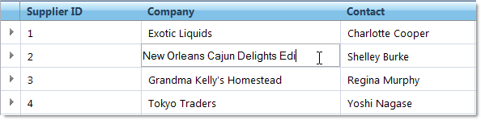

////

|metadata|
{
    "name": "webhierarchicaldatagrid-cell-editing",
    "controlName": ["WebHierarchicalDataGrid"],
    "tags": ["Editing","Grids"],
    "guid": "{43E96E6C-E8C1-40E4-A2BB-A56A19E1BDB4}",  
    "buildFlags": [],
    "createdOn": "0001-01-01T00:00:00Z"
}
|metadata|
////

= Cell Editing (WebHierarchicalDataGrid)

Editing a cell's value in WebHierarchicalDataGrid™ is restricted to client-side only. You can edit the value of a cell by getting a reference to that cell and calling its set value method.

On the server, a cell’s value is read-only; however, you can retrieve the value for operations such as data validation. You can retrieve a cell’s value both server-side and client-side.

The following code shows you how to retrieve and edit the value of a cell in WebHierarchicalDataGrid.

.Note:
[NOTE]
====
You need the  pick:[asp-net="link:{ApiPlatform}web{ApiVersion}~infragistics.web.ui.gridcontrols.editingcore.html[EditingCore]"]  behavior enabled and its  pick:[asp-net="link:{ApiPlatform}web{ApiVersion}~infragistics.web.ui.gridcontrols.editingcore~enableinheritance.html[EnableInheritance]"]  property set to true in order to edit cells programmatically.
====

*In Visual Basic:*

----
' Hook up RowIslandDataBound event 
AddHandler Me.WebHierarchicalDataGrid1.RowIslandDataBound, AddressOf WebHierarchicalDataGrid1_RowIslandDataBound
Protected Sub WebHierarchicalDataGrid1_RowIslandDataBound(ByVal sender As Object, ByVal e As RowIslandEventArgs) Handles WebHierarchicalDataGrid1.RowIslandDataBound
   If e.RowIsland.DataMember = "SqlDataSource1_DefaultView" Then
      ' Access a PARENT cell value 
      Dim cellValue As String = e.RowIsland.Rows(0).Items(1).Value.ToString()
   End If
End Sub
----

*In C#:*

----
// Hook up RowIslandDataBound event
this.WebHierarchicalDataGrid1.RowIslandDataBound += new RowIslandEventHandler(WebHierarchicalDataGrid1_RowIslandDataBound);
protected void WebHierarchicalDataGrid1_RowIslandDataBound(object sender, RowIslandEventArgs e)
{
   if(e.RowIsland.DataMember == "SqlDataSource1_DefaultView")
   {
      // Access a PARENT cell value
      string cellValue = e.RowIsland.Rows[0].Items[1].Value.ToString();    
   }
}
----

*In Javascript:*

----
var grid = $find("WebHierarchicalDataGrid1");
var parentGrid = grid.get_gridView();
// Retrieve and set PARENT cell value 
var oldvalue = parentGrid.get_rows().get_row(0).get_cell(1).get_value(); parentGrid.get_rows().get_row(0).get_cell(1).set_value("new string value");
// Retrieve and set CHILD cell value
var childGrid = grid.get_gridView().get_rows().get_row(0).get_rowIslands(0)[0];
var oldValue = childGrid.get_rows().get_row(0).get_cell(1).get_value();
childGrid.get_rows().get_row(0).get_cell(1).set_value("NewChildValue");
----

== Enabling Cell Editing

To enable data editing in WebHierarchicalDataGrid, add the  pick:[asp-net="link:{ApiPlatform}web{ApiVersion}~infragistics.web.ui.gridcontrols.cellediting.html[CellEditing]"]  behavior to the  pick:[asp-net="link:{ApiPlatform}web{ApiVersion}~infragistics.web.ui.gridcontrols.behaviors.html[Behaviors]"]  collection. The  pick:[asp-net="link:{ApiPlatform}web{ApiVersion}~infragistics.web.ui.gridcontrols.editablebehaviorbase~editmodeactions.html[EditModeActions]"]  property of the CellEditing behavior lets you determine what actions will cause a cell to enter edit mode.

If you have handled the  pick:[asp-net="link:{ApiPlatform}web{ApiVersion}~infragistics.web.ui.gridcontrols.webhierarchicaldatagrid~rowupdating_ev.html[RowUpdating]"]  event, changes will commit immediately to your data source as you lose focus on the edited row. For a row to obtain or lose focus, you must have the Activation behavior enabled. For more information on the Activation behavior, see the link:webhierarchicaldatagrid-activation.html[Activation] topic.

.Note:
[NOTE]
====
You must have a supported data source for this type of automatic update to occur. If your data source cannot be automatically updated by WebHierarchicalDataGrid, you must handle the update events and update the data manually.
====

To enable cell editing follow these steps:

[start=1]
. Bind WebHierarchicalDataGrid to a WebHierarchicalDataSource™ component retrieving data from the Categories and products table. For more information on this see the link:webhierarchicaldatasource-using-webhierarchicaldatasource.html[Using WebHierarchicalDataSource] topic.
[start=2]
. In the Microsoft® Visual Studio property window, locate the Behaviors property and click the ellipsis (…) button to launch the Behaviors Editor dialog.
[start=3]
. Check the checkbox next to Cell Editing from the list of behaviors on the left to enable the behavior. Notice that the  pick:[asp-net="link:{ApiPlatform}web{ApiVersion}~infragistics.web.ui.gridcontrols.editingcore.html[EditingCore]"]  behavior is added as well.
[start=4]
. Set  pick:[asp-net="link:{ApiPlatform}web{ApiVersion}~infragistics.web.ui.gridcontrols.editingcore~enableinheritance.html[EnableInheritance]"]  property of the EditingCore and Cell Editing behaviors to True. This enables all the child levels to automatically inherit Cell Editing behavior. The property’s default value is False.
[start=5]
. In the Cell Editing property section, under the EditModeActions property, set the  pick:[asp-net="link:{ApiPlatform}web{ApiVersion}~infragistics.web.ui.gridcontrols.editmodeactions~mouseclick.html[MouseClick]"]  property to Single. This specifies that a cell enters edit mode on a single click. Default is Double Click.
[start=6]
. Click Apply then Ok.
[start=7]
. Go to the events view of the property window for WebHierarchicalDataGrid and handle the RowUpdating event. You do not have to add any code to the event handler.
[start=8]
. Check that EnableAjax is True in the property window of WebHierarchicalDataGrid. If not, set it to True.
[start=9]
. Run the application. When you click on a cell, the cell enters edit mode allowing you to change the data. Once you click off of the cell you just edited, the change is committed to your data source via AJAX.

== Related Topics

link:webhierarchicaldatagrid-behaviors.html[Behaviors]