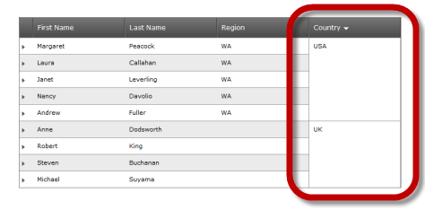
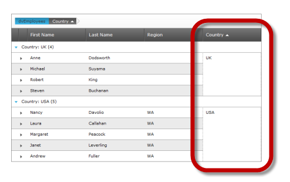

////

|metadata|
{
    "name": "webhierarchicaldatagrid-cell-merging-overview",
    "controlName": ["WebHierarchicalDataGrid"],
    "tags": [],
    "guid": "895c2a95-70ed-4dc4-a4b9-a1dbf5396d1e",  
    "buildFlags": [],
    "createdOn": "2012-04-16T16:48:39.7548288Z"
}
|metadata|
////

= Cell Merging Overview (WebHierarchicalDataGrid)

=== Purpose

An introduction to Merging Cells using the  _WebHierarchicalDataGrid_™ control feature.

=== Required background

Prerequisite materials to understanding this topic.

[options="header", cols="a,a"]
|====
|Topic|Purpose

|[[_Hlk319418933]] 

link:webhierarchicaldatagrid-sorting.html[Sorting]
|Demonstrates through code examples how to enable sorting in the _WebHierarchicalDataGrid_ .

|[[_Hlk319416570]] 

link:webhierarchicaldatagrid-about-outlook-groupby.html[About Outlook GroupBy]
|Demonstrates through code examples how to enable the Outlook GroupBy feature of the _WebHierarchicalDataGrid_ .

|====

== Cell Merging Overview

=== Introduction

Cell merging enables you to sort or group data within the  _WebHierarchicalDataGrid_   and display that data with cells containing the same values merged into a single cell. The cells only appear merged; the grid structure is not affected by the use of this function. Cell merging works with both the link:webhierarchicaldatagrid-sorting.html[sorting] behavior and link:webhierarchicaldatagrid-about-outlook-groupby.html[grouping] settings of the  _WebHierarchicalDataGrid_ .

The following screens illustrate an unmerged display (Figure 1) and a merged display (Figure 2). As you can see the merged display below (Figure 2), has sorted the records, gathering those records with the same region and displaying region as a single merged cell with one instance of the cell’s data.

[cols="a,a"]
|====
|image::images/Overview_page_for_Cell_Merging_1_WHDG.png[]Figure 1 - Sort with Cell Merge disabled|image::images/Overview_page_for_Cell_Merging_2__WHDG.png[]Figure 2 - Sort with Cell Merge enabled

|====

By default, Cell Merging is disabled. Refer to the topic, link:webhierarchicaldatagrid-enabling-cell-merging.html[Enabling Cell Merging] for information on enabling this feature.

=== Supported Cell Merging behaviors

Cell merging can be independently enabled or disabled for either sorting behavior or grouping settings. A detailed explanation of how cell merging impacts each of these follows.

=== Cell Merging on sorting

The following screen shot illustrates how the data of a sorted  _WebHierarchicalDataGrid_   appears with Cell Merging enabled.

A close inspection of <<_Ref320880084,Figure 3 - Examples of Sort with Cell Merging Enabled>> reveals the effects of using the  _WebHierarchicalDataGrid_   _’s_   sorting behavior with Cell Merging enabled. In the sorting example, the sort criteria is for records where Country = ‘USA’, as you can see records meeting these criteria appear clustered together at the top of the grid.

[[_Ref320880084]]
Figure 3 - Examples of Sort with Cell Merging Enabled

==== Related Topics:

* link:webhierarchicaldatagrid-enabling-cell-merging.html[Enabling Cell Merging]
* link:webhierarchicaldatagrid-sorting.html[Sorting]

=== Cell Merging on grouping

The following screen shot illustrates the effect of  _WebHierarchicalDataGrid_   _’s_   group setting with Cell Merging enabled.

As you can see the country column contains values representing different countries, in this case the  __UK__  and  __USA__ . When displayed, the records are grouped by country where the value within the country cells has the same values, as in this example records belonging to either the  __UK__  or the  __USA__  are visually merged with other records belonging to the same country. Additionally, note that a row appears before the grouped records identifying the item grouped, its value and a record count. In this case Country, UK and USA with 4 and 5 records respectively.

==== Related Topics:

* link:webhierarchicaldatagrid-enabling-cell-merging.html[Enabling Cell Merging]
* link:webhierarchicaldatagrid-about-outlook-groupby.html[Outlook GroupBy]

*Related Content*

=== Topics

The following topics provide additional information related to this topic.

[options="header", cols="a,a"]
|====
|Topic|Purpose

| link:webhierarchicaldatagrid-enabling-cell-merging.html[Enabling Cell Merging (WebDataHierarchicalGrid)]
|

| link:webhierarchicaldatagrid-about-outlook-groupby.html[Outlook GroupBy]
|

| link:webhierarchicaldatagrid-sorting.html[Sorting]
|

|====

=== Samples

The following samples provide additional information related to this topic.

[options="header", cols="a,a"]
|====
|Sample|Purpose

| link:{SamplesURL}/samples/webhierarchicaldatagrid/organization/sortingcellmerging/default.aspx?cn=hierarchical-data-grid&sid=bec77c3a-c432-4f5f-a526-a6e7bb4cc9c2[Cell Merging with Sorting]
|Demonstrates the _WebHierarchicalDataGrid_ _’s_ capabilities using its sort behavior with Cell Merging enabled. .

| link:{SamplesURL}/samples/webhierarchicaldatagrid/organization/groupbycellmerging/default.aspx?cn=hierarchical-data-grid&sid=79b0908a-792b-419f-ae00-c6d3947b2866[Cell Merging with Grouping]
|Demonstrates the _WebHierarchicalDataGrid_ _’s_ capabilities using its group setting with Cell Merging enabled.

|====