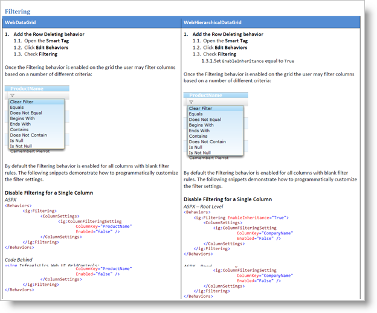

////

|metadata|
{
    "name": "webhierarchicaldatagrid-cheat-sheet",
    "controlName": ["WebHierarchicalDataGrid"],
    "tags": ["How Do I"],
    "guid": "4c1f09a3-3b91-404f-99d8-87fb22350c47",  
    "buildFlags": [],
    "createdOn": "2011-05-28T07:34:30.917845Z"
}
|metadata|
////

= WebHierarchicalDataGrid Cheat Sheet

The link:http://dl.infragistics.com/pg/cheat-sheet/InfragisticsASPNETGridCheatSheet.pdf[Infragistics ASP.NET Grid Cheat Sheet] is available for your reference to provide quick-access guidance to the myriad of features found in both the WebDataGrid™ and WebHierarchicalDataGrid™.

The cheat sheet is a step-by-step guide to using the features and behaviors of the Infragistics ASP.NET AJAX grid controls. Steps and code for both grids is listed side-by-side for easy comparison among the controls.

*Figure 1: Screenshot of the cheat sheet detailing working with grid filtering*

link:http://dl.infragistics.com/pg/cheat-sheet/InfragisticsASPNETGridCheatSheet.pdf[Download the cheat sheet here.]