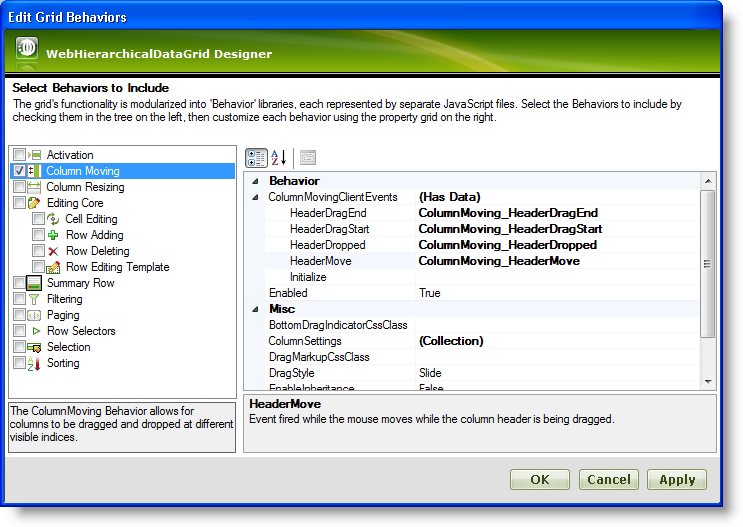

////

|metadata|
{
    "name": "webhierarchicaldatagrid-column-moving",
    "controlName": ["WebHierarchicalDataGrid"],
    "tags": [],
    "guid": "bfbd48f4-c12d-4e24-bd9b-d0e1483122ab",  
    "buildFlags": [],
    "createdOn": "2011-06-02T12:21:09.3527642Z"
}
|metadata|
////

= Column Moving

== Introduction

As of version 2011.1 the WebHierarchicalDataGrid™ control supports moving columns across the grid similarly to the same functionality found in the WebDataGrid™ control. With the ColumnMoving behavior enabled, users are able to drag and drop columns thus rearranging them to their taste. A column of a band with the behavior enabled is moved for each child band deriving from it.

== Column Moving with Hierarchical Data

As you move columns around within hierarchical data, please keep the following in mind:

* When two child row islands are expanded from the same band and a column is moved in one of the bands, a postback occurs to enable the WebHierarchicalDataGrid control to change the visible index on the band column. .Note:
[NOTE]
====
Both row islands return with the altered visible index.
====
* When load on demand is enabled and a column is moved in a child row island, columns in an adjacent bands belonging to the same parent are also moved.
* If columns are auto generated for a band, only the row island where the columns are moved will have its visible indexes altered.
* When column grouping is enabled along with column moving, whether a column is grouped or moved is determined by whether the drop operation is over the group area. Also if grouping is on, and a column is already grouped or the column is a template column, a drag operation begins as long as the column is movable. The opposite is also true - if a column has a column setting making it unmovable, a drag operation will still start if it can be grouped.
* When column grouping is enabled, the grid allows dragging columns to both locations: to the group-by area and to another position in the header.  pick:[asp-net="link:{ApiPlatform}web{ApiVersion}~infragistics.web.ui.gridcontrols.columnmoving~dragstyle.html[DragStyle]"]  moving behavior is set to “follow” in this case to allow grouping.

== Enabling Column Moving

You can set up the column moving behavior from the behaviors dialog at design time in the markup or on runtime as shown by Listing 1 and Listing 2.

*Listing 1: Enable column moving at design time*

*In HTML:*

----
<Behaviors>
   <ig:ColumnMoving EnableInheritance="True">
   </ig:ColumnMoving>
</Behaviors>
----

*Listing 2: Enable column moving at runtime*

*In Visual Basic:*

----
WebHierarchicalDataGrid1.Behaviors.CreateBehavior(Of Infragistics.Web.UI.GridControls.ColumnMoving)()
WebHierarchicalDataGrid1.Behaviors.ColumnMoving.EnableInheritance = True
----

*In C#:*

----
WebHierarchicalDataGrid1.Behaviors.CreateBehavior<Infragistics.Web.UI.GridControls.ColumnMoving>();
WebHierarchicalDataGrid1.Behaviors.ColumnMoving.EnableInheritance = true;
----

In each of the examples the  pick:[asp-net="link:{ApiPlatform}web{ApiVersion}~infragistics.web.ui.gridcontrols.columnmoving~enableinheritance.html[EnableInheritance]"]  property determines whether the functionality transfers to the child bands or not.

== Column Moving Events

This new behavior of the WebHierarchicalDataGrid comes with a few client-side events that can be used for executing custom code. They cover the most important actions the end user performs when moving a column, namely –  pick:[asp-net="link:{ApiPlatform}web{ApiVersion}~infragistics.web.ui.gridcontrols.columnmovingclientevents~headerdragstart.html[HeaderDragStart]"] ,  pick:[asp-net="link:{ApiPlatform}web{ApiVersion}~infragistics.web.ui.gridcontrols.columnmovingclientevents~headerdragend.html[HeaderDragEnd]"] ,  pick:[asp-net="link:{ApiPlatform}web{ApiVersion}~infragistics.web.ui.gridcontrols.columnmovingclientevents~headermove.html[HeaderMove]"]  and  pick:[asp-net="link:{ApiPlatform}web{ApiVersion}~infragistics.web.ui.gridcontrols.columnmovingclientevents~headerdropped.html[HeaderDropped]"] . An  pick:[asp-net="link:{ApiPlatform}web{ApiVersion}~infragistics.web.ui.framework.clienteventsbase~initialize.html[Initialize]"]  event is also available.

== Subscribing with the Designer

You can subscribe to all the aforementioned events using the Designer. To do this, click on the Behaviors link in the link:webhierarchicaldatagrid-webhierarchicaldatagrid-smart-tag.html[WebHierarchicalDataGrid Smart Tag]. Then select Column Moving and expand the  pick:[asp-net="link:{ApiPlatform}web{ApiVersion}~infragistics.web.ui.gridcontrols.columnmoving~columnmovingclientevents.html[ColumnMovingClientEvents]"]  property. Below you can find a screenshot of a sample WebHierarchicalDataGrid Behaviors Designer with most client events subscribed to.

== Subscribing in Code

To subscribe to client events in code you can refer to the following sample:

*In HTML:*

----
<Behaviors>
   <ig:ColumnMoving>
      <ColumnMovingClientEvents HeaderDragEnd="ColumnMoving_HeaderDragEnd" 
         HeaderDragStart="ColumnMoving_HeaderDragStart" 
         HeaderDropped="ColumnMoving_HeaderDropped" 
         HeaderMove="ColumnMoving_HeaderMove" />
   </ig:ColumnMoving>
</Behaviors>
----

*In Javascript:*

----
function ColumnMoving_HeaderMove(sender, eventArgs)
{
}
----

== Server Events

When a column move operation happens for a band, the  pick:[asp-net="link:{ApiPlatform}web{ApiVersion}~infragistics.web.ui.gridcontrols.webhierarchicaldatagrid~columnmoved_ev.html[ColumnMoved]"]  server event will fire with the sender being the  pick:[asp-net="link:{ApiPlatform}web{ApiVersion}~infragistics.web.ui.gridcontrols.iband.html[IBand]"]  that the move happened in rather than a WebHierarchicalDataGrid.

== Related Topics

link:webhierarchicaldatagrid-column-resizing.html[Column Resizing]