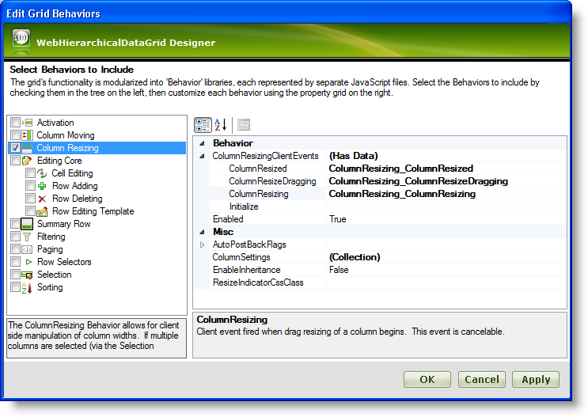

////

|metadata|
{
    "name": "webhierarchicaldatagrid-column-resizing",
    "controlName": ["WebHierarchicalDataGrid"],
    "tags": [],
    "guid": "f81dbdb3-c6bf-4152-a094-3efee1cf73db",  
    "buildFlags": [],
    "createdOn": "2011-06-02T12:22:28.178646Z"
}
|metadata|
////

= Column Resizing

== Introduction

As of version 11.1 the WebHierarchicalDataGrid™ control supports resizing similarly to the same functionality present in the WebDataGrid™ control. With the ColumnResizing behavior enabled users are able to drag and drop the edges of columns thus resizing them. A column of a band with the behavior enabled is resized for each child band deriving from it.

== Column Resizing with Hierarchical Data

As you resize columns within hierarchical data, please keep the following in mind:

* When load on demand is enabled and a column is resized in a child row island, columns in an adjacent bands belonging to the same parent are also resized.
* Whether a postback occurs for the WebHierarchicalDataGrid when a resize operation happens is determined by the ColumnResized AutoPostbackFlag. If true, a postback occurs. If false, the resize is done on the client.
* If columns are auto generated for a band, only the row island that has the where columns are resized will have its widths altered. However, if other row islands of that band are also present on the client, then those columns are resized on the client as well.

== Enabling Column Resizing

You can set up the behavior from the behaviors dialog at design time in the markup or on runtime as shown in *Listing 1* and *Listing 2* .

*Listing 1: Enable column resizing at design time*

*In HTML:*

----
<Behaviors>
   <ig:ColumnResizing EnableInheritance="True">
   </ig:ColumnResizing>
</Behaviors>
----

*Listing 2: Enable column resizing on runtime*

*In Visual Basic:*

----
WebHierarchicalDataGrid1.GridView.Behaviors.CreateBehavior(Of Infragistics.Web.UI.GridControls.ColumnResizing)()
WebHierarchicalDataGrid1.GridView.Behaviors.ColumnResizing.EnableInheritance = True
----

*In C#:*

----
WebHierarchicalDataGrid1.GridView.Behaviors
        .CreateBehavior<Infragistics.Web.UI.GridControls.ColumnResizing>();
WebHierarchicalDataGrid1.GridView.Behaviors
        .ColumnResizing.EnableInheritance = true;
----

In each of the examples the  pick:[asp-net="link:{ApiPlatform}web{ApiVersion}~infragistics.web.ui.gridcontrols.columnresizing~enableinheritance.html[EnableInheritance]"]  property determines whether the functionality transfers to the child bands or not.

== Column Resizing Events

The new functionality comes with a few client-side events that provide the user with the ability to execute custom code during and after the resizing occurs. The client-side events supported by the Column Resizing functionality of the WebHierarchicalDataGrid are:  pick:[asp-net="link:{ApiPlatform}web{ApiVersion}~infragistics.web.ui.gridcontrols.columnresizingclientevents~columnresizing.html[ColumnResizing]"] ,  pick:[asp-net="link:{ApiPlatform}web{ApiVersion}~infragistics.web.ui.gridcontrols.columnresizingclientevents~columnresizedragging.html[ColumnResizeDragging]"]  and  pick:[asp-net="link:{ApiPlatform}web{ApiVersion}~infragistics.web.ui.gridcontrols.columnresizingclientevents~columnresized.html[ColumnResized]"] .

== Subscribing with the Designer

You can subscribe to all the aforementioned events using the Designer. To do this, click on the Behaviors link in the link:webhierarchicaldatagrid-webhierarchicaldatagrid-smart-tag.html[WebHierarchicalDataGrid Smart Tag]. Then select Column Resizing and expand the  pick:[asp-net="link:{ApiPlatform}web{ApiVersion}~infragistics.web.ui.gridcontrols.columnresizing~columnresizingclientevents.html[ColumnResizingClientEvents]"]  property. Below you can find a screenshot of a sample WebHierarchicalDataGrid Behaviors Designer with most client events subscribed to.

== Subscribing in Code

To subscribe to client events in code you can refer to the following sample:

*In HTML:*

----
<Behaviors>
   <ig:ColumnResizing>
      <ColumnResizingClientEvents ColumnResized="ColumnResizing_ColumnResized" 
         ColumnResizeDragging="ColumnResizing_ColumnResizeDragging" 
         ColumnResizing="ColumnResizing_ColumnResizing" />
      </ig:ColumnResizing>
</Behaviors>
----

*In Javascript:*

----
function ColumnResizing_ColumnResizing(sender, eventArgs)
{
}
----

== Server Events

When a column resize operation happens for a band, the  pick:[asp-net="link:{ApiPlatform}web{ApiVersion}~infragistics.web.ui.gridcontrols.webhierarchicaldatagrid~columnresized_ev.html[ColumnResized]"]  server event will fire with the sender being the  pick:[asp-net="link:{ApiPlatform}web{ApiVersion}~infragistics.web.ui.gridcontrols.iband.html[IBand]"]  that the resize happened in rather than a WebHierarchicalDataGrid.

== Related Topics

link:webhierarchicaldatagrid-column-moving.html[Column Moving]