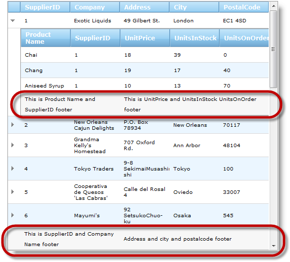
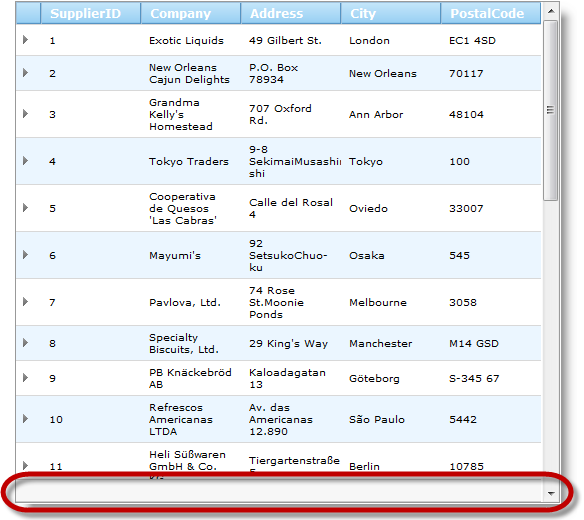
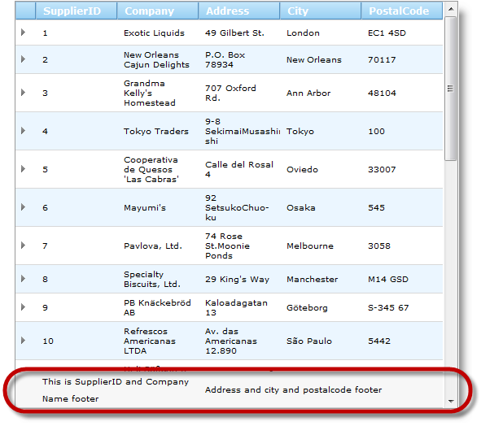

////

|metadata|
{
    "name": "webhierarchicaldatagrid-configuring-multi-column-footers",
    "controlName": ["WebHierarchicalDataGrid"],
    "tags": ["Grids","Grouping"],
    "guid": "5acf4b66-149c-449c-9053-05af0c79a133",  
    "buildFlags": [],
    "createdOn": "2012-04-16T02:34:04.9436489Z"
}
|metadata|
////

= Configuring Multi-Column Footers

== Topic Overview

=== Purpose

This topic shows how to setup multi-column footers in the  _WebHierarchicalDataGrid_   _™_  .

=== Required background

The following table lists the topics required as a prerequisite to understanding this topic.

[options="header", cols="a,a"]
|====
|Topic|Purpose

| link:webhierarchicaldatagrid-about-webhierarchicaldatagrid.html[About]
|This topic describes the features of _WebHierarchicalDataGrid_ .

| link:webhierarchicaldatagrid-getting-started-with-webhierarchicaldatagrid.html[Getting Started with WebHierarchicalDataGrid]
|This topic explains how to bind _WebHierarchicalDataGrid_ to Northwind database.

|====

=== In this topic

This topic contains the following sections:

* <<_Ref321763361, Configuring Multi-Column Footers – Conceptual Overview >>
** <<_Ref321836641,Multi-column footers configuration summary>>
** <<_Ref321836646,Requirements>>
** <<_Ref321836649,Property settings>>

* <<_Ref321763367, Configuring Multi-Column Footers – Code Example >>
** <<_Ref321763378,Introduction>>
** <<_Ref321763381,Preview>>
** <<_Ref321763385,Requirements>>
** <<_Ref321763388,Overview>>
** <<_Ref321763391,Steps>>

* <<_Ref321763372, Related Content >>
** <<_Ref321836628,Topics>>
** <<_Ref321836631,Samples>>

[[_Control_Configuration_Summary]]
[[_Ref321763361]]
== Configuring Multi-Column Footers – Conceptual Overview

[[_Ref321836641]]

=== Multi-column footers configuration summary

The multi-column footer functionality allows you to merge multiple columns footers. This means that the text of the footer of one column is spread across several columns.

Configuring multi-column footers involves creating a link:infragistics4.web.v{ProductVersion}~infragistics.web.ui.gridcontrols.gridfield_members.html[GridField] or its descendant instance and setting the link:infragistics4.web.v{ProductVersion}~infragistics.web.ui.gridcontrols.gridfield~footer.html[Footer] property object. The link:infragistics4.web.v{ProductVersion}~infragistics.web.ui.gridcontrols.gridfield~footer.html[Footer] property object is of class link:infragistics4.web.v{ProductVersion}~infragistics.web.ui.gridcontrols.gridfieldfootercaption_members.html[GridFieldFooterCaption] and has link:infragistics4.web.v{ProductVersion}~infragistics.web.ui.gridcontrols.gridfieldfootercaption~colspan.html[ColSpan] property. This property is responsible for configuring multi-column footers. After setting this property all you need to do is to set the footer text in the Text property of the link:infragistics4.web.v{ProductVersion}~infragistics.web.ui.gridcontrols.gridfield~footer.html[Footer].

Unlike the multi-column header functionality there is no nesting of footers into group. When configuring multi-column footers, you need to keep in mind the following:

*  *Merging is done left to right.*

When there is overlapping of merged columns, the rule for the left column has precedence over the rule for the right column and, as a result, the rule for right is discarded.

*  *Column span cannot go beyond the fixed region.*

When using multi-column footer with column fixing, the column span cannot go beyond the fixed region. For example, if there are 2 columns fixed and you define a footer span of 3 columns, the result will be only 2 column spans

*  *Colum spanning affects only visible columns.*

This means that columns are covered in the visible order rather than in their order in the collection. For example, if you have a visible column with column span 2, then a hidden column, and then another visible column, the second visible column will be included in the column span.

* Column spanning cannot go past the end of the grid.

For example, if there are 2 columns on the right of the grid and you define a 3-column span, the result will be a 2-column span.

.Note:
[NOTE]
====
You can span footers in  _GridField_   instances or its descendants.
====

[[_Ref321836646]]

=== Requirements

_Web_   _Hierarchical_   _DataGrid_   bound to data with link:infragistics4.web.v{ProductVersion}~infragistics.web.ui.gridcontrols.webhierarchicaldatagrid~showfooter.html[ShowFooter] property set to true.

[[_Ref321836649]]

=== Property settings

The following table lists the aspects in which multi-column footers can be configured and maps them to the respective properties that manage them.

[options="header", cols="a,a"]
|====
|Configurable aspect|Properties

|Number of columns
|
* link:infragistics4.web.v{ProductVersion}~infragistics.web.ui.gridcontrols.gridfieldfootercaption~colspan.html[ColSpan] 

|====

[[_Configuring_Multi-Column_Footers]]
[[_Ref321763367]]
== Configuring Multi-Column Footers – Code Example

[[_Ref321763378]]

=== Introduction

In this example, the  _Web_   _Hierarchical_   _DataGrid_   is bound to  _Suppliers_   and  _Products_   tables in  _Northwind_   sample database. In order to display multi-column footers, column footers are enabled for the grid and column spans are defined for two of the columns in  _Suppliers_   table and two of the columns in  _Products_   table. These are  _SupplierID_   and  _Address_   columns for  _Suppliers_   table and  _ProductName_   and  _UnitPrice_   for  _Products_   table.

[[_Ref321763381]]

=== Preview

The following screenshot is a preview of the final result.

[[_Ref321763385]]

=== Requirements

* To complete the procedure, you need the following:
** A  _WebHierarchicalDataGrid_   bound to  _Suppliers_   and  _Products_   tables in  _Northwind_   database.

[[_Ref321763388]]

=== Overview

This topic takes you step-by-step toward configuring Multi-Column Footers in  _WebHierarchicalDataGrid_  . The following is a conceptual overview of the process:

*1*  *.*  <<Configure_footer_visibility, Configur  e   footer visibility >>

*2*  *.*  <<Define_fields, Defin  e   the fields for the grid >>

*3*  *.*  <<Configure_Multi_column_footer, Configur  e   the   m  ulti-  c  olumn   f  ooter for container grid >>

*4*  *.*  <<Configure_Multi_column_footer_for_band, Configu  re   the   m  ulti-  c  olumn   f  ooter for band (optional) >>

[[_Ref321763391]]

=== Steps

The following steps demonstrate how to configure Multi-Column Footers in  _WebHierarchicalDataGrid_  .

=== 1. Configure footer visibility

In order to show the footer set Show Footer property to true. The value will be inherited in the bands.

*In ASPX:*

[source,html]
----
<ig:WebHierarchicalDataGrid ID="WebHierarchicalDataGridView" runat="server" ShowFooter="True" >
</ig:WebHierarchicalDataGrid>
----

*In C#:*

[source,csharp]
----
WebHierarchicalDataGridView.ShowFooter = true;
----

=== 2. Define the fields for the grid

*1*  *.*   *Define fields*   *for the container grid*  *.*

*In ASPX:*

[source,html]
----
<Columns>
    <ig:BoundDataField DataFieldName="SupplierID" Key="SupplierID">
        <Header Text="SupplierID" />
    </ig:BoundDataField>
    <ig:BoundDataField DataFieldName="CompanyName" Key="CompanyName">
        <Header Text="Company" />
    </ig:BoundDataField>
    <ig:BoundDataField DataFieldName="Address" Key="Address">
        <Header Text="Address" />
    </ig:BoundDataField>
    <ig:BoundDataField DataFieldName="City" Key="City">
        <Header Text="City" />
    </ig:BoundDataField>
    <ig:BoundDataField DataFieldName="PostalCode" Key="PostalCode">
        <Header Text="Postal Code" />
    </ig:BoundDataField>
</Columns>
----

*In C#:*

[source,csharp]
----
BoundDataField supplierId = new BoundDataField();
supplierId.DataFieldName = "SupplierID";
supplierId.Key = "SupplierID";
supplierId.Header.Text = "SupplierID";
WebHierarchicalDataGridView.Columns.Add(supplierId);
BoundDataField companyName = new BoundDataField();
companyName.DataFieldName = "CompanyName";
companyName.Key = "CompanyName";
companyName.Header.Text = "Company";
WebHierarchicalDataGridView.Columns.Add(companyName);
BoundDataField address = new BoundDataField();
address.DataFieldName = "Address";
address.Key = "Address";
address.Header.Text = "Address";
WebHierarchicalDataGridView.Columns.Add(address);
BoundDataField city = new BoundDataField();
city.DataFieldName = "City";
city.Key = "City";
city.Header.Text = "City";
WebHierarchicalDataGridView.Columns.Add(city);
BoundDataField postalCode = new BoundDataField();
postalCode.DataFieldName = "PostalCode";
postalCode.Key = "PostalCode";
postalCode.Header.Text = "Postal Code";
WebHierarchicalDataGridView.Columns.Add(postalCode);
----

*2*  *.*   *Define fields for the grid*   *bands*  *.*

*In ASPX:*

[source,html]
----
<ig:Band Key="Products" DataMember="AccessDataSource2_Products" DataKeyFields="SupplierID" AutoGenerateColumns=" DefaultColumnWidth="100px">
    <Columns>
        <ig:BoundDataField DataFieldName="ProductName" Key="ProductName">
            <Header Text="Product Name" />
        </ig:BoundDataField>
        <ig:BoundDataField DataFieldName="SupplierID" Key="SupplierID">
            <Header Text="SupplierID" />
        </ig:BoundDataField>
        <ig:BoundDataField DataFieldName="UnitPrice" Key="UnitPrice">
            <Header Text="UnitPrice" />
        </ig:BoundDataField>
        <ig:BoundDataField DataFieldName="UnitsInStock" Key="UnitsInStock">
            <Header Text="UnitsInStock" />
        </ig:BoundDataField>
        <ig:BoundDataField DataFieldName="UnitsOnOrder" Key="UnitsOnOrder">
            <Header Text="UnitsOnOrder" />
        </ig:BoundDataField>
    </Columns>
</ig:Band>
----

*In C#:*

[source,csharp]
----
if (!IsPostBack)
{
    Band band = WebHierarchicalDataGridView.Bands["Products"];
    BoundDataField supplierID = new BoundDataField();
    supplierID.DataFieldName = "SupplierID";
    supplierID.Key = "SupplierID";
    supplierID.Header.Text = "SupplierID";
    band.Columns.Add(supplierID);
    BoundDataField productName = new BoundDataField();
    productName.DataFieldName = "ProductName";
    productName.Key = "ProductName";
    productName.Header.Text = "Product Name";
    band.Columns.Add(productName);
    BoundDataField unitPrice = new BoundDataField();
    unitPrice.DataFieldName = "UnitPrice";
    unitPrice.Key = "UnitPrice";
    unitPrice.Header.Text = "UnitPrice";
    band.Columns.Add(unitPrice);
    BoundDataField unitsInStock = new BoundDataField();
    unitsInStock.DataFieldName = "UnitsInStock";
    unitsInStock.Key = "UnitsInStock";
    unitsInStock.Header.Text = "UnitsInStock";
    band.Columns.Add(unitsInStock);
    BoundDataField unitsInOrder = new BoundDataField();
    unitsInOrder.DataFieldName = "UnitsOnOrder";
    unitsInOrder.Key = "UnitsOnOrder";
    unitsInOrder.Header.Text = "UnitsOnOrder";
    band.Columns.Add(unitsInOrder);
    WebHierarchicalDataGridView.Bands.Add(band);
}
----

=== 3. Configure the multi-column footer for container grid

Add footers to  _SupplierID_   and  _Address_   columns

 *1*  *.*   *Add footer to*   _SupplierID_    *column and set*   _ColSpan_    *to 2*  *.* 

*In ASPX:*

[source,html]
----
<ig:BoundDataField DataFieldName="SupplierID" Key="SupplierID">
    <Header Text="SupplierID" />
    <Footer Text="SupplierID and Company Name footer" ColSpan="2" />
</ig:BoundDataField>
----

*In C#:*

[source,csharp]
----
BoundDataField supplierId = new BoundDataField();
supplierId.DataFieldName = "SupplierID";
supplierId.Key = "SupplierID";
supplierId.Header.Text = "SupplierID";
supplierId.Footer.Text = "SupplierID and Company Name footer";
supplierId.Footer.ColSpan = 2;
WebHierarchicalDataGridView.Columns.Add(supplierId);
----

*2*  *.*   *Add footer to*   _Address_    *column and set*   _ColSpan_    *to 3*  *.*

*In ASPX:*

[source,html]
----
<ig:BoundDataField DataFieldName="Address" Key="Address">
    <Header Text="Address" />
    <Footer Text="Address and City and Postal Code footer" ColSpan="3" />
</ig:BoundDataField>
----

*In C#:*

[source,csharp]
----
BoundDataField address = new BoundDataField();
address.DataFieldName = "Address";
address.Key = "Address";
address.Header.Text = "Address";
address.Footer.Text = "Address and City and Postal Code footer";
address.Footer.ColSpan = 3;
WebHierarchicalDataGridView.Columns.Add(address);
----

=== 4. Configure the multi-column footer for band (optional)

Add footers to  _ProductName_   and  _UnitPrice_   columns *1*  *.*   *Add footer to*   _ProductName_    *column and set*   _ColSpan_    *to 2*  *.* 

*In ASPX:*

[source,html]
----
<ig:BoundDataField DataFieldName="ProductName" Key="ProductName">
    <Header Text="Product Name" />
    <Footer Text="This is Product Name and SupplierID footer" ColSpan="2" />
</ig:BoundDataField>
----

*In C#:*

[source,csharp]
----
BoundDataField productName = new BoundDataField();
productName.DataFieldName = "ProductName";
productName.Key = "ProductName";
productName.Header.Text = "Product Name";
productName.Footer.Text = "This is Product Name and SupplierID footer";
productName.Footer.ColSpan = 2;
band.Columns.Add(productName);
----

*2*  *.*   *Add footer to*   _UnitPrice_    *column and set*   _ColSpan_    *to 3*  *.*

*In ASPX:*

[source,html]
----
<ig:BoundDataField DataFieldName="UnitPrice" Key="UnitPrice">
    <Header Text="UnitPrice" />
    <Footer Text="This is UnitPrice and UnitsInStock and UnitsOnOrder footer" ColSpan="3" />
</ig:BoundDataField>
----

*In C#:*

[source,csharp]
----
BoundDataField unitPrice = new BoundDataField();
unitPrice.DataFieldName = "UnitPrice";
unitPrice.Key = "UnitPrice";
unitPrice.Header.Text = "UnitPrice";
unitPrice.Footer.Text = "This is UnitPrice and UnitsInStock and UnitsOnOrder footer";
unitPrice.Footer.ColSpan = 3;
band.Columns.Add(unitPrice);
----

[[_Related_Content]]
[[_Ref321763372]]
== Related Content

[[_Ref321836628]]

=== Topics

The following topics provide additional information related to this topic.

[options="header", cols="a,a"]
|====
|Topic|Purpose

| link:webhierarchicaldatagrid-configuring-multi-column-headers.html[Configuring Multi-Column Headers]
|This topic demonstrates how to configure multi-column headers in the _Web_ _Hierarchical_ _DataGrid_ .

|====

[[_Ref321836631]]

=== Samples

The following samples provide additional information related to this topic.

[options="header", cols="a,a"]
|====
|Sample|Purpose

| link:{SamplesURL}/samples/webhierarchicaldatagrid/display/multicolumnfooters/default.aspx?cn=hierarchical-data-grid&sid=87d97c70-f8d3-4311-91ee-33e6a1b4cf86[Multi-Column Footers]
|This sample demonstrates configuring _WebHierarchicalDataGrid_ with multi-column footers.

|====