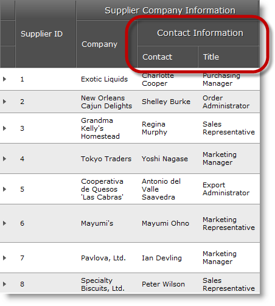

////

|metadata|
{
    "name": "webhierarchicaldatagrid-configuring-multi-column-headers",
    "controlName": ["WebHierarchicalDataGrid"],
    "tags": ["Grids","Grouping","Layouts"],
    "guid": "3204d475-9ef0-4885-b68f-7e7b8dea2a92",  
    "buildFlags": [],
    "createdOn": "2012-04-12T20:07:27.2964535Z"
}
|metadata|
////

= Configuring Multi-Column Headers

== Topic Overview

=== Purpose

This topic shows how to setup multi-column headers in the  _WebHierarchicalDataGrid_   _™_   _._

=== Required background

The following table lists the topics required as a prerequisite to understanding this topic.

[options="header", cols="a,a"]
|====
|Topic|Purpose

| link:webhierarchicaldatagrid-getting-started-with-webhierarchicaldatagrid.html[Getting Started with WebHierarchicalDataGrid]
|This topic explains how to bind _WebHierarchicalDataGrid_ to Northwind database.

|====

=== In this topic

This topic contains the following sections:

* <<_Ref321761870, Configuring Multi-Column Headers – Conceptual Overview >>
* <<_Ref321764907, Configuring multi-column headers – Code Example >>
** <<_Ref321764911,Introduction>>
** <<_Ref321764914,Preview>>
** <<_Ref321764917,Requirements>>
** <<_Ref321764920,Overview>>
** <<_Ref321764924,Steps>>

* <<_Ref320889580, Related Content >>
** <<_Ref321819237,Topics>>
** <<_Ref321819243,Samples>>

[[_Ref321761870]]
== Configuring Multi-Column Headers – Conceptual Overview

=== Multi-column headers configuration summary

If you need to create multiple levels of headers or group them into categories, enabling multi-column headers provides this functionality. The link:{ApiPlatform}web{ApiVersion}~infragistics.web.ui.gridcontrols.groupfield_members.html[GroupField] object is a field that accepts other columns in its columns collection. The header of the link:{ApiPlatform}web{ApiVersion}~infragistics.web.ui.gridcontrols.groupfield_members.html[GroupField] then displays above the columns in its columns collection. The resizing, sorting, selection, filtering, and moving grid behaviors are re-designed to meet the needs of this new layout.

=== Requirements

_Web_   _Hierarchical_   _DataGrid_   bound to data.

=== Property settings

The following table lists the aspects in which multi-column headers can be configured and maps them to the respective properties that manage them.

[options="header", cols="a,a"]
|====
|Configurable aspect|Properties

|Multi-column headers
|
* link:{ApiPlatform}web{ApiVersion}~infragistics.web.ui.gridcontrols.groupfield_members.html[GroupField] 

* link:{ApiPlatform}web{ApiVersion}~infragistics.web.ui.gridcontrols.webhierarchicaldatagrid~columns.html[Columns] 

|====

[[_Control_Configuration_Summary]]
[[_Configuring_multi-column_headers]]
[[_Ref320889575]]
[[_Ref321764907]]
== Configuring multi-column headers – Code Example

[[_Ref321764911]]

=== Introduction

In this example we will define link:{ApiPlatform}web{ApiVersion}~infragistics.web.ui.gridcontrols.groupfield_members.html[GroupField] object which will group contact information fields. Then we will add two BoundDataField objects to the field’s link:{ApiPlatform}web{ApiVersion}~infragistics.web.ui.gridcontrols.webhierarchicaldatagrid~columns.html[Columns] collection. These fields will hold  _ContactName_   and  _ContactTitle_   column data.

[[_Ref321764914]]

=== Preview

The following screenshot is a preview of the final result.

[[_Ref321764917]]

=== Requirements

To complete the procedure, you need a  _WebHierarchicalDataGrid_   bound to the suppliers table of the  _Northwind_   sample database.

[[_Ref321764920]]

=== Overview

This topic takes you step-by-step toward configuring multi-column headers for  _WebHierarchicalDataGrid_  . The following is a conceptual overview of the process:

* link:webhierarchicaldatagrid-configuring-multi-column-headers.html#_1_defining_a_groupfield[1. Defining a GroupField]<<Define_GroupField,>>*

* link:webhierarchicaldatagrid-configuring-multi-column-headers.html#_2_configuring_the_header_text[2. Configuring the header text]<<Configure_the_header_text,>>*

* link:webhierarchicaldatagrid-configuring-multi-column-headers.html#_3_adding_columns_to_the_groupfield_s_columns_collection[3. Adding columns to the GroupField’s columns collection]*

[[_Ref321764924]]

=== Steps

The following steps demonstrate how to configure Multi-Column headers.

=== 1. Defining a GroupField

A GroupField is defined like any other column. It is not bound to data but does require a key like other columns.

*In ASPX:*

[source,html]
----
<ig:GroupField Key="ContactInfo">
</ig:GroupField>
----

*In C#:*

[source,csharp]
----
GroupField groupField = new GroupField();
groupField.Key = "ContactInfo";
this.WebHierarchicalDataGridView.Columns.Add(groupField);
----

=== 2. Configuring the header text

The header text is the text that is displayed for the column. Configure this on the `Text` property of the GridField’s `Header` object.

*In ASPX:*

[source,html]
----
<Header Text="Contact Information" />
----

*In C#:*

[source,csharp]
----
groupField.Header.Text = "Contact Information";
----

=== 3. Adding columns to the GroupField’s columns collection

In order to show the child columns, add them to the Columns collection of the GroupField.

*In ASPX:*

[source,html]
----
<Columns>
    <ig:BoundDataField DataFieldName="ContactName" Key="ContactName">
        <Header Text="Contact" />
    </ig:BoundDataField>
    <ig:BoundDataField DataFieldName="ContactTitle" Key="ContactTitle">
        <Header Text="Title" />
    </ig:BoundDataField>
</Columns>
----

*In C#:*

[source,csharp]
----
/* Creating a  BoundDataField * /
BoundDataField field = new BoundDataField();
field.DataFieldName = "ContactName";
field.Key = "ContactName";
field.Header.Text = "Contact";
/* Adding the BoundDataField to be under the GroupedField 
* which was created above
*/
groupField.Columns.Add(field);
/* Creating a  BoundDataField * /
field = new BoundDataField();
field.DataFieldName = "ContactTitle";
field.Key = "ContactTitle";
field.Header.Text = "Title";
/* Adding the BoundDataField to be under the GroupedField 
* which was created above
*/
groupField.Columns.Add(field);
----

[[_Related_Content]]
[[_Ref320889580]]
== Related Content

[[_Ref321819237]]

=== Topics

The following topics provide additional information related to this topic.

[options="header", cols="a,a"]
|====
|Topic|Purpose

| link:webhierarchicaldatagrid-getting-started-with-webhierarchicaldatagrid.html[Getting Started with WebHierarchicalDataGrid]
|This topic explains how to bind _WebHierarchicalDataGrid_ to Northwind database.

| link:webhierarchicaldatagrid-behaviors.html[Behaviors]
|This topic lists the behaviors you can configure with _WebHierarchicalDataGrid_ .

|====

[[_Ref321819243]]

=== Samples

The following samples provide additional information related to this topic.

[options="header", cols="a,a"]
|====
|Sample|Purpose

| link:{SamplesURL}/samples/webhierarchicaldatagrid/display/multicolumnheaders/default.aspx?cn=hierarchical-data-grid&sid=d893d141-97f2-4848-a4ed-3622544a7612[Multi-Column Headers]
|This sample shows how to configure multi-column headers in _WebHierarchicalDataGrid_ .

|====