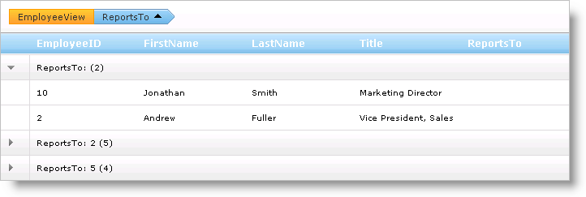
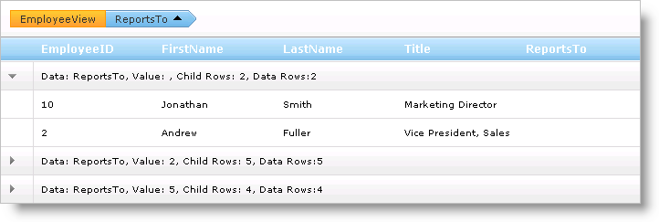
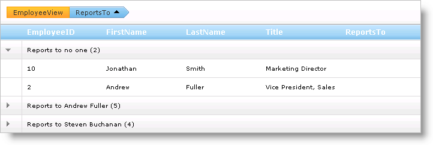

////

|metadata|
{
    "name": "webhierarchicaldatagrid-custom-text-in-group-row",
    "controlName": ["WebHierarchicalDataGrid"],
    "tags": ["Editing","Grids","Styling"],
    "guid": "{05137124-CA41-4E4A-810D-62874C14903D}",  
    "buildFlags": [],
    "createdOn": "0001-01-01T00:00:00Z"
}
|metadata|
////

= Custom Text in Group Row

When WebHierarchicalDataGrid™ displays grouped rows, each row has a descriptive text in the following format: [Column Name]: [Value] ([Number of Child Rows]).

You can access the text using the link:{ApiPlatform}web{ApiVersion}~infragistics.web.ui.gridcontrols.groupedrecord.html[GroupedRecord] object's link:{ApiPlatform}web{ApiVersion}~infragistics.web.ui.gridcontrols.groupedrecord~text.html[Text] property. The column's value is accessed using the link:{ApiPlatform}web{ApiVersion}~infragistics.web.ui.gridcontrols.groupedrecord~value.html[Value] property.

If you want to display a custom description for your GroupedRecord objects you can do so by supplying a custom string, either through manual construction or with a mask.

== Custom GroupBy Mask

An object that implements the link:{ApiPlatform}web{ApiVersion}~infragistics.web.ui.gridcontrols.iband.html[IBand] interface exposes the link:{ApiPlatform}web{ApiVersion}~infragistics.web.ui.gridcontrols.groupingsettings.html[GroupingSettings] object which allows you to set a text mask by setting the link:{ApiPlatform}web{ApiVersion}~infragistics.web.ui.gridcontrols.groupingsettings~groupedrowtextmask.html[GroupedRowTeskMask] property. The tokens you can use for this mask are as follows:

* {0} – Column name.
* {1} – Column value.
* {2} – Immediate child rows belonging to the group row.
* {3} – Total data rows belonging to the group row.

The following code shows you how to set a text mask for the group rows.

*In HTML:*

----
<GroupingSettings GroupedRowTextMask="Data: {0}, Value: {1}, Child Rows: {2}, Data Rows:{3}" />
----

*In Visual Basic:*

----
Me.WebHierarchicalDataGrid1.GroupingSettings.GroupedRowTextMask = "Data: {0}, Value: {1}, Child Rows: {2}, Data Rows:{3}"
----

*In C#:*

----
this.WebHierarchicalDataGrid1.GroupingSettings.GroupedRowTextMask = "Data: {0}, Value: {1}, Child Rows: {2}, Data Rows:{3}";
----

== Manually Customize Text

If you want full control of what values are displayed in the group row's text, you can manually manipulate the row's text in WebHierarchicalDataGrid's link:{ApiPlatform}web{ApiVersion}~infragistics.web.ui.gridcontrols.webhierarchicaldatagrid~groupedrowinitialized_ev.html[GroupedRowInitialized] event. The following code shows you how to display different cell values in the group row's text.

*In Visual Basic:*

----
Private Sub WebHierarchicalDataGrid1_GroupedRowInitialized(ByVal sender As Object, ByVal e As Infragistics.Web.UI.GridControls.GroupedRowEventArgs)
    ' Set custom text for ReportsTo column
    If e.GroupedRow.ColumnGroupedBy.Key = "ReportsTo" Then
        ' If value does not exist, the employee reports to no one
        If e.GroupedRow.Value = DBNull.Value Then
            ' Get number of items from default text
            Dim numItems As String = e.GroupedRow.Text.Substring(e.GroupedRow.Text.Length - 3, 3)
            e.GroupedRow.Text = "Reports to no one " & numItems
        Else
            Dim numItems As String = e.GroupedRow.Text.Substring(e.GroupedRow.Text.Length - 3, 3)
            ' Get value being grouped by
            Dim value As Integer = CInt(e.GroupedRow.Value)
            ' Get the row with EmployeeID equal to the value being grouped by from the ReportsTo column.
            ' This returns the row for the employee that the rows that are being grouped reports to.
            Dim record As GridRecord = Me.WebHierarchicalDataGrid1.Rows.FromKey(New Object() {value})
            If record IsNot Nothing Then
                ' Get the name of the person to report to
                Dim name As String = (record.Items(1).Value.ToString() & " ") + record.Items(2).Value.ToString()
                e.GroupedRow.Text = ("Reports to " & name & " ") + numItems
            End If
        End If
    End If
End Sub
----

*In C#:*

----
void WebHierarchicalDataGrid1_GroupedRowInitialized(object sender, Infragistics.Web.UI.GridControls.GroupedRowEventArgs e)
{
    // Set custom text for ReportsTo column
    if (e.GroupedRow.ColumnGroupedBy.Key == "ReportsTo")
    {
        // If value does not exist, the employee reports to no one
        if (e.GroupedRow.Value == DBNull.Value)
        {
            // Get number of items from default text
            string numItems = e.GroupedRow.Text.Substring(e.GroupedRow.Text.Length - 3, 3);
            e.GroupedRow.Text = "Reports to no one " + numItems;
        }
        else
        {
            string numItems = e.GroupedRow.Text.Substring(e.GroupedRow.Text.Length - 3, 3);
            // Get value being grouped by
            int value = (int)e.GroupedRow.Value;
            // Get the row with EmployeeID equal to the value being grouped by from the ReportsTo column.
            // This returns the row for the employee that the rows that are being grouped reports to.
            GridRecord record = this.WebHierarchicalDataGrid1.Rows.FromKey(new object[] { value });
            if (record != null)
            {
                // Get the name of the person to report to
                string name = record.Items[1].Value.ToString() + " " + record.Items[2].Value.ToString();
                e.GroupedRow.Text = "Reports to " + name + " " + numItems;
            }
        }
    }
}
----

== Related Topics

link:webhierarchicaldatagrid-about-outlook-groupby.html[About Outlook GroupBy]

link:webhierarchicaldatagrid-custom-group-by-name.html[Custom Group by Name]

link:webhierarchicaldatagrid-group-columns-from-code-behind.html[Group Columns from Code Behind]

link:webhierarchicaldatagrid-outlook-groupby-with-behaviors.html[Outlook GroupBy with Behaviors]

link:webhierarchicaldatagrid-referencing-rows-when-using-outlook-groupby.html[Referencing Rows When Using Outlook GroupBy]