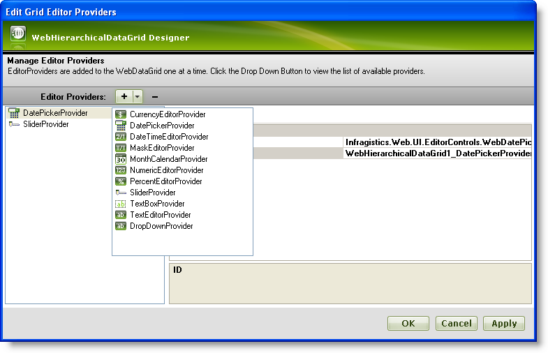

////

|metadata|
{
    "name": "webhierarchicaldatagrid-editor-providers",
    "controlName": ["WebHierarchicalDataGrid"],
    "tags": ["Editing","Grids"],
    "guid": "{0AE764B7-D861-466B-9AEC-9E8B795D5A33}",  
    "buildFlags": [],
    "createdOn": "2009-02-10T15:02:20Z"
}
|metadata|
////

= Editor Providers

There may be times in which you might want to use different editors for fields in WebHierarchicalDataGrid™. You can do so through the use of editor providers.

On an editing-enabled WebHierarchicalDataGrid control, the most appropriate editor provider will be used on each column depending on the column's data type. For example, numeric and DateTime data type columns will automatically use the NumericEditorProvider and the DateTimeEditorProvider respectively. However, if you wish to override this default functionality, you can always specify your own editor provider(s). This allows you to provide different editors you deem more appropriate for each column. The available editor providers are:

* link:{ApiPlatform}web{ApiVersion}~infragistics.web.ui.gridcontrols.currencyeditorprovider.html[CurrencyEditorProvider]
* link:{ApiPlatform}web{ApiVersion}~infragistics.web.ui.gridcontrols.datepickerprovider.html[DatePickerProvider]
* link:{ApiPlatform}web{ApiVersion}~infragistics.web.ui.gridcontrols.datetimeeditorprovider.html[DateTimeEditorProvider]
* link:{ApiPlatform}web{ApiVersion}~infragistics.web.ui.gridcontrols.dropdownprovider.html[DropDownProvider]
* link:{ApiPlatform}web{ApiVersion}~infragistics.web.ui.gridcontrols.maskeditorprovider.html[MaskEditorProvider]
* link:{ApiPlatform}web{ApiVersion}~infragistics.web.ui.gridcontrols.monthcalendarprovider.html[MonthCalendarProvider]
* link:{ApiPlatform}web{ApiVersion}~infragistics.web.ui.gridcontrols.numericeditorprovider.html[NumericEditorProvider]
* link:{ApiPlatform}web{ApiVersion}~infragistics.web.ui.gridcontrols.percenteditorprovider.html[PercentEditorProvider]
* link:{ApiPlatform}web{ApiVersion}~infragistics.web.ui.gridcontrols.sliderprovider.html[SliderProvider]
* link:{ApiPlatform}web{ApiVersion}~infragistics.web.ui.gridcontrols.textboxprovider.html[TextBoxProvider]
* link:{ApiPlatform}web{ApiVersion}~infragistics.web.ui.gridcontrols.texteditorprovider.html[TextEditorProvider]

Some of the editor providers used by default depending on the data type of WebHierarchicalDataGrid’s columns are listed below. The following table lists the data types and their associated editors.

[options="header", cols="a,a"]
|====
|Type|Editor

|Byte
|WebNumericEditorProvider

|Char
|WebNumericEditorProvider

|DateTime
|DateTimeEditorProvider

|Double
|NumericEditorProvider

|Int16
|NumericEditorProvider

|Int32
|NumericEditorProvider

|Int64
|NumericEditorProvider

|Single
|NumericEditorProvider

|String
|TextBoxProvider

|====

To use editor providers, add them to the EditorProviders collection. Once added, you can access an editor provider with its Id and assign it to a particular column.

The following walkthrough shows how to use EditorProviders with your WebHierarchicalDataGrid control.

== Follow these Steps

[start=1]
. Bind WebHierarchicalDataGrid to a WebHierarchicalDataSource™ component retrieving data from the Orders and Order Details tables. For more information on doing this, see the link:webhierarchicaldatasource-using-webhierarchicaldatasource.html[Using WebHierarchicalDataSource] topic.
[start=2]
. In the Microsoft® Visual Studio™ property window, locate the EditorProviders property and click the ellipsis (...) button to launch the Editor Providers Designer.
[start=3]
. Click the Plus (+) button to drop-down a list of possible editors. Select two Editors, one for the parent band and one for the child band to make it available later when you are setting up columns. For our purposes, select the DatePickerProvider and the SliderProvider.

[start=4]
. Leave the ID for the editors as WebHierarchicalDataGrid1_DatePickerProvider1 and WebHierarchicalDataGrid1_SliderProvider1 in the property grid on the right. You will need this ID later when setting the editors for columns.
[start=5]
. You can set any additional properties for the editor controls by expanding the EditorControl property. For this topic, expand the EditorControl property of the SliderProvider. Set values for the following properties:

** MaxValue – 150
** MinValue – 0
** ValueType – Int

[start=6]
. Click Apply then OK to close the designer
[start=7]
. Locate the link:{ApiPlatform}web{ApiVersion}~infragistics.web.ui.gridcontrols.webhierarchicaldatagrid~bands.html[Bands] property and click the ellipsis (...) button to launch the Edit WebHierarchicalDataGrid Bands Dialog.
[start=8]
. In this window you can set properties for the parent and child bands. Locate the link:{ApiPlatform}web{ApiVersion}~infragistics.web.ui.gridcontrols.webhierarchicaldatagrid~behaviors.html[Behaviors] property from the property grid on the right for the parent band. Click the ellipsis (...) button to launch the Edit Grid Behaviors dialog.

[start=9]
. Check the link:{ApiPlatform}web{ApiVersion}~infragistics.web.ui.gridcontrols.cellediting.html[CellEditing] behavior in the list on the left to enable editing.
[start=10]
. Locate the link:webhierarchicaldatagrid~infragistics.web.ui.grideditbase~columnsettings.html[ColumnSettings] property in the property grid on the right and click the ellipsis (...) button to launch the Column Settings Editor Dialog.
[start=11]
. Configure parent band of WebHierarchicalDataGrid to use the DatePickerProvider for editing of the RequiredDate column.

.. Add a column setting by clicking add item.
.. Set the ColumnKey as RequiredDate.
.. For the EditorID property, click the dropdown list and select

WebHierarchicalDataGrid 1_DatePickerProvider1. Only editors that are added to the EditorProviders collection are available here.
.. Leave ReadOnly as False.
.. Click OK in the Column Setting and Edit Grid Behaviors dialog windows.

.Note:
[NOTE]
====
You can also select the Add/Modify Columns option in the drop-down list to go to the Edit Grid Columns dialog.
====

[start=12]
. Follow steps 8 to 10, but this time to configure the child band.
[start=13]
. Configure child band of WebHierarchicalDataGrid to use the SliderProvider for editing of the Quantity column.

.. Add a column setting by clicking add item.
.. Set the ColumnKey as Quantity.
.. For the EditorID property, click the dropdown list and select WebHierarchicalDataGrid1_SliderProviderProvider1. Only editors that are added to the EditorProviders collection are available here.
.. Leave the ReadOnly property as False.
.. Click OK in the Column Setting and Edit Grid Behaviors dialog windows.

[start=14]
. Click OK to close the Edit WebHierarchicalDataGrid Bands dialog.
[start=15]
. Run your application. When you enter edit mode in a cell of the RequiredDate column, the DatePickerProvider displays. Similarly when you enter edit mode in a cell of the Quantity column within the child band, the SliderProvider displays.

===== WebHierarchicalDataGrid - Parent Band showing DatePickerProvider in RequiredDate column

===== WebHierarchicalDataGrid - Child Band showing SliderProvider in Quantity column

