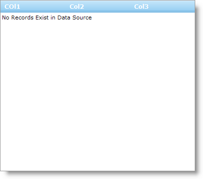

////

|metadata|
{
    "name": "webhierarchicaldatagrid-enable-empty-rows-template",
    "controlName": ["WebHierarchicalDataGrid"],
    "tags": ["Grids","Templating"],
    "guid": "{88D47868-FDBE-4552-9341-480DBB1158E1}",  
    "buildFlags": [],
    "createdOn": "0001-01-01T00:00:00Z"
}
|metadata|
////

= Enable Empty Rows Template

WebHierarchicalDataGrid™ has an Empty Rows Template that you can use to provide your end-users with a custom display that appears whenever there are no rows in the data source. Like all templates, you can place any control within the Empty Template to provide a custom message to your end-users.

You can set up the Empty Rows Template at design time by clicking the control’s smart tag and selecting Edit Templates. From the Display drop-down list, select Empty Rows Template. You can then drag controls onto the Empty Rows Template surface.

The following code shows you how to create a custom template displaying a message to end-users when WebHierarchicalDataGrid is bound but has no rows. As with the creation of any template, you need a class that implements the ITemplate interface.

*In Visual Basic:*

----
Protected Overloads Overrides Sub OnInit(ByVal e As EventArgs) 
    MyBase.OnInit(e) 
    'template needs to be instantiated on every postback 
    Me.WebHierarchicalDataGrid1.EmptyRowsTemplate = New CustomEmptyRowsTemplate() 
End Sub 
Private Class CustomEmptyRowsTemplate 
    Implements ITemplate 
    #Region "ITemplate Members" 
    Public Sub InstantiateIn(ByVal container As Control) Implements ITemplate.InstantiateIn
        Dim label1 As New System.Web.UI.WebControls.Label() 
        label1.Text = "No Records Exist in Data Source" 
        label1.ID = "Label1" 
        container.Controls.Add(label1) 
    End Sub 
    #End Region
End Class
----

*In C#:*

----
protected override void OnInit(EventArgs e)
{
   base.OnInit(e);
   //template needs to be instantiated on every postback
   this.WebHierarchicalDataGrid1.EmptyRowsTemplate = new CustomEmptyRowsTemplate();
}
private class CustomEmptyRowsTemplate : ITemplate
{
   #region ITemplate Members
   public void InstantiateIn(Control container)
   {
      System.Web.UI.WebControls.Label label1 = new System.Web.UI.WebControls.Label();
      label1.Text = "No Records Exist in Data Source";
      label1.ID = "Label1";
      container.Controls.Add(label1);
    }
    #endregion
}
----

== Related Topics

link:webhierarchicladatagrid-column-templates.html[Column Templates]

link:webhierarchicaldatagrid-paging-template.html[Paging Template]

link:webhierarchicaldatagrid-enable-error-template.html[Enable Error Template]