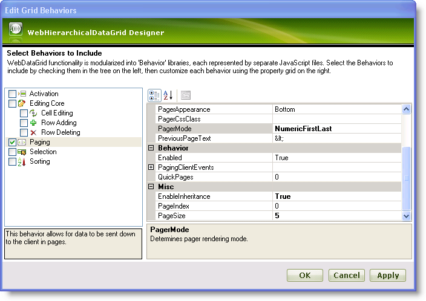
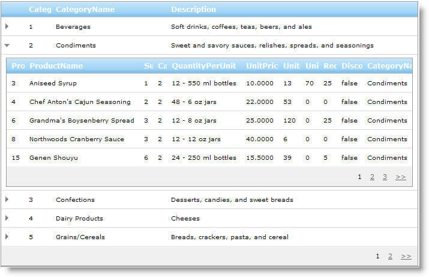

////

|metadata|
{
    "name": "webhierarchicaldatagrid-enabling-paging",
    "controlName": ["WebHierarchicalDataGrid"],
    "tags": ["Grids","Paging"],
    "guid": "{3AEBBF60-C2D5-4181-9924-47CEEF36A66D}",  
    "buildFlags": [],
    "createdOn": "0001-01-01T00:00:00Z"
}
|metadata|
////

= Enabling Paging

== Before You Begin

WebHierarchicalDataGrid™ provides paging functionality to present data in smaller subsets displayed as pages. To enable paging, add the  pick:[asp-net="link:{ApiPlatform}web{ApiVersion}~infragistics.web.ui.gridcontrols.paging.html[Paging]"]  behavior to the  pick:[asp-net="link:{ApiPlatform}web{ApiVersion}~infragistics.web.ui.gridcontrols.gridbehaviorcollection.html[Behaviors]"]  collection.

== What You Will Accomplish

You will learn how to enable basic paging for WebHierarchicalDataGrid and set several options for paging.

== Follow these Steps

[start=1]
. Bind WebHierarchicalDataGrid to the WebHierarchicalDataSource™ component retrieving data from the Categories and Products table. For more information on doing this, see the link:webhierarchicaldatasource-using-webhierarchicaldatasource.html[Using the WebHierarchicalDataSource] topic.
[start=2]
. In the Microsoft® Visual Studio™ property window, locate the Behaviors property and click the ellipsis (...) button to launch the Behaviors Editor Dialog.
[start=3]
. Check the CheckBox next to Paging from the list on the left to add and enable the behavior.
[start=4]
. In the properties, set  pick:[asp-net="link:{ApiPlatform}web{ApiVersion}~infragistics.web.ui.gridcontrols.paging~pagesize.html[PageSize]"]  to 5, increasing the number of records per page to 5.
[start=5]
. Set  pick:[asp-net="link:{ApiPlatform}web{ApiVersion}~infragistics.web.ui.gridcontrols.paging~pagermode.html[PagerMode]"]  to NumericFirstLast which changes the pager links to numbers with links to the first and last pages.
[start=6]
. Set the  pick:[asp-net="link:{ApiPlatform}web{ApiVersion}~infragistics.web.ui.gridcontrols.paging~enableinheritance.html[EnableInheritance]"]  property to True, to enable Paging for all child levels. The default value is False.

Click Apply then OK. You have enabled paging for the parent and child levels with some Pager settings at design time.

.Note:
[NOTE]
====
In order to use Paging behavior in conjunction with Sorting, DataKeyFields need to be set for each band in the HierarchicalDataGrid.
====

You can also use the following code examples for enabling paging.

*In HTML:*

----
<ig:WebHierarchicalDataGrid ID="WebHierarchicalDataGrid1" runat="server" 
        Height="350px" Width="400px">
        <Behaviors>
            <ig:Paging EnableInheritance="True" PagerMode="NumericFirstLast" PageSize="5">
            </ig:Paging>
        </Behaviors>
    </ig:WebHierarchicalDataGrid>
----

*In Visual Basic:*

----
Me.WebHierarchicalDataGrid1.Behaviors.Paging.PagerMode = _
    Infragistics.Web.UI.GridControls.PagerMode.NumericFirstLast
Me.WebHierarchicalDataGrid1.Behaviors.Paging.PageSize = 5
Me.WebHierarchicalDataGrid1.Behaviors.Paging.EnableInheritance = True
----

*In C#:*

----
this.WebHierarchicalDataGrid1.Behaviors.Paging.PagerMode =
    Infragistics.Web.UI.GridControls.PagerMode.NumericFirstLast;
this.WebHierarchicalDataGrid1.Behaviors.Paging.PageSize = 5;
this.WebHierarchicalDataGrid1.Behaviors.Paging.EnableInheritance = true;
----

== Related Topics

link:webhierarchicaldatagrid-activation.html[Activation]

link:webhierarchicaldatagrid-cell-editing.html[Cell Editing]

link:webhierarchicaldatagrid-enabling-row-adding.html[Enabling Row Adding]

link:webhierarchicaldatagrid-enabling-row-deleting.html[Enabling Row Deleting]

link:webhierachicaldatagrid-selection.html[Selection]

link:webhierarchicaldatagrid-sorting.html[Sorting]