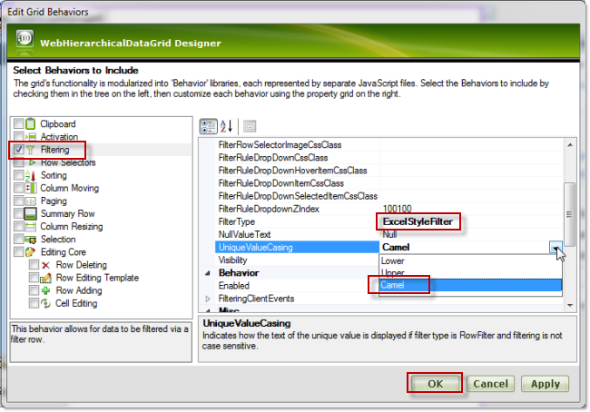
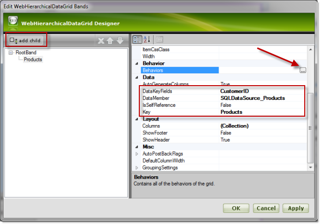
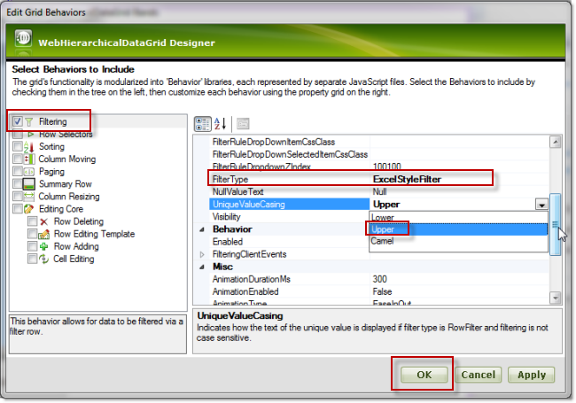
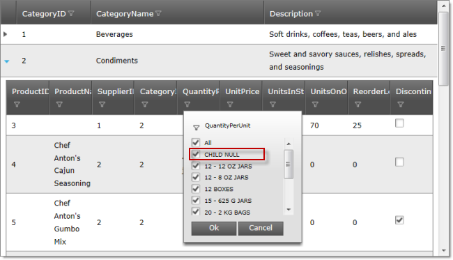
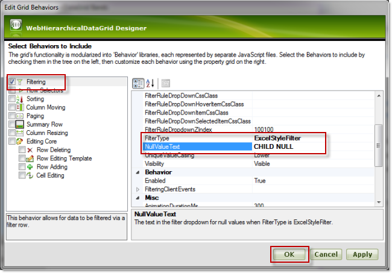

////

|metadata|
{
    "name": "webhierarchicaldatagrid-excelstylefiltering-configuring",
    "controlName": ["WebHierarchicalDataGrid"],
    "tags": ["Filtering","Grids"],
    "guid": "1b29e2f3-22aa-4118-b3d8-a69fac4e1fff",  
    "buildFlags": [],
    "createdOn": "2012-07-16T12:20:10.9190495Z"
}
|metadata|
////

= Configuring Excel Style Filtering

Configuring Excel-Style Filtering ( _WebHierarchicalDataGrid_ )

[[_Ref336005674]]
== Topic Overview

[[_Ref336006129]]

=== Purpose

This topic explains how to configure the Excel-Style Filtering options of the  _WebHierarchicalDataGrid_™ control.

=== Required background

The following topics are prerequisites to understanding this topic:

[options="header", cols="a,a"]
|====
|Topic|Purpose

| link:webhierarchicaldatagrid-getting-started-with-webhierarchicaldatagrid.html[Getting Started with]
|This topic demonstrates how to bind the _WebHierarchicalDataGrid_ to the _WebHierarchicalDataSource_™ component using the _Categories_ and _Products_ tables of the Northwind sample database.

| link:webhierarchicaldatagrid-excelstylefiltering-overview.html[Excel-Style Filtering Overview _(WebHierarchicalDataGrid)_ ]
|This topic introduces the Excel-Style Filtering feature of the _WebHierarchicalDataGrid_ control.

| link:webhierarchicaldatagrid-excelstylefiltering-enabling.html[Enabling Excel-Style Filtering _(WebHierarchicalDataGrid)_ ]
|This topic provides reference about the properties that are specific to the Excel-Style Filtering feature of the _WebHierarchicalDataGrid_ control.

|====

=== In this topic

This topic contains the following sections:

* <<_Ref329857460,Excel-Style Filtering Configuration Summary>>
* <<_Ref336284691,Configuring the Capitalization of the Unique Values in the Filtering Drop-Down>>
* <<_Ref336006342,Overview>>
* <<_Ref336006348,Property settings>>
* <<_Ref329857547,Prerequisites>>
* <<_Ref336019721,Configuring the capitalization of unique values using the Designer>>
* <<_Ref336022251,Configuring the capitalization of unique values in the ASPX markup>>

* <<_Ref329857565,Configuring the capitalization of unique values in the code-behind>>

* <<_Ref336284708,Configuring the Text for the Null Values in the Filtering Drop-Down>>

* <<_Ref336284789,Overview>>
* <<_Ref336006661,Preview>>
* <<_Ref329857590,Property settings>>
* <<_Ref329857593,Prerequisites>>
* <<_Ref329857597,Configuring the text for the null values using the Designer>>
* <<_Ref336022322,Configuring the text for the null values in the ASPX markup>>
* <<_Ref329857603,Configuring the text for the null values in the code-behind>>

* <<_Ref336284750,Related Content>>

* <<_Ref336006743,Topics>>
* <<_Ref336006749,Samples>>

[[_Ref329857460]]
[[_Ref336019679]]
== Excel-Style Filtering Configuration Summary

[[_Ref336006324]]

=== Excel-Style Filtering configuration summary chart

The following table lists the configurable aspects of the link:webhierarchicaldatagrid-excelstylefiltering-landingpage.html[*Excel Style Filtering* ] feature of the WebHierarchicalDataGird™ control.

[options="header", cols="a,a,a"]
|====
|Configurable aspects|Details|Properties

|<<_Ref336284691,Configuring the Capitalization of the Unique Values in the Filtering Drop-Down>>
|You can specify the capitalization of values into the filtering dropdown. The available options are: lowercase capitalization, uppercase capitalization, and camelcase capitalization.
|
* link:infragistics4.web.v{ProductVersion}~infragistics.web.ui.gridcontrols.columnfilteringsetting~uniquevaluecasing.html[UniqueValueCasing] 

|<<_Ref336284708,Configuring the Text for the Null Values in the Filtering Drop-Down>>
|You can specify custom text for Null values in the filtering drop-down.
|
* link:infragistics4.web.v{ProductVersion}~infragistics.web.ui.gridcontrols.columnfilteringsetting~nullvaluetext.html[NullValueText] 

|====

[[_Ref329857481]]

[[_Ref336006336]]

[[_Ref336284691]]
== Configuring the Capitalization of the Unique Values in the Filtering Drop-Down

[[_Ref336006342]]

=== Overview

The capitalization options for the unique values are the following:

*  *Lowercase capitalization*  (default) – the items appear in lowercase letters
*  *Uppercase*   *capitalization*  – the items appear in uppercase letters (all caps)
*  *Camelcase capitalization*  – the items appear with sentence capitalization (Only the first letter of the item is capitalized even if the item consists of more than one words.)

The capitalization is managed by the link:infragistics4.web.v{ProductVersion}~infragistics.web.ui.gridcontrols.columnfilteringsetting~uniquevaluecasing.html[UniqueValueCasing] property.

The capitalization of unique values can be set on several levels:

* per column
* per band (parent/child)
* for the whole grid

The column setting takes the highest priority.

[[_Ref336006348]]

=== Property settings

[options="header", cols="a,a,a"]
|====
|The following table maps the desired capitalization configurations of the property settings that configure them:In order to:|Use this property:|And set it to:

|Configure lowercase capitalization for the items in the filtering drop-down in lower case
| link:infragistics4.web.v{ProductVersion}~infragistics.web.ui.gridcontrols.columnfilteringsetting~uniquevaluecasing.html[UniqueValueCasing]
| _Lower_ 

|Configure uppercase capitalization for the items in the filtering drop-down in upper case
| link:infragistics4.web.v{ProductVersion}~infragistics.web.ui.gridcontrols.columnfilteringsetting~uniquevaluecasing.html[UniqueValueCasing]
| _Upper_ 

|Configure camelcase capitalization for the items in the filtering drop-down with only the first capitalized
| link:infragistics4.web.v{ProductVersion}~infragistics.web.ui.gridcontrols.columnfilteringsetting~uniquevaluecasing.html[UniqueValueCasing]
| _Camel_ 

|====

[[_Ref329857547]]

=== Prerequisites

To complete the procedure, you need the following:

* An ASP.NET Web project with a WebHierarchicalDataGrid instantiated on a web page
* The WebHierarchicalDataGrid bound to a SqlDataSource component and configured to retrieve the CustomerID, CompanyName, ContactName, and ContactTitle fields from the Customers table of the Northwind sample database. (For details, see the * link:webhierarchicaldatagrid-getting-started-with-webhierarchicaldatagrid.html[Getting Started with WebHierarchicalDataGrid]* topic.)

[[_Ref336019721]]

=== Configuring the capitalization of unique values using the Designer

*Configuring the capitalization on grid level*

To set the * link:infragistics4.web.v{ProductVersion}~infragistics.web.ui.gridcontrols.columnfilteringsetting~uniquevaluecasing.html[UniqueValueCasing]* property to  _Camel_  on grid-level using the designer:

*1**.* From the smart tag of the  _WebDataGrid_,  *open the*  *WebDataGrid Designer* .

*2**.* In the left pane,  *select the desired filtering behavior* .

*3**.* In the right pane,  *set the*  * link:infragistics4.web.v{ProductVersion}~infragistics.web.ui.gridcontrols.columnfilteringsetting~uniquevaluecasing.html[UniqueValueCasing]*  *property to*   _Camel_ .

*4**.*  *Click the*  *OK*  *button* .

*Configuring the capitalization on*band* *level*

The following example demonstrates how to configure the capitalization of the unique valies in the filtering drop-down for the first child band. In this example, the items are being set to appear in all-uppercase letters (The link:infragistics4.web.v{ProductVersion}~infragistics.web.ui.gridcontrols.columnfilteringsetting~uniquevaluecasing.html[UniqueValueCasing] property is being set to  _Upper_  .).

*1**.*  *Add the child band*  * .*

*2**.*  * Configure filtering behavior for that band.*

[[_Ref329857558]]

=== Configuring the capitalization of unique values in the ASPX markup

The following code demonstrates how to configure, in the ASPX markup, the unique values with sentence capitalization for the parent (by setting the link:infragistics4.web.v{ProductVersion}~infragistics.web.ui.gridcontrols.columnfilteringsetting~uniquevaluecasing.html[UniqueValueCasing] property to  _Camel_   on the parent level) and with all-uppercase capitalization for the child (by setting the link:infragistics4.web.v{ProductVersion}~infragistics.web.ui.gridcontrols.columnfilteringsetting~uniquevaluecasing.html[UniqueValueCasing] property to  _Upper_   on the child level).

*In ASPX:*

[source,html]
----
<Behaviors>
    <ig:Filtering FilterType="ExcelStyleFilter" 
    UniqueValueCasing="Camel">
    </ig:Filtering>
</Behaviors>
<Bands>
    <ig:Band Key="Products" DataMember="SQLDataSource_Products" 
        DataKeyFields="CategoryID">
        <Behaviors>
            <ig:Filtering FilterType="ExcelStyleFilter" 
            UniqueValueCasing="Upper">
            </ig:Filtering>
        </Behaviors>
    </ig:Band>
</Bands>
----

[[_Ref329857565]]

=== Configuring the capitalization of unique values in the code-behind

The following code demonstrates how to configure, in the code-behind, the unique values with sentence capitalization for the parent (by setting the link:infragistics4.web.v{ProductVersion}~infragistics.web.ui.gridcontrols.columnfilteringsetting~uniquevaluecasing.html[UniqueValueCasing] property to  _Camel_   on the parent level) and with all-uppercase capitalization for the child (by setting the link:infragistics4.web.v{ProductVersion}~infragistics.web.ui.gridcontrols.columnfilteringsetting~uniquevaluecasing.html[UniqueValueCasing] property to  _Upper_   on the child level).

*In C#:*

[source,csharp]
----
 protected void Page_Load(object sender, EventArgs e)
        {
            this.WebHierarchicalDataGrid1.InitializeBand += new InitializeBandEventHandler(WebHierarchicalDataGrid1_InitializeBand);
            this.WebHierarchicalDataGrid1.Behaviors.CreateBehavior<Filtering>();
            this.WebHierarchicalDataGrid1.Behaviors.Filtering.FilterType = FilteringType.ExcelStyleFilter;
            this.WebHierarchicalDataGrid1.Behaviors.Filtering.EnableInheritance = true;
            this.WebHierarchicalDataGrid1.Behaviors.Filtering.UniqueValueCasing = UniqueValueCasing.Camel;
            this.WebHierarchicalDataGrid1.RefreshBehaviors();
        }
        void WebHierarchicalDataGrid1_InitializeBand(object sender, BandEventArgs e)
        {
            e.Band.Behaviors.CreateBehavior<Filtering>();
            e.Band.Behaviors.Filtering.Enabled = true;
            e.Band.Behaviors.Filtering.FilterType = FilteringType.ExcelStyleFilter;
            e.Band.Behaviors.Filtering.EnableInheritance = true;
            e.Band.Behaviors.Filtering.UniqueValueCasing = UniqueValueCasing.Upper;
        }
----

[[_Ref336006648]]

[[_Ref336284708]]
== Configuring the Text for the Null Values in the Filtering Drop-Down

[[_Ref336284789]]

=== Overview

Setting the null value text allows you to change the text for the item in the filter drop-down. This text will be displayed for the items that have a Null value in the data source/database.

The * link:infragistics4.web.v{ProductVersion}~infragistics.web.ui.gridcontrols.columnfilteringsetting~nullvaluetext.html[NullValueText]* property is of type string and has default value of  _Null_ . This property can be set on both the parent and child levels. In this example, the link:infragistics4.web.v{ProductVersion}~infragistics.web.ui.gridcontrols.columnfilteringsetting~nullvaluetext.html[NullValueText] property is set to  _CHILD NULL_   for the child band.

[[_Ref336006661]]

=== Preview

The following picture demonstrates the null value items displayed as  _CHILD NULL_   as a result of setting the link:infragistics4.web.v{ProductVersion}~infragistics.web.ui.gridcontrols.columnfilteringsetting~nullvaluetext.html[NullValueText] property to  _CHILD NULL_   string.

[[_Ref329857590]]

=== Property settings

The following table maps the desired configuration to the property settings that create it.

[options="header", cols="a,a,a"]
|====
|In order to:|Use this property:|And set it to:

|Set the text for the items with null values to _CHILD NUL_ in the filtering drop-down of the child band.
| link:infragistics4.web.v{ProductVersion}~infragistics.web.ui.gridcontrols.columnfilteringsetting~nullvaluetext.html[NullValueText]
| _CHILD NULL_ 

|====

[[_Ref329857593]]

=== Prerequisites

To complete the procedure, you need the following:

* An ASP.NET Web project with a WebHierarchicalDataGrid instantiated on a web page
* The WebHierarchicalDataGrid bound to a SqlDataSource component and configured to retrieve the CustomerID, CompanyName, ContactName, and ContactTitle fields from the Customers table of the Northwind sample database. (For details, see the * link:webhierarchicaldatagrid-getting-started-with-webhierarchicaldatagrid.html[Getting Started with WebHierarchicalDataGrid]* topic.)

[[_Ref329857597]]

=== Configuring the text for the null values using the Designer

The screenshots below demonstrates how to set the link:infragistics4.web.v{ProductVersion}~infragistics.web.ui.gridcontrols.columnfilteringsetting~nullvaluetext.html[NullValueText] to “ _CHILD NULL_  ” on the child band in the WebHierarchicalDataGrid™ using the designer. First open the Edit Bands from the smart tag of the WebHierarchicalDataGrid™. First the child band has to be added, after that filtering behavior with link:infragistics4.web.v{ProductVersion}~infragistics.web.ui.gridcontrols.columnfilteringsetting~nullvaluetext.html[NullValueText] set to “ _CHILD NULL_  ”.

To set the link:infragistics4.web.v{ProductVersion}~infragistics.web.ui.gridcontrols.columnfilteringsetting~nullvaluetext.html[NullValueText] to  _My Null_   for the child band in the  _WebHierarchicalDataGrid_   using the Designer:

*1.*  From the smart tag of the  _WebDataGrid_,  *open the*  Edit WebHierarchicalDataGrid Bands dialog.

*2.*  From the left pane,  *click and mark*  Filtering.

*2.*  From the right pane,  *set the*  FilterType  *property to*   _ExcelStyleFilter_  .

*3.*  From the right pane,  *set the*  link:infragistics4.web.v{ProductVersion}~infragistics.web.ui.gridcontrols.columnfilteringsetting~nullvaluetext.html[NullValueText]  *property to*   _My Null_  .

*4. Click the*  OK  *button* .

[[_Ref329857600]]

=== Configuring the text for the null values in the ASPX markup

The code snippet below demonstrates how to set the link:infragistics4.web.v{ProductVersion}~infragistics.web.ui.gridcontrols.columnfilteringsetting~nullvaluetext.html[NullValueText] property for the child band to “ _CHILD NULL_  ” in the ASPX markup.

*In ASPX:*

[source,html]
----
<Bands>
    <ig:Band DataKeyFields="CustomerID" DataMember="SQLDataSource_Products" 
        Key="Products">
        <Behaviors>
            <ig:Filtering FilterType="ExcelStyleFilter"
 NullValueText="CHILD NULL">
            </ig:Filtering>
        </Behaviors>
    </ig:Band>
</Bands>
----

[[_Ref329857603]]

=== Configuring the text for the null values in the code-behind

The code snippet below demonstrates how to set the link:infragistics4.web.v{ProductVersion}~infragistics.web.ui.gridcontrols.columnfilteringsetting~nullvaluetext.html[NullValueText] property for the child band to “ _CHILD NULL_  ” from the code-behind.

*In C#:*

[source,csharp]
----
 protected void Page_Load(object sender, EventArgs e)
        {
            this.WebHierarchicalDataGrid1.InitializeBand += new InitializeBandEventHandler(WebHierarchicalDataGrid1_InitializeBand);
            this.WebHierarchicalDataGrid1.Behaviors.CreateBehavior<Filtering>();
            this.WebHierarchicalDataGrid1.Behaviors.Filtering.FilterType = FilteringType.ExcelStyleFilter;
            this.WebHierarchicalDataGrid1.Behaviors.Filtering.EnableInheritance = true;
            this.WebHierarchicalDataGrid1.RefreshBehaviors();
        }
        void WebHierarchicalDataGrid1_InitializeBand(object sender, BandEventArgs e)
        {
            e.Band.Behaviors.CreateBehavior<Filtering>();
            e.Band.Behaviors.Filtering.Enabled = true;
            e.Band.Behaviors.Filtering.FilterType = FilteringType.ExcelStyleFilter;
            e.Band.Behaviors.Filtering.EnableInheritance = true;
            e.Band.Behaviors.Filtering.NullValueText = "CHILD NULL";
        }
----

[[_Ref336006691]]

[[_Ref336284750]]
== Related Content

[[_Ref336006743]]

=== Topics

The following topics provide additional information related to this topic.

[options="header", cols="a,a"]
|====
|Topic|Purpose

| link:webhierarchicaldatagrid-excelstylefiltering-propertyreference.html[Excel-Style Filtering Property Reference _(WebHierarchicalDataGrid)_ ]
|This topic provides reference information about the properties that are specific to the Excel-Style Filtering feature of the _WebHierarchicalDataGrid_ control.

|====

[[_Ref336006749]]

=== Samples

The following samples provide additional information related to this topic.

[options="header", cols="a,a"]
|====
|Sample|Purpose

| link:{SamplesUrl}/hierarchical-data-grid/excel-style-filtering-bound-unbound-fields[Excel-Style Filtering - Bound/Unbound Fields]
|This sample demonstrates Excel-Style Filtering with Bound and Unbound fields as well as with Bound and Unbound checkboxes.

| link:{SamplesUrl}/hierarchical-data-grid/excel-style-filtering-with-crud-enabled[Excel-Style Filtering with CRUD Enabled]
|This sample demonstrates Excel-Style Filtering with editing.

|====