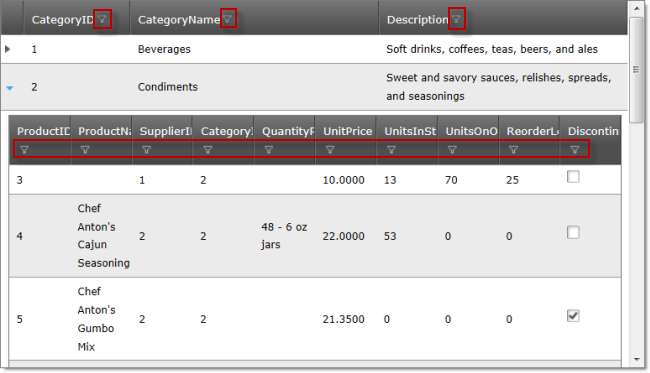
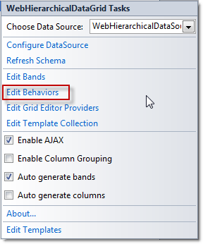
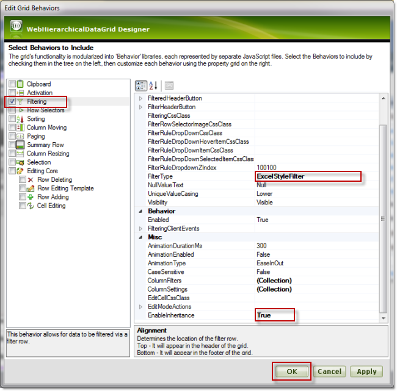
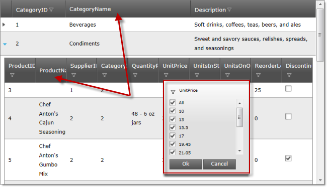

////

|metadata|
{
    "name": "webhierarchicaldatagrid-excelstylefiltering-enabling",
    "controlName": ["WebHierarchicalDataGrid"],
    "tags": ["Filtering","Grids"],
    "guid": "b1a99bd5-5ad9-457c-a9bc-5fb7dd4d84f0",  
    "buildFlags": [],
    "createdOn": "2012-07-16T12:17:57.6127202Z"
}
|metadata|
////

= Enabling Excel Style Filtering

== Topic Overview

=== Purpose

This topic demonstrates how to enable the link:webhierarchicaldatagrid-excelstylefiltering-landingpage.html[*Excel-Style Filtering* ] feature of the  _WebHierarchicalDataGrid_™ control.

=== Required background

The following topics are prerequisites to understanding this topic:

[options="header", cols="a,a"]
|====
|Topic|Purpose

| link:webhierarchicaldatagrid-getting-started-with-webhierarchicaldatagrid.html[Getting Started with _(WebHierarchicalDataGrid)_ ]
|This topic demonstrates how to bind the _WebHierarchicalDataGrid_ to the _WebHierarchicalDataSource_™ component using the _Categories_ and _Products_ tables of the Northwind sample database.

| link:webhierarchicaldatagrid-excelstylefiltering-overview.html[Excel-Style Filtering Overview ( _WebHierarchicalDataGrid_ )]
|This topic introduces the Excel-Style Filtering feature of the _WebHierarchicalDataGrid_ control.

|====

=== In this topic

This topic contains the following sections:

* <<_Ref335674225,Introduction>>
* <<_Ref336016015,Enabling Excel-Style Filtering summary>>

* <<_Ref336016195,Enabling Excel-Style Filtering property settings>>

* <<_Ref335674238,Enabling Excel-Style Filtering Using the Designer>>

* <<_Ref336279462,Introduction>>
* <<OLE_LINK77,Preview>>
* <<OLE_LINK41,Prerequisites>>
* <<OLE_LINK63,Overview>>
* <<_Ref336279480,Steps>>

* <<_Ref336279314,Enabling Excel-Style Filtering in the ASPX Markup>>

* <<_Ref336279498,Overview>>
* <<_Ref336279509,Preview>>
* <<_Ref336279547,Code>>

* <<_Ref336279321,Enabling Excel-Style Filtering in the Code-Behind>>

* <<_Ref336279563,Overview>>
* <<_Ref336279567,Preview>>
* <<_Ref336279570,Code>>

* <<_Ref335674243,Related Content>>

* <<_Ref336279588,Topics>>
* <<_Ref336279591,Samples>>

[[_Ref335674225]]
== Introduction

[[_Ref336016015]]

=== Enabling Excel-Style Filtering summary

By default, in  _WebHierarchicalDataGrid_  , the standard (non-Excel type) of filtering is enabled. Excel-Style Filtering option is enabled by setting the  _WebHierarchicalDataGrid_  ’s link:infragistics4.web.v{ProductVersion}~infragistics.web.ui.gridcontrols.filtering~filtertype.html[FilterType] property to  _ExcelStyleFilter_  . This enables Excel-Style Filtering on all columns, but you can use the link:infragistics4.web.v{ProductVersion}~infragistics.web.ui.gridcontrols.columnfilteringsetting.html[ColumnFilteringSetting] property to disable the feature on per-column basis.

The following section demonstrates how to enable Excel-Style Filtering on all columns:

* <<_Ref335674238,Enabling Excel-Style Filtering Using the Designer>>

The following sections demonstrate how to enable Excel-Style Filtering on all columns except one column in the parent band and one column in the parent band disable filtering for those two columns:

* <<_Ref336279314,Enabling Excel-Style Filtering in the ASPX Markup>>
* <<_Ref336279321,Enabling Excel-Style Filtering in the Code-Behind>>

[[_Ref336016020]]

=== Enabling Excel-Style Filtering property settings

The following table maps the desired filtering behavior to the property settings that configure it:

[options="header", cols="a,a,a"]
|====
|In order to:|Use this property:|And set it to:

|Enable Excel-Style Filtering
| link:infragistics4.web.v{ProductVersion}~infragistics.web.ui.gridcontrols.filtering~filtertype.html[FilterType]
|_ExcelStyleFilter_

|Disable filtering on a column
| link:infragistics4.web.v{ProductVersion}~infragistics.web.ui.gridcontrols.columnfilteringsetting.html[Enable (of ColumnSetting)]
| _false_ 

|====

[[_Ref335674229]]

[[_Ref335674238]]
== Enabling Excel-Style Filtering Using the Designer

[[_Ref336279462]]

=== Introduction

This example demonstrates how to enable the Excel-Style Filtering feature of the  _WebHierarchicalDataGrid_   for both the parent and the child bands using the Designer.

=== Preview

The following screenshot is a preview of the final result:

=== Prerequisites

To complete the procedure, you need the following:

* An ASP.NET Web Project with a WebHierarchicalDataGrid instantiated in a web page
* The WebHierarchicalDataGrid bound to the WebHierarchicalDataSource component using the Northwind  _Categories_   and  _Products_   tables. (For details, see the * link:webhierarchicaldatagrid-getting-started-with-webhierarchicaldatagrid.html[Getting Started with WebHierarchicalDataGrid]* topic.)

=== Overview

Following is a conceptual overview of the process: *1. Enabling Excel-Style Filtering* 

*2.*   _(Optional)_    * Verifying the result*

[[_Ref336279480]]

=== Steps

The following steps demonstrate how to Enable Excel-Style Filtering using the Designer.

=== 1. Enable Excel-Style Filtering.

*1.*  *Launch the* Edit Grid Behaviors dialog.

Click on the smart tag of the  _WebHierarchicalDataGrid_   and then *select the* *Edit Behaviors* *option* .

The WebDataGrid Designer dialog opens up. *2. Enable Excel-Style Filtering on both the parent and child levels.* 

A. In the Edit Grid Behaviors dialog. dialog, in the left-hand side panel, *check* *Filtering* .

B. In the right-hand side panel, *set the* * link:infragistics4.web.v{ProductVersion}~infragistics.web.ui.gridcontrols.filtering~filtertype.html[FilterType]* *property to*  _ExcelStyleFilter_  .

B. In the right-hand side panel, *set the* *EnableInheritance* *property to*  _True_  .

These settings enable filtering and allow it for the child bands.

B.  *Click the*  OK  *button* .

=== 3. (Optional) Verify the result.

To verify the result, save and run the project, then test the filtering behavior of the  _WebHierarchicalDataGrid_  .

[[_Ref336279314]]
== Enabling Excel-Style Filtering in the ASPX Markup

[[_Ref336279498]]

=== Overview

This example demonstrates how, in the ASPX markup, to enable Excel-Style Filtering on all columns for both the parent and the child bands except on one column in each band (CategoryName in the parent band and ProductName in the child band) for which filtering is explicitly disabled.

[[_Ref336279509]]

=== Preview

The following picture demonstrates the result generated by the code in this example.

[[_Ref336279547]]

=== Code

*In ASPX:*

[source,html]
----
<Behaviors>
    <ig:Filtering FilterType="ExcelStyleFilter">
        <ColumnSettings>
            <ig:ColumnFilteringSetting ColumnKey="CategoryName" Enabled=" />
        </ColumnSettings>
    </ig:Filtering>
</Behaviors>
<Bands>
    <ig:Band Key="Products" DataMember="SQLDataSource_Products" DataKeyFields="CategoryID">
        <Behaviors>
            <ig:Filtering FilterType="ExcelStyleFilter">
                <ColumnSettings>
                    <ig:ColumnFilteringSetting ColumnKey="ProductName" Enabled=" />
                </ColumnSettings>
            </ig:Filtering>
        </Behaviors>
    </ig:Band>
</Bands>
----

[[_Ref335674233]]

[[_Ref336279321]]
== Enabling Excel-Style Filtering in the Code-Behind

[[_Ref336279563]]

=== Overview

This example demonstrates how, in the ASPX markup, to enable Excel-Style Filtering on all columns for both the parent and the child bands except on one column in each band (CategoryName in the parent band and ProductName in the child band) for which filtering is explicitly disabled.

[[_Ref336279567]]

=== Preview

The following picture demonstrates the result generated by the code in this example.

[[_Ref336279570]]

=== Code

*In C#:*

[source,csharp]
----
 protected void Page_Load(object sender, EventArgs e)
        {
            this.WebHierarchicalDataGrid1.InitializeBand += new InitializeBandEventHandler(WebHierarchicalDataGrid1_InitializeBand);
            this.WebHierarchicalDataGrid1.Behaviors.CreateBehavior<Filtering>();
            this.WebHierarchicalDataGrid1.Behaviors.Filtering.FilterType = FilteringType.ExcelStyleFilter;
            this.WebHierarchicalDataGrid1.Behaviors.Filtering.EnableInheritance = true;
            //Create a ColumnFilteringSetting 
            ColumnFilteringSetting settingColumn = new ColumnFilteringSetting();
            //Set the ColumnKey
            settingColumn.ColumnKey = "CategoryName";
            //Set the Enabled property to false
            settingColumn.Enabled = false;
            this.WebHierarchicalDataGrid1.Behaviors.Filtering.ColumnSettings.Add(settingColumn);
            this.WebHierarchicalDataGrid1.RefreshBehaviors();
        }
        void WebHierarchicalDataGrid1_InitializeBand(object sender, BandEventArgs e)
        {
            e.Band.Behaviors.CreateBehavior<Filtering>();
            e.Band.Behaviors.Filtering.Enabled = true;
            e.Band.Behaviors.Filtering.FilterType = FilteringType.ExcelStyleFilter;
            e.Band.Behaviors.Filtering.EnableInheritance = true;
            ColumnFilteringSetting settingColumn = new ColumnFilteringSetting();
            settingColumn.ColumnKey = "ProductName";
            settingColumn.Enabled = false;
            e.Band.Behaviors.Filtering.ColumnSettings.Add(settingColumn);
        }
----

[[_Ref335674243]]
== Related Content

[[_Ref336279588]]

=== Topics

The following topics provide additional information related to this topic:

[options="header", cols="a,a"]
|====
|Topic|Purpose

| link:webhierarchicaldatagrid-excelstylefiltering-configuring.html[Configuring Excel-Style Filtering _(WebHierarchicalDataGrid)_ ]
|This topic explains how to configure the Excel-Style Filtering options of the _WebHierarchicalDataGrid_ control.

| link:webhierarchicaldatagrid-excelstylefiltering-propertyreference.html[Excel-Style Filtering Property Reference _(WebHierarchicalDataGrid)_ ]
|This topic provides reference information about the properties that are specific to the Excel-Style Filtering feature of the _WebHierarchicalDataGrid_ control.

|====

[[_Ref336279591]]

=== Samples

The following samples provide additional information related to this topic:

[options="header", cols="a,a"]
|====
|Sample|Purpose

| link:{SamplesUrl}/hierarchical-data-grid/excel-style-filtering-bound-unbound-fields[Excel-Style Filtering - Bound/Unbound Fields]
|This sample demonstrates Excel-Style Filtering with Bound and Unbound fields as well as with Bound and Unbound checkboxes.

| link:{SamplesUrl}/hierarchical-data-grid/excel-style-filtering-with-crud-enabled[Excel-Style Filtering with CRUD Enabled]
|This sample demonstrates Excel-Style Filtering with editing.

|====