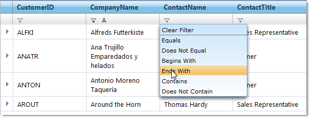

////

|metadata|
{
    "name": "webhierarchicaldatagrid-filtering",
    "controlName": ["WebHierarchicalDataGrid"],
    "tags": ["Filtering","Grids"],
    "guid": "8c53fb26-5c31-49c1-9130-65682c7c4505",  
    "buildFlags": [],
    "createdOn": "2010-06-08T03:45:40.2308078Z"
}
|metadata|
////

= Filtering

The filtering feature of WebDataGrid™ is available in WebHierarchicalDataGrid™. Filtering breaks the data into a smaller subset that matches your filter criteria and displays it. This makes the data more viewable and manageable to your end-users. If AJAX is enabled, the filtering is asynchronous. You can filter using the API provided for WebDataGrid or through the filter row UI.

The core filtering functionality remains the same as that of WebDataGrid. This article focuses on the filtering settings that are specific to WebHierarchicalDataGrid. For basic information on filtering, see link:webdatagrid-filtering.html[Filtering]in WebDataGrid.

== Filtering Hierarchical Data

Each band in WebHierarchicalDataGrid can be assigned a Filtering behavior. You can set the  pick:[asp-net="link:{ApiPlatform}web{ApiVersion}~infragistics.web.ui.gridcontrols.editablebehaviorbase~enableinheritance.html[EnableInheritance]"]  property of a band to enable child bands to inherit the setting. This allows you to customize filtering behavior in each band of data. For example, if you want filtering for all bands in WebHierarchicalDataGrid, just enable the Filtering behavior at the root level and set EnableInheritance to True. If you want to disable the behavior for a specific child band, disable the behavior for that specific band.

== Filtering Child Bands

When you enable filtering for child bands, the child container grids display filter icons that your end-users can click on to filter the child data. The data is only filtered for that particular container grid; i.e., child data is filtered by the data islands it belongs to, not by the band.

If you filter out all the child rows for a row, you can still expand and collapse the row; however, the container grid will be blank.

You can also filter data from code-behind without relying on the UI. This is useful when you have data that you want to filter on load of the WebHierarchicalDataGrid control. Keep in mind that since the control displays an expansion indicator only if the row has child data, this may result in parent rows that are not expandable since their entire child rows may be filtered out.

Bellow you can find a walkthrough on enabling the filtering functionality.

== Follow These Steps

[start=1]
. Bind WebHierarchicalDataGrid to a WebHierarchicalDataSource component retrieving data from the Customers and Orders tables of Northwind. For more information on doing this, see Binding WebHierarchicalDataGrid to a WebHierarchicalDataSource.
[start=2]
. In the Microsoft® Visual Studio™ property window, locate the  pick:[asp-net="link:{ApiPlatform}web{ApiVersion}~infragistics.web.ui.gridcontrols.webhierarchicaldatagrid~behaviors.html[Behaviors]"]  property and click the ellipsis (...) button to launch the Behaviors Editor Dialog.
[start=3]
. Check the check box for the Activation behavior from the list on the left to enable it.
[start=4]
. Check the Filtering behavior and set Enable and EnableInheritance to True.
[start=5]
. Set the initial filtering condition for the Customer band so that WebHierarchicalDataGrid only filters in data for Sales Representatives.

.. Locate the  pick:[asp-net="link:{ApiPlatform}web{ApiVersion}~infragistics.web.ui.gridcontrols.columnfilters.html[ColumnFilters]"]  property and click the ellipsis (...) button to launch the Column Filter Editor Dialog.
.. Add a Column Filter by clicking the Add Item button.
.. Set the filter’s  pick:[asp-net="link:{ApiPlatform}web{ApiVersion}~infragistics.web.ui.gridcontrols.columnfilter~columnkey.html[ColumnKey]"]  property to ContactTitle.
.. Select RuleTextNode in the drop-down for the Condition property.
.. Click the expansion indicator of the  pick:[asp-net="link:{ApiPlatform}web{ApiVersion}~infragistics.web.ui.gridcontrols.columnfilter~condition.html[Condition]"]  property for the column. The Rule and Value properties appear.
.. Set the Rule to Equals and the Value to Sales Representative.
.. Click Apply then OK to close the Column Filter Editor Dialog.
.. Click Apply then OK to close the Behaviors Editor Dialog.

[start=6]
. Set the initial filtering condition for the child Order band so that WebHierarchicalDataGrid only filters in data with dates after 12/31/1996.

.. Locate the  pick:[asp-net="link:{ApiPlatform}web{ApiVersion}~infragistics.web.ui.gridcontrols.webhierarchicaldatagrid~bands.html[Bands]"]  property and click the ellipsis (…) button. The Edit Bands dialog displays.
.. Add a child band to the root band by clicking the Add Child button.
.. Change the  pick:[asp-net="link:{ApiPlatform}web{ApiVersion}~infragistics.web.ui.gridcontrols.band~key.html[Key]"]  to Orders.
.. Set  pick:[asp-net="link:{ApiPlatform}web{ApiVersion}~infragistics.web.ui.gridcontrols.band~datamember.html[DataMember]"]  to AccessDataSource2_Orders.
.. Set  pick:[asp-net="link:{ApiPlatform}web{ApiVersion}~infragistics.web.ui.gridcontrols.band~datakeyfields.html[DataKeyFields]"]  to OrderID.
.. Click the ellipsis (…) button for the Behaviors property.
.. Check the checkbox for the Filtering behavior.
.. Click the ellipsis (…) button for the ColumnFilters property.
.. Add a Column Filter like you did in step 5, this time setting ColumnKey to OrderDate and the Condition to RuleDateNode.
[start=10]
.. Set the Rule to After and the Value to 12/31/1996.
[start=11]
.. Click OK to close the Edit Behaviors dialog.
[start=12]
.. Click OK to close the Edit Bands dialog.

You can also do the above steps using the code below.

.Note:
[NOTE]
====
In certain cases, you must call the ApplyFilter method to apply the filter or WebHierarchicalDataGrid does not filter until the next postback. On the client side, when adding multiple filters, you must add them as an array of filters using the add_columnFilterRange method. The code-behind shown below assumes you have defined your bands in the markup and handled the InitializeBand server-side event.
====

*In HTML:*

[source]
----
<ig:webhierarchicaldatagrid ID="WebHierarchicalDataGrid1" DataSourceID="WebHierarchicalDataSource1" runat="server" Height="350px" Width="600px" DataKeyFields="CustomerID" Key="Customers">
----

[source]
----
            <Behaviors>
                <ig:Activation Enabled="true">
                </ig:Activation>
                <ig:Filtering>
                    <ColumnFilters>
                        <ig:ColumnFilter ColumnKey="ContactTitle">
                            <ConditionWrapper>
                                <ig:RuleTextNode Rule="Equals" Value="Sales Representative" />
                            </ConditionWrapper>
                        </ig:ColumnFilter>
                    </ColumnFilters>
                </ig:Filtering>
            </Behaviors>
            <Bands>
                <ig:Band Key="Orders">
                    <Behaviors>
                        <ig:Filtering>
                            <ColumnFilters>
                                <ig:ColumnFilter ColumnKey="OrderDate">
                                    <ConditionWrapper>
                                        <ig:RuleDateNode Value="" />
                                    </ConditionWrapper>
                                </ig:ColumnFilter>
                            </ColumnFilters>
                            <ColumnSettings>
                                <ig:ColumnFilteringSetting />
                            </ColumnSettings>
                        </ig:Filtering>
                    </Behaviors>
                </ig:Band>
            </Bands>
----

[source]
----
</ig:webhierarchicaldatagrid> 
----

*In C#:*

----
protected void WebHierarchicalDataGrid1_InitializeBand(object sender, BandEventArgs e)
    {
        if (e.Band.Key == "Customers")
        {
            e.Band.Behaviors.CreateBehavior<Filtering>();
            e.Band.Behaviors.Filtering.Enabled = true;
            e.Band.Behaviors.Filtering.EnableInheritance = true;
            RuleTextNode textCondition = new RuleTextNode(TextFilterRules.Equals, "Sales Representative");
            ColumnFilter columnFilter1 = new ColumnFilter();
            columnFilter1.ColumnKey = "ContactTitle";
            columnFilter1.Condition = textCondition;
            e.Band.Behaviors.Filtering.ColumnFilters.Add(columnFilter1);
            this.WebHierarchicalDataGrid1.RefreshBehaviors();
        }
        else if (e.Band.Key == "Orders")
        {
            e.Band.Behaviors.CreateBehavior<Filtering>();
            e.Band.Behaviors.Filtering.Enabled = true;
            RuleDateNode dateCondition = new RuleDateNode(DateTimeFilterRules.After, DateTime.Parse("12/31/1996"));
            ColumnFilter columnFilter1 = new ColumnFilter();
            columnFilter1.ColumnKey = "OrderDate";
            columnFilter1.Condition = dateCondition;
            e.Band.Behaviors.Filtering.ColumnFilters.Add(columnFilter1);
            this.WebHierarchicalDataGrid1.RefreshBehaviors();
        }
    }
----

[start=7]
. Run the application. WebDataGrid displays records for customer ALFKI after order date of 1996. You can filter the data further by clicking on a drop-down list in one of the columns, choosing a condition, and typing in a value. WebDataGrid will filter the existing data.