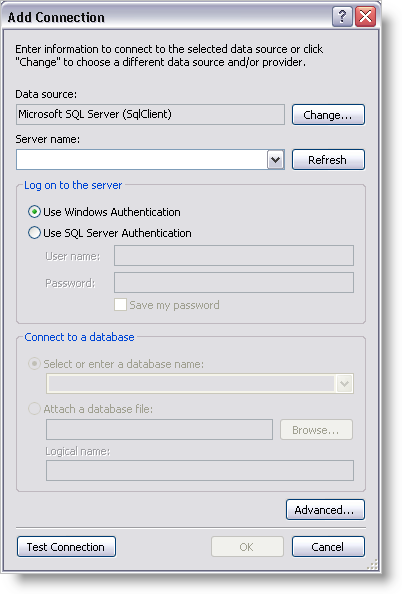

////

|metadata|
{
    "name": "webhierarchicaldatagrid-getting-started-with-webhierarchicaldatagrid",
    "controlName": ["WebHierarchicalDataGrid"],
    "tags": ["Data Binding","Data Presentation","Design Environment","Getting Started","Grids"],
    "guid": "{1A4F9337-B361-4831-A5C2-D1790ECDCE2E}",  
    "buildFlags": [],
    "createdOn": "0001-01-01T00:00:00Z"
}
|metadata|
////

= Getting Started with WebHierarchicalDataGrid

== Before You Begin

WebHierarchicalDataGrid™ allows many features to be enabled for complex behaviors and dynamic operations. The most common use however, is to display data. Binding and displaying data with WebHierarchicalDataGrid is a simple process. It can bind to many forms of hierarchical data sources. One convenient way to obtain hierarchical data is by using WebHierarchicalDataSource™. For more information on using the WebHierarchicalDataSource component to bind to data, see link:webhierarchicaldatasource-getting-started-with-webhierarchicaldatasource.html[Getting Started with WebHierarchicalDataSource].

== What You Will Accomplish

You will learn how to bind WebHierarchicalDataGrid to the WebHierarchicalDataSource component using the Northwind Categories and Products table.

== Follow these Steps

[start=1]
. Create an ASP.Net web page.
[start=2]
. Drag a ScriptManager component from the toolbox onto the page.
[start=3]
. Drag a WebHierarchicalDataGrid control from the toolbox onto the page.
[start=4]
. Drag a WebHierarchicalDataSource component from the toolbox onto the page.

.Note:
[NOTE]
====
If you already know how to set up WebHierarchicalDataSource, set the component to retrieve the Categories and Products data with a parent-child relationship, and skip to step 26.
====

[start=5]
. Click WebHierarchicalDataSource's Smart Tag and select Edit Relations. The Quick Design appears.

[start=6]
. Click the Add View option.
[start=7]
. Select New Data Source from the drop-down list that appears.

.Note:
[NOTE]
====
If you have data sources readily available on your page at this time, these data sources will appear in the drop-down list. If you have multiple views in a data source, they are selectable in the DataView drop-down list.
====

The Data Source Configuration Wizard appears.

image::images/WebHierarchicalDataSource_Getting_Started_with_WebHierarchicalDatasource_02.png[]

[start=8]
. Select Database.
[start=9]
. Click OK.
[start=10]
. WebHierarchicalDataSource adds a SqlDataSource component to the form and the Configure Data Source wizard appears for the SqlDataSource component.

image::images/WebGrid_Binding_WebGrid_To_SQL_Data_Source_01.png[]

[start=11]
. Click New Connection to configure the connection string. The Add Connection dialog appears.

[start=12]
. Set the server name to the server you are using, SQLEXPRESS in this case. Set the database to Northwind.
[start=13]
. Click Ok. You are returned to the Configure Connection screen.
[start=14]
. Click Next.
[start=15]
. Select Specify Columns from a Table or View and do the following:

.. Choose the Categories table from the drop-down list.
.. In the Columns section, select CategoryID, CategoryName, and Description to display those columns.
.. At this point you have the option to click the Advanced button to specify that the SqlDataSource component should generate Insert, Update, and Delete statements for the data retrieved.

[start=16]
. Click Next.
[start=17]
. Test your query to make sure SqlDataSource retrieves your data.
[start=18]
. Click Finish to close the configuration wizard. SqlDataSource is set up to retrieve the Categories data from the Northwind database.
[start=19]
. Click Ok to return to the Quick Design. You will see the SqlDataSource you just added.

[start=20]
. Click the Add Child node directly under the SqlDataSource1 node. The child configuration screen appears.

.Note:
[NOTE]
====
You can also add a sibling node for the existing data source at this point by clicking on the Add View link at the same level of the added data source.
====

[start=21]
. Select New Data Source in the Child DataSource drop-down list.

.Note:
[NOTE]
====
At this point, you can also select the first data source to create a self-related view. For more information, see link:webhierarchicaldatasource-creating-a-self-related-data-relation.html[Creating a Self-Related Data Relation].
====

[start=22]
. Repeat steps 8 – 12 for the second SqlDataSource, this time choosing the Products table with all columns selected.
[start=23]
. Add the relation between the two data sources by selecting the columns for the relationship.

.. Select CategoryID in the Parent Columns drop-down list.
.. Select CategoryID in the Child Columns drop-down list.

.Note:
[NOTE]
====
You can relate tables by selecting additional columns based on a composite key. For more information, see link:webhierarchicaldatasource-add-a-composite-key-relationship.html[Add a Composite Key Relationship].
====

[start=24]
. Click Ok to return to the Quick Design view.
[start=25]
. At this point, WebHierarchicalDataSource is ready to use two SQL data sources to display hierarchical data. Click Apply then Ok.
[start=26]
. Set WebHierarchicalDataGrid's DataSourceID property to WebHierarchicalDataSource1 in the Properties window. You will be prompted to Refresh Bands, Columns, and Keys for WebHierarchicalDataGrid.
[start=27]
. Click Yes. This will automatically set the DataMember and Key properties to SqlDataSource1_DefaultView, which is the name of the first data view that you set up in WebHierarchicalDataSource.

[start=28]
. Run the application. WebHierarchicalDataGrid displays a hierarchical view of the Categories and Products tables.

image::images/WebHierarchicalDataGrid_Binding_to_Data_03.png[]

== Related Topics

link:webhierarchicaldatagrid-about-webhierarchicaldatagrid.html[About Data Binding]