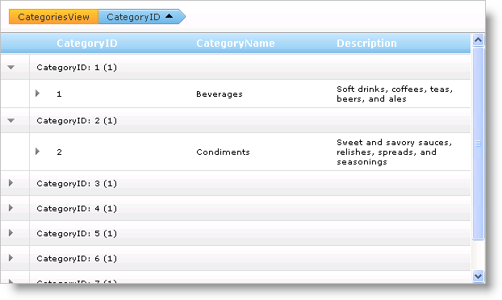

////

|metadata|
{
    "name": "webhierarchicaldatagrid-group-columns-from-code-behind",
    "controlName": ["WebHierarchicalDataGrid"],
    "tags": ["Grids","Grouping"],
    "guid": "{A22B176A-88A2-407A-B6B9-81FA76F79FF6}",  
    "buildFlags": [],
    "createdOn": "0001-01-01T00:00:00Z"
}
|metadata|
////

= Group Columns from Code Behind

Using the GroupBy feature in WebHierarchicalDataGrid™ allows you to present data to your end users in an organized fashion. You can group columns from code behind by adding columns to the link:infragistics4.web.v{ProductVersion}~infragistics.web.ui.gridcontrols.groupedcolumns.html[GroupedColumns] collection.

The following code shows you how to group by the CategoryName column.

*In Visual Basic:*

----
Me.WebHierarchicalDataGrid1.GroupingSettings.EnableColumnGrouping = True
Me.WebHierarchicalDataGrid1.GroupingSettings.GroupedColumns.Add("CategoryID")
----

*In C#:*

----
this.WebHierarchicalDataGrid1.GroupingSettings.EnableColumnGrouping = true;
this.WebHierarchicalDataGrid1.GroupingSettings.GroupedColumns.Add("CategoryID");
----

*In Javascript:*

----
var grid = $find("WebHierarchicalDataGrid1");
grid.get_groupingSettings().get_groupedColumns().add("CategoryID");
----

== Related Topics

link:webhierarchicaldatagrid-about-outlook-groupby.html[About Outlook GroupBy]

link:webhierarchicaldatagrid-custom-group-by-name.html[Custom Group by Name]

link:webhierarchicaldatagrid-custom-text-in-group-row.html[Custom Text in Group Row]

link:webhierarchicaldatagrid-outlook-groupby-with-behaviors.html[Outlook GroupBy with Behaviors]

link:webhierarchicaldatagrid-referencing-rows-when-using-outlook-groupby.html[Referencing Rows When Using Outlook GroupBy]