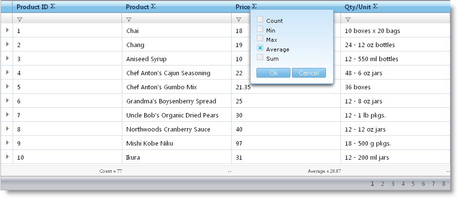

////

|metadata|
{
    "name": "webhierarchicaldatagrid-summary-row",
    "controlName": ["WebHierarchicalDataGrid"],
    "tags": ["Grids","Summaries"],
    "guid": "095a6e5e-c66b-450c-a2f2-92b541b6d87c",  
    "buildFlags": [],
    "createdOn": "2010-09-30T07:07:59.1446544Z"
}
|metadata|
////

= Summary Row

The Summary Row feature of WebDataGrid™ is available in WebHierarchicalDataGrid™. The behavior allows adding standard summaries (Count; Sum; Average; Min; Max) as well as custom ones.

Each band in WebHierarchicalDataGrid can be assigned a Summary Row behavior. You can set the link:{ApiPlatform}web{ApiVersion}~infragistics.web.ui.gridcontrols.summaryrow~enableinheritance.html[EnableInheritance] property of a band to enable child bands to inherit the setting. This allows you to customize summary row behavior in each band of data. For example, if you want summaries for all bands in WebHierarchicalDataGrid, just enable the SummaryRow behavior at the root level and set EnableInheritance to True. If you want to disable the behavior for a specific child band, disable the behavior for that specific band.

When enabled, the behavior adds a summary button to each header. When the button is pressed, a drop-down with available summaries appears.

.Note:
[NOTE]
====
The standard summaries are available for numeric data only. An exception is Count summary type, which is always available.
====

== Enabling Summary Row

In order to enable summaries for WebHierarchicalDataGrid and allow end-users to add summaries for a column you can follow these steps.

[start=1]
. Bind WebHierarchicalDataGrid to a WebHierarchicalDataSource component retrieving data from the Products and Orders tables of Northwind. For more information on doing this, see Binding WebHierarchicalDataGrid to a WebHierarchicalDataSource.
[start=2]
. In the Microsoft® Visual Studio™ property window, locate the link:{ApiPlatform}web{ApiVersion}~infragistics.web.ui.gridcontrols.webhierarchicaldatagrid~behaviors.html[Behaviors] property and click the ellipsis (...) button to launch the Behaviors Editor Dialog.
[start=3]
. Check the link:{ApiPlatform}web{ApiVersion}~infragistics.web.ui.gridcontrols.summaryrow.html[Summary Row] behavior and set Enable and link:{ApiPlatform}web{ApiVersion}~infragistics.web.ui.gridcontrols.summaryrow~enableinheritance.html[EnableInheritance] to True.
[start=4]
. Add an Average summary for the Products band (UnitPrice column).

.. Locate the link:{ApiPlatform}web{ApiVersion}~infragistics.web.ui.gridcontrols.summaryrow~columnsummaries.html[ColumnSummaries] property and click the ellipsis (...) button to launch the link:{ApiPlatform}web{ApiVersion}~infragistics.web.ui.gridcontrols.columnsummaryinfo.html[ColumnSummaryInfo] Dialog.
.. Add a Column Summary by clicking the Add Item Button.
.. Set the summary’s link:{ApiPlatform}web{ApiVersion}~infragistics.web.ui.gridcontrols.columnsummaryinfo~columnkey.html[ColumnKey] property to UnitPrice.
.. Locate the link:{ApiPlatform}web{ApiVersion}~infragistics.web.ui.gridcontrols.summaries.html[Summaries] property and click the ellipsis (...) button to launch the the link:{ApiPlatform}web{ApiVersion}~infragistics.web.ui.gridcontrols.summary.html[Summary] Collection Editor Dialog.
.. Set the link:{ApiPlatform}web{ApiVersion}~infragistics.web.ui.gridcontrols.summary~summarytype.html[SummaryType] property to Average.
.. Click Apply then OK to close the Summary Collection Editor Dialog, and do the same to close ColumnSummaryInfo Dialog.
.. Click Apply then OK to close the Behaviors Editor Dialog.

[start=5]
. Add a Sum summary for the child Orders band (Quantity column).

.. Locate the link:{ApiPlatform}web{ApiVersion}~infragistics.web.ui.gridcontrols.band.html[Band] property and click the ellipsis (…) button. The Edit Bands dialog displays.
.. Add a child band to the root band by clicking the Add Child button.
.. Change the link:{ApiPlatform}web{ApiVersion}~infragistics.web.ui.gridcontrols.band~key.html[Key] to Orders.
.. Set link:{ApiPlatform}web{ApiVersion}~infragistics.web.ui.gridcontrols.band~datamember.html[DataMember] to AccessDataSource2_Orders.
.. Set link:{ApiPlatform}web{ApiVersion}~infragistics.web.ui.gridcontrols.band~datakeyfields.html[DataKeyFields] to OrderID.
.. Click the ellipsis (…) button for the Behaviors property.
.. Check the checkbox for the Summary Row behavior.
.. Click the ellipsis (…) button for the ColumnSummaries property.
.. Add a column summary as you did at the previous step; this time set the ColumnKey to Quantity and the SummaryType to Sum.
[start=10]
.. Click OK to close the Edit Behaviors dialog.
[start=11]
.. Click Apply then OK to close the Behaviors Editor Dialog.

You can also do the above steps using the code below.

*In HTML:*

----
<ig:WebHierarchicalDataGrid ID="WebHierarchicalDataGrid1" runat="server" DataSourceID="WebHierarchicalDataSource1"
            Height="400px" Width="750px" DataKeyFields="ProductID">
            <Bands>
                <ig:Band Height="100" DataMember="AccessDataSource1_Orders" DataKeyFields="OrderID">
                    <Behaviors>
                        <ig:SummaryRow>
                            <ColumnSummaries>
                                <ig:ColumnSummaryInfo ColumnKey="Quantity">
                                    <Summaries>
                                        <ig:Summary SummaryType="Sum"></ig:Summary>
                                    </Summaries>
                                </ig:ColumnSummaryInfo>
                            </ColumnSummaries>
                        </ig:SummaryRow>
                    </Behaviors>
                </ig:Band>
            </Bands>
            <Behaviors>
                <ig:SummaryRow EnableInheritance="true">
                    <ColumnSummaries>
                        <ig:ColumnSummaryInfo ColumnKey="UnitPrice">
                            <Summaries>
                                <ig:Summary SummaryType="Average"></ig:Summary>
                            </Summaries>
                        </ig:ColumnSummaryInfo>
                    </ColumnSummaries>
                </ig:SummaryRow>
            </Behaviors>
        </ig:WebHierarchicalDataGrid>
----

*In C#:*

----
protected void WebHierarchicalDataGrid1_InitializeBand(object sender, BandEventArgs e)
{
    if (e.Band.Key == "Products")
    {
        e.Band.Behaviors.CreateBehavior<SummaryRow>();
        e.Band.Behaviors.SummaryRow.EnableInheritance = true;
        ColumnSummaryInfo unitPriceSummary = new ColumnSummaryInfo();
        unitPriceSummary.ColumnKey = "UnitPrice";
        unitPriceSummary.Summaries.Add(SummaryType.Average);
        e.Band.Behaviors.SummaryRow.ColumnSummaries.Add(unitPriceSummary);
        this.WebHierarchicalDataGrid1.RefreshBehaviors();
    }
    else if (e.Band.Key == "Orders")
    {
        e.Band.Behaviors.CreateBehavior<SummaryRow>();
        e.Band.Behaviors.SummaryRow.EnableInheritance = true;
        ColumnSummaryInfo quantitySummary = new ColumnSummaryInfo();
        quantitySummary.ColumnKey = "Quantity";
        quantitySummary.Summaries.Add(SummaryType.Sum);
        quantitySummary.Summaries.Add(SummaryType.Max);
        e.Band.Behaviors.SummaryRow.ColumnSummaries.Add(quantitySummary);
        this.WebHierarchicalDataGrid1.RefreshBehaviors();
    }
}
----

[start=6]
. Run the application. WebHierarchicalDataGrid displays Average summary for the UnitPrice column and Sum summary for the child band’s Quantity column. You can add additional summaries by clicking the summary button at the header of the columns and choosing a summary type from the drop-down options.

== Related Topics

link:webdatagrid-adding-custom-summary.html[Adding Custom Summaries]

link:webdatagrid-summary-settings.html[Summary Settings]

link:webdatagrid-compact-rendering.html[Compact Rendering]