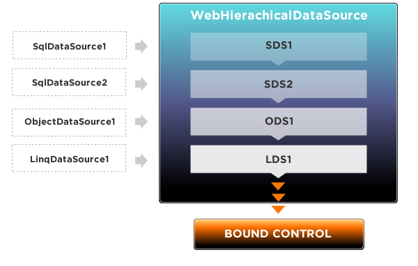

////

|metadata|
{
    "name": "webhierarchicaldatasource-about-webhierarchicaldatasource",
    "controlName": ["WebHierarchicalDataSource"],
    "tags": ["Data Presentation","Getting Started","Sample Data Source"],
    "guid": "{CCAD9E90-C8A2-4A4C-8DDC-F8CD8AD2423C}",  
    "buildFlags": [],
    "createdOn": "0001-01-01T00:00:00Z"
}
|metadata|
////

= About WebHierarchicalDataSource

The WebHierarchicalDataSource™ component is an intermediary between data-bound controls and data sources such as standard Microsoft® data source controls. You can use WebHierarchicalDataSource to combine data source controls and link them together so that, as far as the data-bound controls are concerned, only one data source is seen.

Using WebHierarchicalDataSource you can display a hierarchical view of data from data sources that do not implement the IHierarchicalDataSource interface.

The data sources used can be linked together using data relations. WebHierarchicalDataSource supports the following relations:

* One parent to one child
* One parent to N child
* Composite key
* Self Related

WebHierarchicalDataSource only supports certain types of objects. Auto Create, Read, Update, and Delete (CRUD) operations also depend on the data source type. The following table displays supported data sources and depicts the status of support for certain data operations. The status of support is as follows:

* Yes – automatic support.
* Configure – data source must be configured for support.
* Implement – data source must implement proper interface for support.

[options="header", cols="a,a,a"]
|====
|Object Type|Supported|Auto CRUD

|SqlDataSource
|Yes
|Configure

|LinqDataSource
|Yes
|Configure

|ObjectDataSource
|Yes
|Configure

|XmlDataSource
|No
|No

|AccessDataSource
|Yes
|Configure

|SitemapDataSource
|No
|No

|DataSet
|Yes
|No

|IEnumerable
|Yes
|No

|ICollection
|Yes
|No

|====