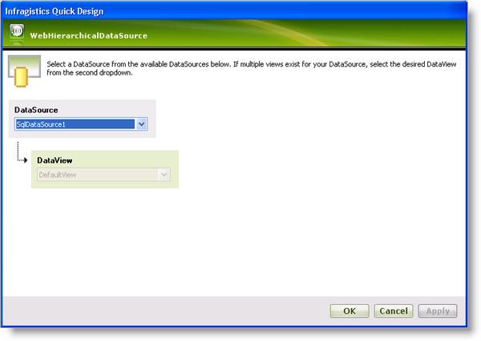
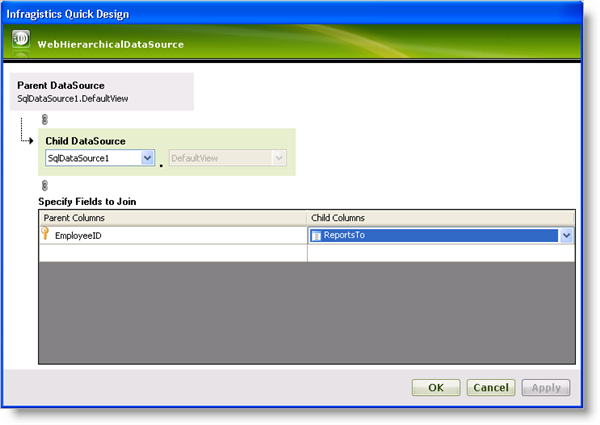
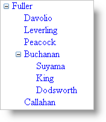

////

|metadata|
{
    "name": "webhierarchicaldatasource-creating-a-self-related-data-relation",
    "controlName": ["WebHierarchicalDataSource"],
    "tags": ["Data Presentation","Sample Data Source"],
    "guid": "{7C43A2CC-003D-40FE-99A5-1357E73F10A9}",  
    "buildFlags": [],
    "createdOn": "0001-01-01T00:00:00Z"
}
|metadata|
////

= Creating a Self-Related Data Relation

== Before You Begin

You can represent a self-related data model with WebHierarchicalDataSource™. If your data entity contains fields that relate to each other, you can show the self-related data model as a hierarchical view using WebHierarchicalDataSource.

For example, the Employees table of the Northwind data base contains a ReportTo field that specifies the employee id that an employee reports to. You can display the hierarchy of employee order by defining a self-related relationship using WebHierarchicalDataSource.

.Note:
[NOTE]
====
When creating a self-related data relation, make sure that the relation is not infinitely recursive otherwise no data is displayed.
====

== What You Will Accomplish

You will display the Employees table in a hierarchical fashion in order to show who the employees report to. You will do this using a self-related data relation using the WebHierarchicalDataSource component. The hierarchy of data is displayed in a TreeView control.

== Follow These Steps

[start=1]
. Create an ASP.NET Webpage.
[start=2]
. Drag a ScriptManager component on the form.
[start=3]
. Drag a TreeView control on the form.
[start=4]
. Drag a WebHierarchicalDataSource component on the form.
[start=5]
. Drag a SqlDataSource component on the form.
[start=6]
. Configure the SqlDataSource component to connect to the Employees table of the Northwind data base. Retrieve the EmployeeID, LastName, and ReportTo fields.
[start=7]
. In the Quick Designer for WebHierarchicalDataSource, click Add View.
[start=8]
. Select SqlDataSource1 as the data source.

[start=9]
. Click OK.
[start=10]
. Click Add Child to add the child data.
[start=11]
. Select the same data source, SqlDataSource1, as the child data source.
[start=12]
. In the Specify Fields to Join section, leave the EmployeeID field as the parent column and select the ReportsTo field as the child column.

[start=13]
. Click Ok. You return to the Quick Design main screen.
[start=14]
. Click Apply then OK. WebHierarchicalDataSource is now configured to display the SQL data as a hierarchy.
[start=15]
. Click the Smart Tag for the TreeView control.

.. Select WebHierarchicalDataSource for the data source.
.. Click on the Edit TreeNode Databindings link. The TreeView DataBindings Editor appears.
.. Select SqlDataSource1_DefaultView in the Available data bindings section and click Add.
.. In the properties window, make sure SqlDataSource1_DefaultView is the DataMember and that the TextField property is set to LastName.
.. Click Apply then OK.

[start=16]
. Run the application. You will see a hierarchical tree view that displays employee names nested according to the order of who they report to.

== Related Topics

link:webhierarchicaldatasource-add-a-parent-to-multiple-child-relationship.html[Add a Parent to Multiple Child Relationship]

link:webhierarchicaldatasource-add-a-composite-key-relationship.html[Add a Composite Key Relationship]

link:webhierarchicaldatasource-add-a-single-parent-to-single-child-relationship.html[Add a Single Parent to Single Child Relationship]