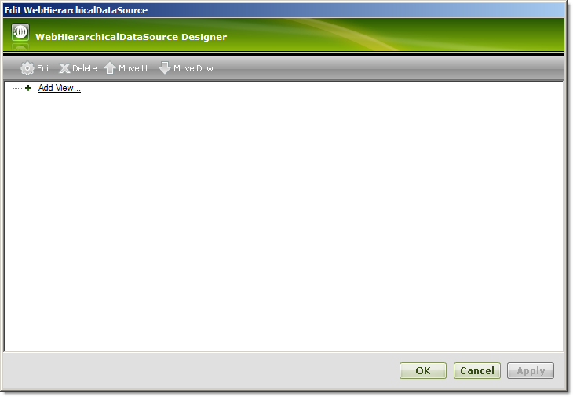
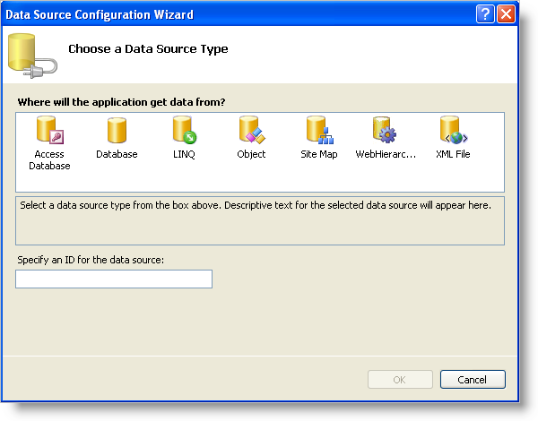
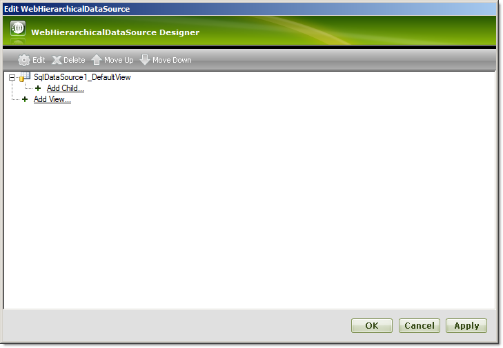
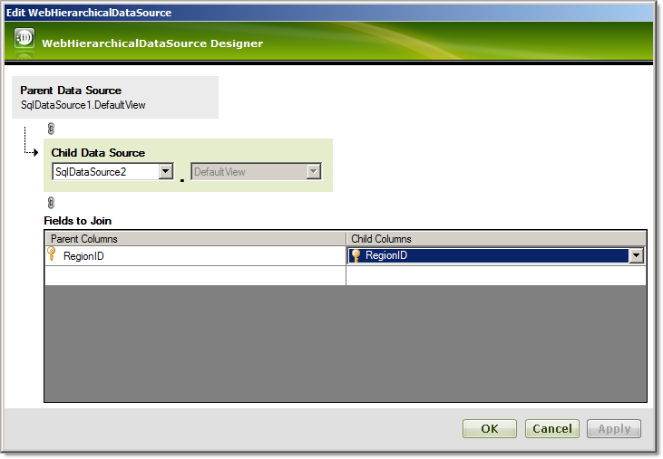

////

|metadata|
{
    "name": "webhierarchicaldatasource-getting-started-with-webhierarchicaldatasource",
    "controlName": ["WebHierarchicalDataSource"],
    "tags": [],
    "guid": "{058F5265-7714-49E5-B2C8-0794351F448A}",  
    "buildFlags": [],
    "createdOn": "2008-05-05T10:23:54Z"
}
|metadata|
////

= Getting Started with WebHierarchicalDataSource

== Before You Begin

The WebHierarchicalDataSource™ component allows you to use a variety of data sources as the data source for a data-bound control such as the WebHierarchicalDataGrid™. You can add data relations to WebHierarchicalDataSource – a powerful and flexible technique to display hierarchical data or combine different data sources.

== What You Will Accomplish

You will learn how to display a hierarchical view in the WebHierarchicalDataGrid using the WebHierarchicalDataSource component and two SQL Data Sources.

== Follow These Steps

[start=1]
. Create an ASP.Net web page.
[start=2]
. Drag a ScriptManager component from the toolbox onto the page.
[start=3]
. Drag a WebHierarchicalDataGrid control from the toolbox onto the page.
[start=4]
. Drag a WebHierarchicalDataSource component from the toolbox onto the page.
[start=5]
. Click WebHierarchicalDataSource's Smart Tag and select 'Configure DataSource'. The Quick Design appears.

[start=6]
. Click the Add View option.
[start=7]
. Select New Data Source from the drop-down list that appears.

.Note:
[NOTE]
====
If you have data sources readily available on your page at this time, these data sources will appear in the drop-down list. If you have multiple views in a data source, they are selectable in the DataView drop-down list.
====

The Data Source Configuration Wizard appears.

[start=8]
. Select Database.
[start=9]
. Click Ok.
[start=10]
. WebHierarchicalDataSource adds a SqlDataSource component to the form and the Configure Data Source wizard appears for the SqlDataSource component.
[start=11]
. Configure the data source to retrieve the Regions table with all columns selected from the Northwind database.
[start=12]
. Click Ok to return to the Quick Design. You will see the SqlDataSource you just added.

[start=13]
. Click the Add Child node directly under the SqlDataSource1 node. The child configuration screen appears.

.Note:
[NOTE]
====
You can also add a sibling node for the existing data source at this point by clicking on the Add View link at the same level of the added data source.
====

[start=14]
. Select New Data Source in the Child DataSource drop-down list.

.Note:
[NOTE]
====
At this point, you can also select the first data source to create a self-related view. For more information, see link:webhierarchicaldatasource-creating-a-self-related-data-relation.html[Creating a Self-Related Data Relation].
====

[start=15]
. Repeat steps 8 – 12 for the second SqlDataSource, this time choosing the Territory table with all columns selected.
[start=16]
. Add the relation between the two data sources by selecting the columns for the relationship.

.. Select RegionID in the Parent Columns drop-down list.
.. Select RegionID in the Child Columns drop-down list.

.Note:
[NOTE]
====
You can relate tables by selecting additional columns based on a composite key. For more information, see link:webhierarchicaldatasource-add-a-composite-key-relationship.html[Add a Composite Key Relationship].
====

* Click Ok to return to the Quick Design view.
* At this point, WebHierarchicalDataSource is ready to use two SQL data sources to display hierarchical data. Click Apply then Ok.
* In the properties window for the WebHierarchicalDataGrid, set the DataSourceId to the id of WebHierarchicalDataSource.
* Run the application. The WebHierarchicalDataGrid displays a hierarchical view of the Region data with its associated Territory data for each Region.