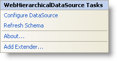

////

|metadata|
{
    "name": "webhierarchicaldatasource-webhierarchicaldatasource-smart-tag",
    "controlName": ["WebHierarchicalDataSource"],
    "tags": [],
    "guid": "{081407C0-445E-4BF7-B490-873C163175C9}",  
    "buildFlags": [],
    "createdOn": "2008-02-05T14:30:19Z"
}
|metadata|
////

= WebHierarchicalDataSource Smart Tag

In Visual Studio 2005/2008 (.NET Framework 2.0/3.5), each Infragistics ASP.NET control/component is equipped with a Smart Tag. By simply selecting the control/component, a Smart Tag anchor appears. When you click this anchor, a pop-up panel appears, providing you with quick and easy access to the most common properties and settings of the control/component.

The WebHierarchicalDataSource™ Smart Tag has the following links:

* Configure Data Source - Links to the data source configuration wizard allowing you to configure the data source to bind to WebHierarchicalDataSource.
* Refresh Schema - Clicking this refreshes WebHierarchicalDataSource so that any changes to the data source or the schema are displayed in the designer.
* About – Displays information about the component.
* Add Extender – Clicking this brings up all the available control extenders that can be used with WebHierarchicalDataSource. Control Extenders can be used to add additional functionality (usually AJAX or JavaScript support) to existing controls already declared on a page and can also nicely encapsulate UI behavior, and make it really easy to add richer functionality to an application.

|====
|====