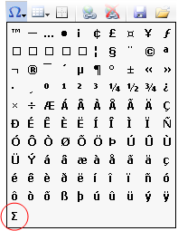

////
|metadata|
{
    "name": "webhtmleditor-add-a-special-character-in-webhtmleditor",
    "controlName": ["WebHtmlEditor"],
    "tags": ["Editing"],
    "guid": "{61F92A41-8C5E-47A2-8B82-78E4147D0420}",
    "buildFlags": [],
    "createdOn": "0001-01-01T00:00:00Z"
}
|metadata|
////

= Add a Special Character in WebHtmlEditor

WebHtmlEditor™ lets end users enter special characters that are uncommon on most keyboards by selecting them from a list without having to know their esoteric encoding. WebHtmlEditor handles the translation into "character entity references" The WebHtmlEditor control provides a starter list containing some common special characters. Your application can add to this list.

In the example code below, you will add the Greek letter sigma (S), to the  pick:[asp-net="link:{ApiPlatform}webui.webhtmleditor{ApiVersion}~infragistics.webui.webhtmleditor.webhtmleditor~specialcharacterlist.html[SpecialCharacterList]"]  property so your end users receive the Special Characters drop-down list shown above.

In the Page_Load event handler of your Web form, add an HTML character entity reference for the special character that you want to be available in the Special Characters Toolbar drop-down list.

*In Visual Basic:*

----
Me.WebHtmlEditor1.SpecialCharacterList.Add("&Sigma;")
----

*In C#:*

----
this.WebHtmlEditor1.SpecialCharacterList.Add("&Sigma;");
----

.Note:
[NOTE]
====
For a list of all HTML character entity references, consult on the link:http://www.w3.org/TR/1998/REC-html40-19980424/sgml/entities.html[W3C® web site].
====

== Related Topic:

link:webhtmleditor-remove-a-special-character-in-webhtmleditor.html[Remove a Special Character in WebHtmlEditor]