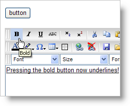

////

|metadata|
{
    "name": "webhtmleditor-change-the-default-action-of-a-button",
    "controlName": ["WebHtmlEditor"],
    "tags": ["Editing"],
    "guid": "{FD2B9316-8F8E-402E-BDFA-C374745E72ED}",  
    "buildFlags": [],
    "createdOn": "2007-10-09T14:28:23Z"
}
|metadata|
////

= Change the Default Action of a Button

WebHtmlEditor's™  pick:[asp-net="link:infragistics4.webui.webhtmleditor.v{ProductVersion}~infragistics.webui.webhtmleditor.clientsideevents~beforeaction.html[BeforeAction]"]  client-side event contains an "act" parameter which allows you to get or set the action that WebHtmlEditor is about to perform related to the end user's action. This is useful if you want to disable the default action or change the action.

The following JavaScript will change the default bold action to underline when the end user clicks the Bold button.

*In JavaScript:*

----
function WebHtmlEditor1_BeforeAction
    (oEditor, actID, oEvent, p4, p5, p6, p7, p8, act){
	// If the action about to be performed is bold...
	if(act == "bold")
	{
	    // ...change the event's action to underline.
	    // change ‘underline’ to ‘none’ in order to
	    // disable the button.
	    oEvent.act = "underline";
	}
}
----