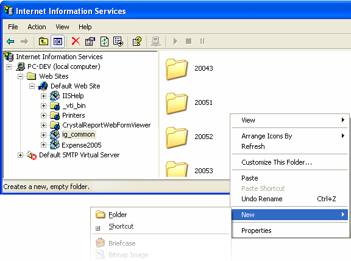
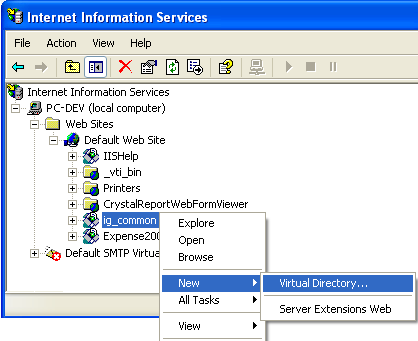
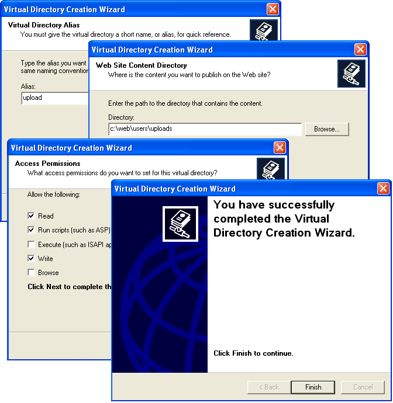

////

|metadata|
{
    "name": "webhtmleditor-configuring-the-upload-area-in-iis",
    "controlName": ["WebHtmlEditor"],
    "tags": ["Editing"],
    "guid": "{C4C2949C-6559-4AD4-A2BA-27E757F9A87C}",  
    "buildFlags": [],
    "createdOn": "2006-11-01T00:00:00Z"
}
|metadata|
////

= Configuring the Upload Area in IIS

The WebHtmlEditor™ control offers powerful support that allow users to upload files (e.g., images, and streaming media files) from their desktop to your Web server, and then link to those files within the document they are editing. In this walkthrough, you will learn the necessary configuration steps to take when setting up your Web server in Microsoft® Internet Information Services (IIS) for deployment of a WebHtmlEditor application with upload capabilities. When you are finished, your end users can upload their files for storage on your Web server to get full benefit out of WebHtmlEditor's image and media attachment capability.

.Note:
[NOTE]
====
If your WebHtmlEditor application uses the "InsertImage", "InsertFlash", or "InsertWindowsMedia" buttons, you must properly configure an upload area to receive attached files. Otherwise users attempting to upload a file to your Web server will receive an error when they use these buttons. If your application does not require attachments, you should remove these buttons as described in, link:webhtmleditor-remove-toolbar-buttons-of-webhtmleditor.html[Remove Toolbar Buttons].
====

Before you begin, you should be familiar with basic Web site administration tasks. To carry out some tasks described below, you may need administrative privileges to manage IIS and adjust security permissions for NTFS files and folders (or the aid of your Web site's administrator).

[start=1]
. Launch the IIS Microsoft Management Console (MMC) snap-in. You can do this through the Start menu (Start | Control Panel | Administrative Tools | Internet Information Services).
[start=2]
. Navigate to your Web site and look for the 'ig_common' folder. This is the name of the virtual directory typically installed with Infragistics ASP.NET to contain common resource files such as JavaScript and image files. You can store uploaded files in either a subfolder or a virtual directory.

== Storing Uploaded Files in a Subfolder

By default, the  pick:[asp-net="link:{ApiPlatform}webui.webhtmleditor{ApiVersion}~infragistics.webui.webhtmleditor.webhtmleditor~uploadedfilesdirectory.html[UploadedFilesDirectory]"]  property assumes all uploaded files will be stored in a subfolder of "ig_common" named "upload". If you would like the upload files directory to be contained underneath your 'ig_common' virtual directory, you can create a physical folder underneath 'ig_common' through IIS. This doesn't mean all of your Web applications have to share this physical folder for uploads because you can set the UploadedFilesDirectory property differently in each of your Web applications (you can even set a different property value per-user).

Right-click the "ig_common" folder and select "Explore". While you would normally see an IIS-managed view of subfolders underneath a virtual directory in the right pane, this view only allows you to add virtual directories. Using "Explore" opens a standard Windows Explorer shell in the right pane, which allows you to click in the right pane and select "New | Folder" to create a physical folder underneath 'ig_common' (or any virtual directory of your choosing).

Name the new folder "upload" and verify that the setting of the UploadedFilesDirectory property remains "/ig_common/upload". You are now ready to receive uploaded files.

== Storing Uploaded Files in a Virtual Directory

If you elect instead to store uploaded files somewhere other than a subfolder underneath a virtual directory (whether it is "ig_common" or the virtual directory hosting your Web application), you must instead create a new virtual directory (right-click the "ig_common" subfolder, point to New and click Virtual Directory). Then, specify to IIS to associate this virtual directory with the physical folder where the uploaded files will be stored.

.Note:
[NOTE]
====
There is a key point in the Access Permissions page of the Virtual Directory Creation Wizard. By default, IIS allow only "Read" and "Run scripts" permissions for the virtual directory. You must select the "Write" checkbox to allow users to write their uploaded files to the Web Site Content Directory (the physical folder path) you specified on the preceding page of the wizard.
====

[start=3]
. (Recommended) Whichever alternative you choose, you can further secure an upload directory by setting NTFS security privileges on the physical subfolder to which you are storing uploaded files. See the .NET Framework documentation for more information on the ASP.NET identity and how to use impersonation to determine which Windows user accounts you should lock down for a secure site.

You are now ready to configure an upload area for users of WebHtmlEditor and your Web application. If you are using an uploaded files path that is different from "/ig_common/upload" see link:webhtmleditor-set-where-upload-files-are-stored.html[Set Where Uploaded Files are Stored] for step-by-step instructions on configuring WebHtmlEditor so it can find that location.