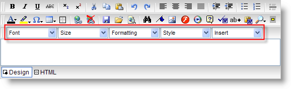
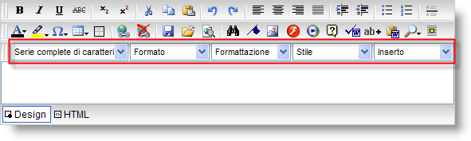

////

|metadata|
{
    "name": "webhtmleditor-creating-and-using-a-custom-language-file",
    "controlName": ["WebHtmlEditor"],
    "tags": ["Editing","Localization"],
    "guid": "{17577A5C-CDDD-4D64-B84F-290F46C55D54}",  
    "buildFlags": [],
    "createdOn": "0001-01-01T00:00:00Z"
}
|metadata|
////

= Creating and Using a Custom Language File

== Before You Begin

WebHtmlEditor™ provides built-in link:webhtmleditor-multi-language-support.html[multi-language support] through the  pick:[asp-net="link:{ApiPlatform}webui.webhtmleditor{ApiVersion}~infragistics.webui.webhtmleditor.webhtmleditor~localizationtype.html[LocalizationType]"]  property, which you can set to use built-in language files: English (default), French, German, and Spanish. With the help of the built-in language files, you can change WebHtmlEditor's labels, ToolTips, dialog boxes, and static text. However, in some cases, you may need the WebHtmlEditor control to provide support for a language that is not part of the built-in language files.

== What You Will Accomplish

This walkthrough will guide you through the process of creating an Italian custom language file, and use it by setting it to the  pick:[asp-net="link:{ApiPlatform}webui.webhtmleditor{ApiVersion}~infragistics.webui.webhtmleditor.webhtmleditor~localizationfile.html[LocalizationFile]"]  property to modify the link:webhtmleditor-drop-down-lists-of-webhtmleditor-toolbar.html[Toolbar Drop-Downs Lists].

== Follow these Steps

[start=1]
. Create the custom file and place it within a folder in the Web project

.. In Solution Explorer, right-click the Web site and select New Folder. Name the folder "Files".
.. Navigate to the default installation path where the built-in language files are located:

{InstallPath}\ASP.NET\Scripts
.. Find the localization.xml file, and copy it to the folder created in step a.

.Note:
[NOTE]
====
If you save the custom language files outside of the /ig_common/Scripts directory, you may need to grant your ASP.NET user identity (this may be the ASP.NET, Network Service, or an impersonated user account, depending on the Web.config settings, and the version of IIS and.NET Framework on which Infragistics ASP.NET is running) adequate access rights to open and read the custom language file.
====

.. Rename the file "localization-it-IT.xml".

[start=2]
. Edit the custom file.

.Note:
[NOTE]
====
Since the language files are formatted as XML, the XML files can be modified using any text editor such as Notepad.
====

.. Open the XML file, and scroll down until you find the tag named "FontNameTitle", as demonstrated in the XML excerpt below:

*In XML:*

----
…
<data name="FontNameTitle">
        <value>Font</value>
</data>
…
----

This <data> tag contains the value for the Font Name drop-down list displayed in the control. The subsequent tags named FontSizeTitle, FontStyleTitle, FontFormattingTitle, and InsertTitle correspond to the Size, Style, Formatting, and Insert drop-down lists, respectively.
.. Change each <data> tag's value to the Italian translation.

*In XML:*

----
…
<data name="FontNameTitle">
        <value>Serie complete di caratteri</value>
</data>
<data name="FontSizeTitle">
        <value>Formato</value>
</data>
<data name="FontStyleTitle">
        <value>Stile</value>
</data>
<data name="FontFormattingTitle">
        <value>Formattazione</value>
</data>
<data name="InsertTitle">
        <value>Inserto</value>
</data>
…
----

[start=3]
. Set the LocalizationFile property.

In the Page_Load event, set the LocalizationFile property to the localization-it-IT.xml.

*In Visual Basic:*

----
Protected Sub Page_Load(ByVal sender As Object, ByVal e As System.EventArgs) _
   Handles Me.Load   
        ' Set the LocalizationFile to the (custom) Italian XML file
        Me.WebHtmlEditor1.LocalizationFile = "./Files/localization-it-IT.xml"
End Sub
----

*In C#:*

----
protected void Page_Load(object sender, EventArgs e)
{
        // Set the LocalizationFile to the (custom) Italian XML file
        this.WebHtmlEditor1.LocalizationFile = "./Files/localization-it-IT.xml";
}
----

[start=4]
. Run your application.

When you run your application, notice the text of the drop-down lists have been changed from English to Italian, as shown in the screen shot below.

The XML file can be further edited to translate other sections of the control such as labels, ToolTips, dialog boxes, and static text.