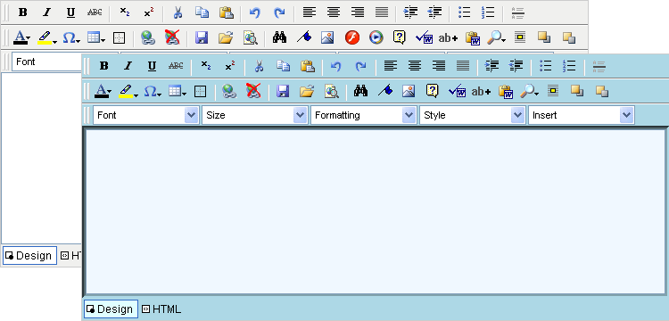
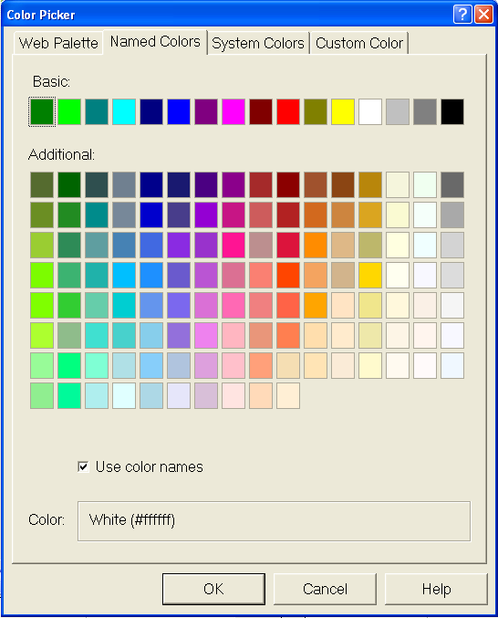

////

|metadata|
{
    "name": "webhtmleditor-creating-custom-skins-for-webhtmleditor",
    "controlName": ["WebHtmlEditor"],
    "tags": ["Editing","Styling","Templating"],
    "guid": "{102E2494-EB9E-431B-90BC-B0E99A7F932F}",  
    "buildFlags": [],
    "createdOn": "2006-10-01T00:00:00Z"
}
|metadata|
////

= Creating Custom Skins for WebHtmlEditor

In this walkthrough you will learn about skinning WebHtmlEditor™ control programmatically. You will envision a consistent-looking style that you'd like to apply to WebHtmlEditor. Next, you will write the code to make the necessary settings to the WebHtmlEditor control through the code-behind file on the first request to the page. Then you will store the skin information for later use as an XML file using the  pick:[asp-net="link:{ApiPlatform}webui.webhtmleditor{ApiVersion}~infragistics.webui.webhtmleditor.webhtmleditor~saveskin.html[SaveSkin]"]  method. The goal of this walkthrough is to make yourself a skin file with an Aqua-colored motif for your WebHtmlEditor as shown in the following screenshot, although you can substitute any color scheme you desire.

Before you begin, you should have a basic understanding of the different parts of WebHtmlEditor, as described in the help topic, link:webhtmleditor-layout-of-webhtmleditor.html[Layout of WebHtmlEditor]. You should also be familiar with the assortment of properties exposed through which you can style Infragistics Web elements, such as the BackgroundImage and Font properties.

[start=1]
. Before you start writing any code, you should place using/imports directives in your code-behind so you don't need to always type out a member's fully qualified name.

*In Visual Basic:*

----
Imports Infragistics.WebUI.WebHtmlEditor
----

*In C#:*

----
using Infragistics.WebUI.WebHtmlEditor;
----

[start=2]
. Before visually designing the appearance for your WebHtmlEditor control, it's a good idea to sit down and plan the sorts of colors and styles you'd like to assign each part of the control. Start by pulling up a color palette in Microsoft® Visual Studio® .NET. On the Format menu, point to Build Style, then click Background. Then click the ellipsis button adjacent to any color property. On this dialog box, it's often easier to work in the Named Colors tab.

Select two complementary colors from this palette to serve as the base colors for your theme. Since the goal of this walkthrough is to go for an aquatic or marine look and feel in our color selections, choose "Aqua" and "Blue". Write these colors' names side-by-side on a scratch pad.

Next, we are going to need several other colors that are close to these base colors because WebHtmlEditor has many edges where shades one or two degrees lighter and darker are necessary. For "Aqua" select the colors "LightCyan", "LightBlue", and "DarkCyan". For "Blue" select the colors "Navy", "MidnightBlue", and "AliceBlue". When you have finished your color selection, you should have a table on your scratch pad that looks like this:

[cols="a,a,a,a"]
|====
|
|Aqua
|
|Blue

|
|DarkCyan
|
|Navy

|
|LightBlue
|
|MidnightBlue

|
|LightCyan
|
|AliceBlue

|====

[start=3]
. From this color palette you are going to assign colors to the backgrounds, borders and mouse effects of WebHtmlEditor's control regions. Start with the background color of the face of the editor. This will be the color your end users will see the most, but it also should be somewhat subdued so as not to be distracting. Since we're aiming for a marine-like color scheme, we'll choose LightBlue for the BackColor property. The other colors in the palette are all nuances that show up clearly when used with this shade of light blue.

.Note:
[NOTE]
====
You're going to make these property assignments through code-behind using your favorite .NET programming language in this walkthrough, although you could also make these property settings using the Properties window.
====

*In Visual Basic:*

----
' Set the backgrounds and borders of a variety of
' styles to different shades of cyan and blue.
Me.WebHtmlEditor1.BackColor = Color.LightBlue
' Sets the WebHtmlEditor to not use its default styles
Me.WebHtmlEditor1.UseDefaultStyles = UseDefaultStyles.None
----

*In C#:*

----
// Set the backgrounds and borders of a variety of
// styles to different shades of cyan and blue.
this.WebHtmlEditor1.BackColor = Color.LightBlue;
// Sets the WebHtmlEditor to not use its default styles
this.WebHtmlEditor1.UseDefaultStyles = UseDefaultStyles.None;
----

[start=4]
. Styling the buttons so that their appearance matches the overall color scheme of the WebHtmlEditor control makes your application look more consistent to end users. Decide on a brighter shade of color like Aqua for the highlighting effect that WebHtmlEditor gives to toolbar buttons when the end user hovers the mouse over them. Select a darker shade of color like DarkCyan to give these buttons a pressed-in appearance when the end user clicks on them. Similarly, we give complementary border colors and styles. Notice how the use of the Outset and Inset border styles give the buttons both an elevated and depressed look.

*In Visual Basic:*

----
' Style the toolbar buttons for highlighting ...
Me.WebHtmlEditor1.ButtonStyle.MouseOverBorderColor = Color.LightCyan
Me.WebHtmlEditor1.ButtonStyle.MouseOverBackColor = Color.Aqua
Me.WebHtmlEditor1.ButtonStyle.MouseOverBorderStyle = BorderStyle.Outset
' ... and style them for the pressed down state.
Me.WebHtmlEditor1.ButtonStyle.MouseDownBorderColor = Color.MidnightBlue
Me.WebHtmlEditor1.ButtonStyle.MouseDownBackColor = Color.DarkCyan
Me.WebHtmlEditor1.ButtonStyle.MouseDownBorderStyle = BorderStyle.Inset
----

*In C#:*

----
// Style the toolbar buttons for highlighting ...
this.WebHtmlEditor1.ButtonStyle.MouseOverBorderColor = Color.LightCyan;
this.WebHtmlEditor1.ButtonStyle.MouseOverBackColor = Color.Aqua;
this.WebHtmlEditor1.ButtonStyle.MouseOverBorderStyle = BorderStyle.Outset;
// ... and style them for the pressed down state.		
this.WebHtmlEditor1.ButtonStyle.MouseDownBorderColor = Color.MidnightBlue;
this.WebHtmlEditor1.ButtonStyle.MouseDownBackColor = Color.DarkCyan;
this.WebHtmlEditor1.ButtonStyle.MouseDownBorderStyle = BorderStyle.Inset;
----

[start=5]
. Interactions such as showing a drop-down menu, or popping up a dialog box provide additional UI elements to your audience. Similar to the mouse effects on buttons, it is also important for you to maintain consistency in the coloration and styling applied on these facets of WebHtmlEditor. These statements assign the common LightBlue background to drop-down menus and dialog boxes. Notice that the dark background color applied to the dialog box's title bar requires a corresponding light foreground text color to be assigned (because the default text color in most cases is Black.)

*In Visual Basic:*

----
' Style the Dialogs.
Me.WebHtmlEditor1.DialogStyle.BackColor = Color.LightBlue
Me.WebHtmlEditor1.DialogStyle.TitlebarBackColor = Color.MidnightBlue
Me.WebHtmlEditor1.DialogStyle.ForeColor = Color.White
' Style the Drop-down Menus.
Me.WebHtmlEditor1.MenuStyle.BackColor = Color.LightBlue
Me.WebHtmlEditor1.MenuStyle.ImageColumnColor = Color.DarkCyan
----

*In C#:*

----
// Style the Dialogs.
this.WebHtmlEditor1.DialogStyle.BackColor = Color.LightBlue;
this.WebHtmlEditor1.DialogStyle.TitlebarBackColor = Color.MidnightBlue;
this.WebHtmlEditor1.DialogStyle.ForeColor = Color.White;
// Style the Drop-down Menus.
this.WebHtmlEditor1.MenuStyle.BackColor = Color.LightBlue;
this.WebHtmlEditor1.MenuStyle.ImageColumnColor = Color.DarkCyan;
----

[start=6]
. The text window and tab strip are two remaining regions of WebHtmlEditor that you should style in your skin to be consistent with the toolbar and other UI elements. Below are statements that give the text window a LightBlue border with a background color that has only a tinge of AliceBlue for the editing client area. The statements below also color the tab strip with a LightBlue background color and a LightCyan highlight color similar to (but not as bright) as the mouse-over color given to the toolbar buttons.

*In Visual Basic:*

----
' Style the Text Window.
Me.WebHtmlEditor1.TextWindow.BackColor = Color.AliceBlue
Me.WebHtmlEditor1.TextWindow.BorderStyle = BorderStyle.Inset
Me.WebHtmlEditor1.TextWindow.BorderColor = Color.LightBlue
' Style the Tab Strip.
Me.WebHtmlEditor1.TabStrip.BackColor = Color.LightBlue
Me.WebHtmlEditor1.TabStrip.HighlightBackColor = Color.LightCyan
----

*In C#:*

----
// Style the Text Window.
this.WebHtmlEditor1.TextWindow.BackColor = Color.AliceBlue;
this.WebHtmlEditor1.TextWindow.BorderStyle = BorderStyle.Inset;
this.WebHtmlEditor1.TextWindow.BorderColor = Color.LightBlue;
// Style the Tab Strip.
this.WebHtmlEditor1.TabStrip.BackColor = Color.LightBlue;
this.WebHtmlEditor1.TabStrip.HighlightBackColor = Color.LightCyan;
----

[start=7]
. Once you have completely styled WebHtmlEditor the way you want it to appear, you should save it to an XML "skin" file. You can do this in a subfolder of your Web application named "skins" with the SaveSkin method call shown next.

*In Visual Basic:*

----
' Save my custom skin to the file, "Aqua.xml"
Me.WebHtmlEditor1.SaveSkin(Server.MapPath("./skins"),"Aqua")
----

*In C#:*

----
// Save my custom skin to the file, "Aqua.xml"
this.WebHtmlEditor1.SaveSkin(Server.MapPath("./skins"),"Aqua");
----

.Note:
[NOTE]
====
When saving any file to any location on your Web server, you must ensure that the Windows identity under which the ASP.NET process runs (this identity is usually named ASPNET or Network Service, unless your application uses impersonation) has write permissions to create a file there, otherwise calling the SaveSkin method could throw an Unauthorized Access Exception.
====

In this walkthrough you've learned how to design, create and save a custom skin. From here, you may want to practice creating attractive skins for your Web application, and see link:webhtmleditor-load-a-custom-skin.html[Load a Custom Skin] to learn how to apply skins automatically at run time.