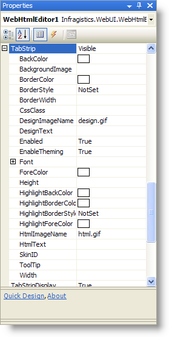

////

|metadata|
{
    "name": "webhtmleditor-customize-the-tab-strip-of-webhtmleditor",
    "controlName": ["WebHtmlEditor"],
    "tags": ["Editing"],
    "guid": "{BBF4F4FC-9135-4731-BB64-1927E953EC9C}",  
    "buildFlags": [],
    "createdOn": "2006-04-01T00:00:00Z"
}
|metadata|
////

= Customize the Tab Strip of WebHtmlEditor

WebHtmlEditor™ exposes properties enabling your application to customize the tab strip region, such as the text on its labels (and their icons). In the following procedure, you will set the label appearing on the HTML view tab to "Source" through the design-time environment.

[start=1]
. Select WebHtmlEditor on the design surface and search through the Properties Window for the  pick:[asp-net="link:infragistics4.webui.webhtmleditor.v{ProductVersion}~infragistics.webui.webhtmleditor.webhtmleditor~tabstrip.html[TabStrip]"]  property. Expand the property to view the list of sub-properties, which allow you to customize the tab strip region.

[start=2]
. From the list of sub-properties, select the HtmlText property. Set this property's value to "Source" to change the label on the HTML view tab. Your change immediately takes effect on Microsoft Visual Studio .NET's design surface.

== Related Topics:

link:webhtmleditor-webhtmleditor-tab-strip.html[WebHtmlEditor Tab Strip]

link:webhtmleditor-hide-the-tab-strip-of-webhtmleditor.html[Hide the WebHtmlEditor Tab Strip]