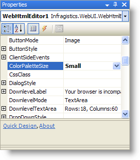
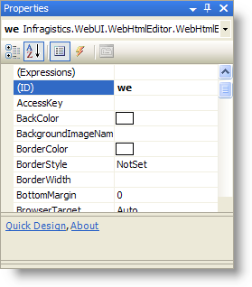

////

|metadata|
{
    "name": "webhtmleditor-improving-webhtmleditor-performance",
    "controlName": ["WebHtmlEditor"],
    "tags": ["Editing","Performance"],
    "guid": "{4F9D0BBB-2A48-4078-AA73-444923DC7741}",  
    "buildFlags": [],
    "createdOn": "2006-12-01T00:00:00Z"
}
|metadata|
////

= Improving WebHtmlEditor Performance

When your Web application doesn't require all of WebHtmlEditor's™ powerful editing capabilities, you can improve performance by reducing your use of (or disabling) certain features. In this walkthrough you will learn about the properties of WebHtmlEditor that influence your Web application's performance, and what you can do to limit or eliminate their overhead. After you have completed this walkthrough, you will be able to optimize WebHtmlEditor by making informed decisions on trade-offs.

Before you begin, you should have an existing WebHtmlEditor application you want to optimize, or a simple WebHtmlEditor example to experiment on. Each section below illustrates how you can make a single performance optimization, which can be used on either an individual basis or collectively to meet your Web application's requirements.

You will learn a number of tips and techniques that you can now apply to your Web application to improve it's performance when using WebHtmlEditor. A recurring theme is that you can improve performance by accepting modest limitations in functionality. When designing your Web application, use your best judgement in determining which features you need and which features your users can do without for a simpler editing experience and faster performance.

== Turn off ViewState and configure WebHtmlEditor on every request

Every property set on WebHtmlEditor from the server side causes the setting to get stored in ViewState, which ASP.NET passes back-and-forth between the user and the server with each request. You can reduce the payload size of HTML rendered to the user by disabling ViewState. This technique is most appropriate in these situations:

* The end user's connection has limited bandwidth, and therefore users receive pages slowly because the page size contains ViewState.
* Your Web application makes many changes dynamically on the server, which causes ViewState to become large.
* Your Web application makes very few changes dynamically on the server, and instead relies on settings made at design time. It doesn't benefit much from having ViewState.

The only disadvantage to turning off ViewState is that WebHtmlEditor will assume only its initial property value settings (those that were set during design time). With ViewState disabled, your Web application can't avoid making custom property settings on every page request by placing its initialization code in an If-conditional block that only executes when the Page's IsPostBack property is False.

For example, when ViewState is turned on you can use the code below to set a dynamic background color to the WebHtmlEditor:

*In Visual Basic:*

----
' ViewState is enabled, therefore only initialize on the first request.
If ( Not Page.IsPostBack ) Then
    Me.WebHtmlEditor1.BackColor = Color.Beige
End If
----

*In C#:*

----
// ViewState is enabled, therefore only initialize on the first request.
if ( !Page.IsPostBack )
{
    this.WebHtmlEditor1.BackColor = Color.Beige;
}
----

However, if you deactivate ViewState using the EnableViewState property, this property setting will not be remembered on postbacks. Therefore your property settings must execute on every Page request (see the example code below).

*In Visual Basic:*

----
' Disable ViewState and initialize on every Page request, postback or not.
Me.WebHtmlEditor1.EnableViewState = False
Me.WebHtmlEditor1.BackColor = Color.Beige
----

*In C#:*

----
// Disable ViewState and initialize on every Page request, postback or not.
this.WebHtmlEditor1.EnableViewState = false;
this.WebHtmlEditor1.BackColor = Color.Beige;
----

In addition to initializing properties from code-behind, WebHtmlEditor offers a custom skins feature that can be used to initialize the look of the control without heavy reliance on ViewState. See link:webhtmleditor-creating-custom-skins-for-webhtmleditor.html[Creating Custom Skins] and link:webhtmleditor-load-a-custom-skin.html[Load a Custom Skin] for further information.

== Use simple custom dialog content

Dialogs snap up quickly because the dialog box's content is available on the client side without making a return trip to the Web server. Consequently, any custom dialog box content you provide must be rendered on every request whether seen by the user or not. When the pop-up dialog boxes become complex, this increases the complexity and amount of HTML rendered.

You can limit the performance impact of WebHtmlEditor's pre-rendered dialog boxes with any or all of these approaches:

* Keep the content of your pop-up dialog boxes simple. See link:webhtmleditor-customize-the-help-dialog-box-of-webhtmleditor.html[Customizing Dialog Buttons] for information on how to set your custom dialog box's HTML content.
* You can remove any toolbar dialog box buttons that are unnecessary in your Web application. Remove them from the Toolbar Items collection so that their pop-up dialog boxes are not rendered. See link:webhtmleditor-remove-toolbar-buttons-of-webhtmleditor.html[Remove Toolbar Buttons] for a step-by-step procedure.
* Replace a standard dialog box button with a custom dialog box button. You can set its ImageName property to make it look identical to an existing button, and handle the ButtonClicked event to open a new window directed to a separate Web page URL you create. You can therefore have a complex dialog box, and the user only receives it when they click your custom dialog button.

== Use a small color picker

As a special case of the previous optimization tip ("Use Simple Custom Dialog Content" section), one of the more complicated dialog boxes shown by WebHtmlEditor is the pop-up color picker. By using the  pick:[asp-net="link:{ApiPlatform}webui.webhtmleditor{ApiVersion}~infragistics.webui.webhtmleditor.webhtmleditor~colorpalettesize.html[ColorPaletteSize]"]  property, you can reduce the amount of HTML necessary to render this dialog box. This property can be set programmatically in code-behind or through the Properties window (press F4 in Microsoft® Visual Studio® .NET) as shown in the following screenshot.

The smaller your color palette size, the fewer columns of colors the pop-up color picker dialog box will display to the user at one time.

== Turn off table support in basic editing situations

As a general rule-of-thumb, remember that the fewer features you have activated on WebHtmlEditor, the faster its performance will be.

WebHtmlEditor's support of HTML table elements and the complex layouts they permit is one of the more expensive features in terms of performance overhead. It requires pre-rendered HTML for the table-related dialog box elements that users interact with when adding a table, and it includes additional Javascript for supporting functionality specific to table editing.

If your Web application doesn't require users to create complex tabular layouts, you should remove the InsertTable toolbar button. See link:webhtmleditor-remove-toolbar-buttons-of-webhtmleditor.html[Remove Toolbar Buttons] for step-by-step instructions on accomplishing this task.

== Shorten the ID that's used to refer to WebHtmlEditor

The ID property serves as a programmatic identifier for the control, but also

qualifies the names given to all sub-elements contained within the control to ensure their uniqueness on the Page (for example, it qualifies the ID attributes assigned to toolbar items and styles.)

If you assign a lengthy identifier to your WebHtmlEditor control (it defaults to WebHtmlEditor1, which is at 14 characters) it may get repeated many times when rendering. At the risk of a little clarity, you can abbreviate the ID assigned to WebHtmlEditor to reduce the HTML size rendered. Through the Properties window in Visual Studio .NET, you would modify the (ID) property as shown in the following screenshot.

This will not only modify the ID attribute rendered in HTML for the control and its children, but also affects the programmatic identifier used in Visual Studio .NET (you'll notice the property is parenthesitized, meaning you cannot set it from C# or VB.NET code).