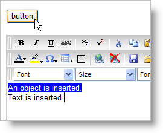

////

|metadata|
{
    "name": "webhtmleditor-insert-objects-into-webhtmleditor",
    "controlName": ["WebHtmlEditor"],
    "tags": ["Editing"],
    "guid": "{A3F2B502-30DE-4802-940D-245426732FA4}",  
    "buildFlags": [],
    "createdOn": "2007-10-09T14:11:49Z"
}
|metadata|
////

= Insert Objects into WebHtmlEditor

WebHtmlEditor's™ link:webhtmleditor-client-side-events-csom.html[client-side object model] (CSOM) includes a powerful function that allows you to insert any object or plain text at WebHtmlEditor's caret. This function, insertAtCaret, can accept either an object or a string and will insert either at the control's caret.

When attached to an HTML button's onclick event, the following JavaScript will insert both an object and plain text at WebHtmlEditor's caret. This example assumes that you already have an HTML button and an instance of WebHtmlEditor on your web form with its ID set to "WebHtmlEditor1".

*In JavaScript:*

----
function insertObject(){
    // Get a reference to the editor.
    var _editor = iged_getById("WebHtmlEditor1");
    // Create a new span object.
    var object = document.createElement("SPAN");
    // Style the object and add text.
    object.style.background = "blue";
    object.style.color = "white";
    object.innerHTML = "An object is inserted.";    
    // Insert the object into WebHtmlEditor.
    _editor.insertAtCaret( object );
    // WebHtmlEditor can also insert text.
    _editor.insertAtCaret( " Text is inserted." );
}
----