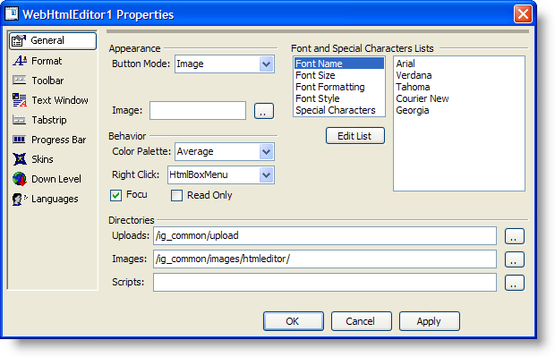

////

|metadata|
{
    "name": "webhtmleditor-overview-of-the-webhtmleditor-designer",
    "controlName": ["WebHtmlEditor"],
    "tags": ["Design Environment","Editing"],
    "guid": "{DE5CA177-5EF3-46A7-AB5B-95D6CC86DA8E}",  
    "buildFlags": [],
    "createdOn": "2006-11-01T00:00:00Z"
}
|metadata|
////

= Overview of the WebHtmlEditor Designer

The WebHtmlEditor™ control comes with a design-time Quick Design that enables you to customize the appearance and behavior of the control in the Microsoft® Visual Studio® .NET designer environment. In this walkthrough you will learn about the purpose and capabilities of each tab in the Quick Design, and practice making changes to observe their effect on WebHtmlEditor's appearance and behavior.

Before you begin you should know how to drag controls onto the Visual Studio .NET designer surface from the Toolbox, and have a general knowledge about the kinds of applications for which you'd like to use WebHtmlEditor. You'll get much more out of this lesson if you try different settings from those described here, and identify what effects these settings will have on WebHtmlEditor when it is part of your Web application.

Open the Quick Design for WebHtmlEditor. (If the Properties window is not already visible within your Microsoft® Visual Studio® .NET workspace, select WebHtmlEditor by clicking on it and press the F4 key to open). At the bottom of the Properties window click the "Quick Design" link to open the Quick Design.

The Quick Design is comprised of the following nine tabs. Click each link below for a walkthrough on how to use each tab.

* link:webhtmleditor-webhtmleditor-designer-general-tab.html[General]
* link:webhtmleditor-webhtmleditor-designer-format-tab.html[Format]
* link:webhtmleditor-webhtmleditor-designer-toolbar-tab.html[Toolbar]
* link:webhtmleditor-webhtmleditor-designer-text-window-tab.html[Text Window]
* link:webhtmleditor-webhtmleditor-designer-tabstrip-tab.html[TabStrip]
* link:webhtmleditor-webhtmleditor-designer-progress-bar-tab.html[Progress Bar]
* link:webhtmleditor-webhtmleditor-designer-skins-tab.html[Skins]
* link:webhtmleditor-webhtmleditor-designer-down-level-tab.html[Down Level]
* link:webhtmleditor-webhtmleditor-designer-languages-tab.html[Languages]

After you read through the topics in this section, you will have completed a tour of the WebHtmlEditor Properties dialog box, and have seen a sampling of the great variety in design-time customizations that you can make without writing code. Now is a good time to become more familiar with the Quick Design's features by experimenting with your own settings, and observing their outcome in WebHtmlEditor. The Quick Deign exposes properties found on the server-side objects of WebHtmlEditor, therefore you can find more information about a feature by looking up its related property in the documentation. Finally, when it's not practical to anticipate every setting needed by your WebHtmlEditor control in advance through design-time settings, the help describes how to accomplish the same effect through run-time coding in your favorite .NET programming language.