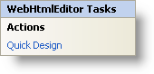

////

|metadata|
{
    "name": "webhtmleditor-smart-tag",
    "controlName": ["WebHtmlEditor"],
    "tags": ["Design Environment","Editing"],
    "guid": "{A51B725F-56A3-482D-B17D-F94A1E51AC6E}",  
    "buildFlags": [],
    "createdOn": "0001-01-01T00:00:00Z"
}
|metadata|
////

= WebHtmlEditor Smart Tag

In Visual Studio 2005 (.NET Framework 2.0), each Infragistics ASP.NET control/component is equipped with a Smart Tag. By simply selecting the control/component, a Smart Tag anchor appears. When you click this anchor, a pop-up panel appears, providing you with quick and easy access to the most common properties and settings of the control/component.

The WebHtmlEditor™ Smart Tag contains the following sections:

* Actions -- Lets you perform common tasks (i.e., accessing the Quick Designer).

See below for a description of the item (e.g., field, drop-down list, checkbox) in each section.

[options="header", cols="a,a,a"]
|====
|Actions|Description|CorrespondingProperty

|Quick Design
|Click Quick Design to access the WebHtmlEditor Designer. This is the same functionality as if you right-clicked on the control and selected Quick Design from the context menu.
|n/a

|====