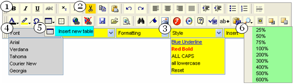

////

|metadata|
{
    "name": "webhtmleditor-using-webhtmleditors-base-styles",
    "controlName": ["WebHtmlEditor"],
    "tags": ["Editing","Styling"],
    "guid": "{AE3385A8-8767-42BC-BEDD-4BE37F0F6F84}",  
    "buildFlags": [],
    "createdOn": "0001-01-01T00:00:00Z"
}
|metadata|
////

= Using WebHtmlEditor's Base Styles

In this walkthrough you are going to learn about WebHtmlEditor's™ base styles and how style inheritance works. When you are finished you'll know where to find the styles for objects in the Toolbar region of WebHtmlEditor, and whether to apply a style at the base level or on an individual item.

Before you begin, you should already be familiar with creating simple WebHtmlEditor applications by dragging the WebHtmlEditor onto the design surface of Microsoft® Visual Studio® .NET, and with setting properties in the Properties window. You should also become acquainted with the layout of WebHtmlEditor (see link:webhtmleditor-layout-of-webhtmleditor.html[Layout of the WebHtmlEditor]) and the different types of items available in the toolbar (see link:webhtmleditor-working-with-webhtmleditors-toolbar.html[Working with WebHtmlEditor's Toolbar])

*In Visual Basic:*

----
Imports Infragistics.WebUI.WebHtmlEditor
----

*In C#:*

----
using Infragistics.WebUI.WebHtmlEditor;
----

In this walkthrough you are going to create the colorful interface pictured above. At each step of the way you'll set a new background color, and you'll learn something about a different base or individual style.

You can place all of the code you see below in your Web application's Page_Load event handler, the body of which Visual Studio .NET will automatically create for you when you double-click on the design surface.

[start=1]
. Before you start writing any code, you should place using/imports directives in your code-behind so you don't need to always type out a member's fully qualified name.
[start=2]
. Base styles apply to all toolbar items that share a common toolbar item type. The most common are the buttons, and their base style is the  pick:[asp-net="link:infragistics4.webui.webhtmleditor.v{ProductVersion}~infragistics.webui.webhtmleditor.webhtmleditor~buttonstyle.html[ButtonStyle]"]  property on the WebHtmlEditor control. Set the background of all buttons to LightYellow with the following statement.

*In Visual Basic:*

----
Me.WebHtmlEditor1.ButtonStyle.BackColor = Color.LightYellow
----

*In C#:*

----
this.WebHtmlEditor1.ButtonStyle.BackColor = Color.LightYellow;
----

[start=3]
. Individual styles apply to one toolbar item at a time. The setting you make on a specific button supersedes the prevailing base style. Get a reference to the BaseToolbarItem (which has a BackColor property) for the "Cut" button and set its background to Gold.

*In Visual Basic:*

----
Me.WebHtmlEditor1.Toolbar.Items.GetByType( _
  ToolbarItemType.Cut).BackColor = Color.Gold
----

*In C#:*

----
this.WebHtmlEditor1.Toolbar.Items.GetByType(
  ToolbarItemType.Cut).BackColor = Color.Gold;
----

[start=4]
. Drop-down lists are unaffected by ButtonStyle because they are not buttons. Their base style is the DropDownStyle property, which is also on the WebHtmlEditor control. Go ahead and set the background of all drop-down lists to Yellow.

*In Visual Basic:*

----
Me.WebHtmlEditor1.DropDownStyle.BackColor = Color.Yellow
----

*In C#:*

----
this.WebHtmlEditor1.DropDownStyle.BackColor = Color.Yellow;
----

[start=5]
. You can control individual drop-down lists in the same way that you control individual buttons, because both are only specialized BaseToolbarItems. Once again, find the FontName drop-down, and this time change its background to LightGray.

*In Visual Basic:*

----
Me.WebHtmlEditor1.Toolbar.Items.GetByType( _
  ToolbarItemType.FontName).BackColor = Color.LightGray
----

*In C#:*

----
this.WebHtmlEditor1.Toolbar.Items.GetByType(
  ToolbarItemType.FontText).BackColor = Color.LightGray;
----

[start=6]
. Menus are another type of toolbar item that have their own base style in the  pick:[asp-net="link:infragistics4.webui.webhtmleditor.v{ProductVersion}~infragistics.webui.webhtmleditor.webhtmleditor~menustyle.html[MenuStyle]"]  property. You have probably guessed already that all base-style properties are exposed at the WebHtmlEditor control level, while the style properties for customizing individual Toolbar items are on each contained Toolbar item object. Set all menus to an Aqua background.

*In Visual Basic:*

----
Me.WebHtmlEditor1.MenuStyle.BackColor = Color.Aqua
----

*In C#:*

----
this.WebHtmlEditor1.MenuStyle.BackColor = Color.Aqua;
----

You have successfully learned to apply styles to the WebHtmlEditor toolbar, when to set style properties that can be inherited by all items of one toolbar item type, and how to override style properties. You have also seen how more sophisticated toolbar items are comprised of more than one styleable object, and how to reach these inner properties. Continuously experiment with different style properties to get the appearance that you're looking for in your Web application.

The next more advanced toolbar item to learn about is the ToolbarDialogButton class. This class has a base style, the DialogStyle property.